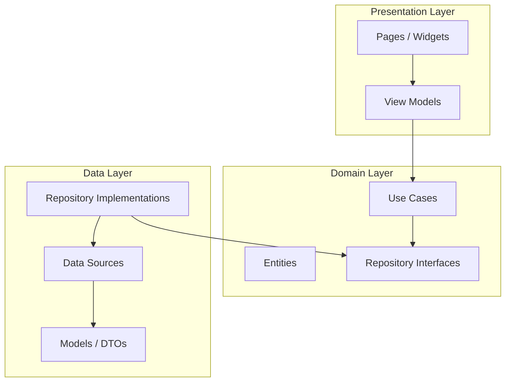

# Issue #1: プロジェクト構造の整理 - Design

## Architecture Overview

The project will follow Clean Architecture with three main layers. This issue establishes the directory structure and minimal app shell.



### Dependency Rule

Dependencies flow inward toward the domain layer:

- **Presentation** depends on **Domain** (uses entities, calls use cases)
- **Data** depends on **Domain** (implements repository interfaces)
- **Domain** depends on nothing (pure business logic)

## Component Design

### Directory Structure

```
lib/
├── main.dart                    # App entry point
├── app.dart                     # LibCheckApp widget (MaterialApp)
├── domain/
│   └── .gitkeep                 # Placeholder for domain layer
├── data/
│   └── .gitkeep                 # Placeholder for data layer
└── presentation/
    └── pages/
        └── home_page.dart       # Simple home page
```

### Key Components

#### `lib/main.dart`
- Entry point that calls `runApp(const LibCheckApp())`
- Minimal, delegates to `app.dart`

#### `lib/app.dart`
- `LibCheckApp` StatelessWidget
- Configures `MaterialApp` with app title, theme, and home page

#### `lib/presentation/pages/home_page.dart`
- `HomePage` StatelessWidget
- Displays AppBar with "LibCheck" title
- Body with centered placeholder text

## Data Flow

Not applicable for this issue. This issue only sets up the project structure. Data flow will be defined in subsequent issues (API client, local storage).

## Domain Models

Not applicable for this issue. Domain models will be defined when implementing specific features (Book entity, Library entity, etc.).
