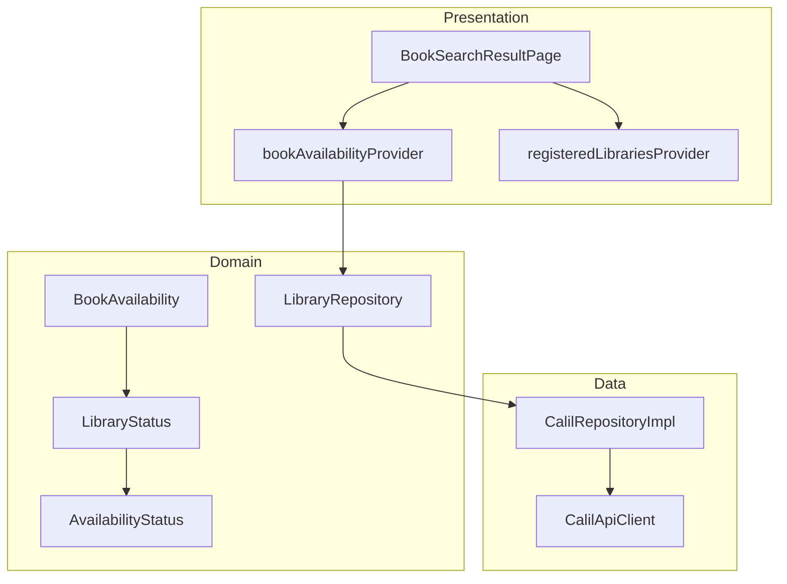
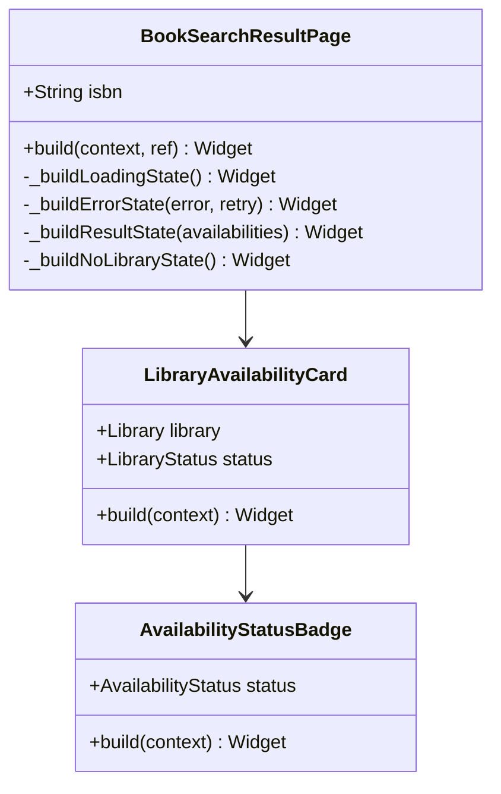
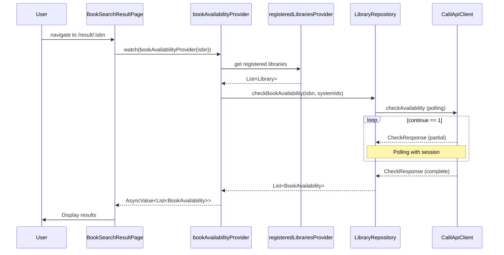

# Issue #10: 蔵書検索・結果表示 - 設計

## Architecture Overview

Clean Architecture に基づき、既存の domain/data 層を活用して presentation 層に検索結果画面を追加する。



## Component Design

### BookSearchResultPage

蔵書検索結果を表示するメインページ。



### Provider設計

```dart
// ISBN を受け取り、登録図書館の蔵書状況を検索する
final bookAvailabilityProvider = FutureProvider.family<List<BookAvailability>, String>(
  (ref, isbn) async {
    final libraries = await ref.watch(registeredLibrariesProvider.future);
    final systemIds = libraries.map((l) => l.systemId).toSet().toList();
    if (systemIds.isEmpty) return [];

    final repository = ref.watch(libraryRepositoryProvider);
    return repository.checkBookAvailability(
      isbn: [isbn],
      systemIds: systemIds,
    );
  },
);
```

## Data Flow



## Domain Models（既存）

以下のモデルは既に実装済み:

- `BookAvailability`: ISBN + 図書館ステータスのマップ
- `LibraryStatus`: systemId + AvailabilityStatus + 予約URL + libKey別ステータス
- `AvailabilityStatus`: enum (available, checkedOut, notFound, etc.)
- `Library`: 図書館情報（systemId, formalName, address, etc.）

## UI Design

### 検索結果画面レイアウト

design-guidelines.md セクション 2.5 に準拠:

- AppBar: 「検索結果」+ 戻るボタン
- ISBN 表示エリア
- 蔵書状況セクション: 登録図書館ごとのカード
- 各カード: 図書館名 + 蔵書状態バッジ（セマンティックカラー）+ 予約リンク
- 「別の本をスキャンする」ボタン

### セマンティックカラー

| 状態 | 色 | AvailabilityStatus |
|------|-----|-------------------|
| 貸出可能 | Green (#2E7D32) | available |
| 館内のみ | Green (#2E7D32) | inLibraryOnly |
| 貸出中 | Orange (#EF6C00) | checkedOut |
| 予約中 | Orange (#EF6C00) | reserved |
| 蔵書なし | Gray (#9E9E9E) | notFound |
| エラー | Red (#D32F2F) | error |

## Routing

```
/result/:isbn → BookSearchResultPage(isbn: isbn)
```

app_router.dart に GoRoute を追加する。
