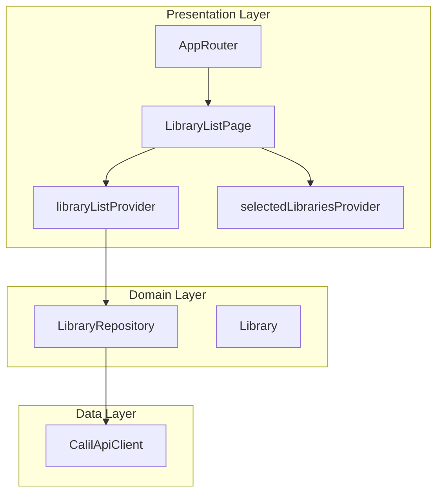
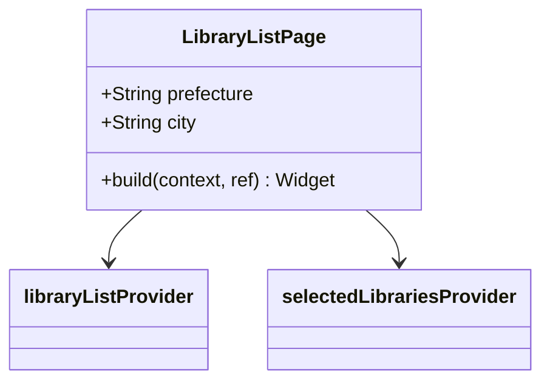
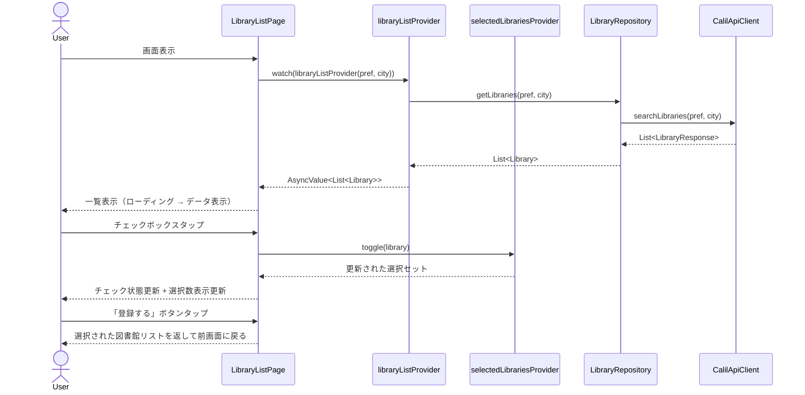

# Issue #10: 図書館一覧表示・選択 - 設計

## Architecture Overview

既存の `LibraryRepository` と `CalilApiClient` を活用し、選択された都道府県・市区町村の図書館一覧を取得・表示する。Riverpod の `FutureProvider.family` で非同期データを管理し、選択状態は `StateNotifierProvider` で管理する。



## Component Design

### Presentation Layer

#### `lib/presentation/pages/library_list_page.dart`

図書館一覧・選択画面。チェックボックス付きリストと登録ボタンを持つ。



#### `lib/presentation/providers/library_list_providers.dart`

図書館一覧取得と選択状態管理のプロバイダー。

```dart
/// 都道府県・市区町村を引数に取り、カーリルAPIから図書館一覧を取得
final libraryListProvider = FutureProvider.family<List<Library>, LibraryListParam>(...);

/// 選択された図書館のセットを管理
final selectedLibrariesProvider = StateProvider<Set<Library>>((ref) => {});
```

`LibraryListParam` は `pref` と `city` を持つパラメータクラス。`FutureProvider.family` の引数として使用する。

### Routing

`app_router.dart` の `/library/add/:pref/:city` ルートのプレースホルダーを `LibraryListPage` に置き換える。

## Data Flow



## Domain Models

既存の `Library` モデルをそのまま使用。新たなドメインモデルの追加は不要。

新規追加:
- `LibraryListParam`: `pref` と `city` を持つパラメータクラス（プロバイダーの引数用）
