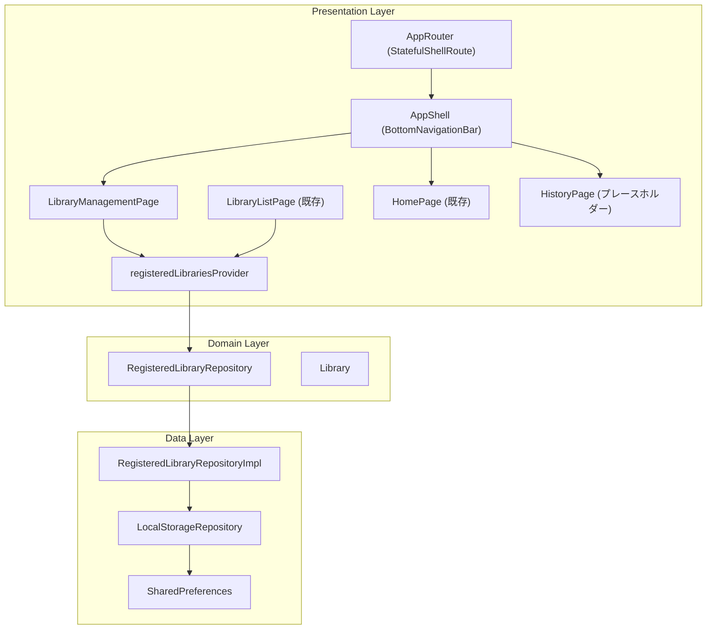
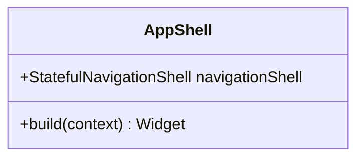
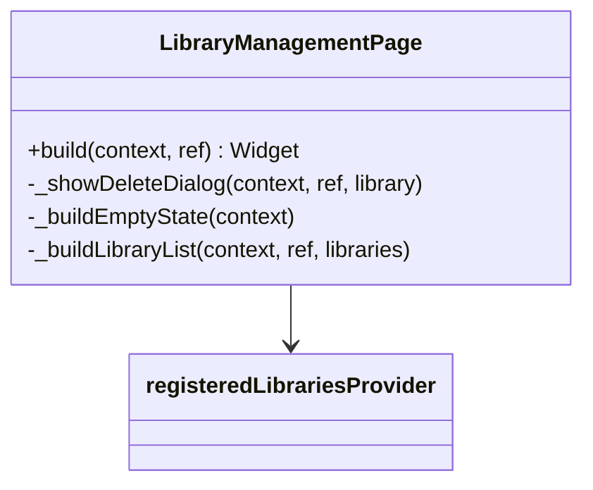
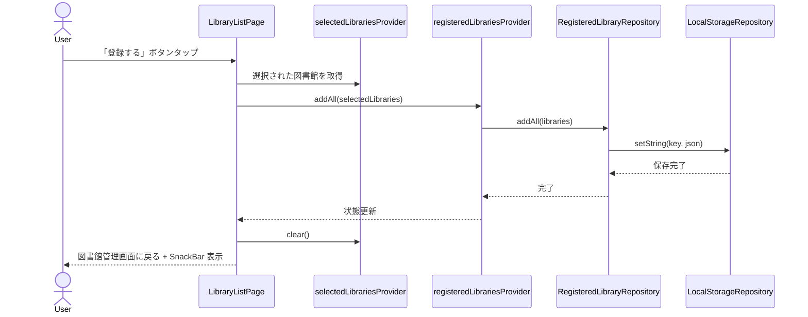
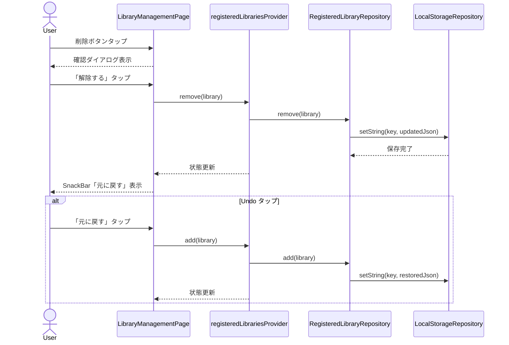

# Issue #11: 登録図書館の管理 - 設計

## Architecture Overview

既存の `LocalStorageRepository` を活用し、登録図書館の永続化を行う。`RegisteredLibraryRepository` を新設して図書館の CRUD 操作をカプセル化する。BottomNavigationBar は go_router の `StatefulShellRoute` で実装し、タブごとに独立したナビゲーションスタックを持たせる。



## Component Design

### Domain Layer

#### `lib/domain/models/library.dart` (既存を拡張)

`Library` モデルに `toJson()` / `fromJson()` を追加し、ローカルストレージへの永続化を可能にする。

```dart
class Library {
  // 既存フィールド...

  Map<String, dynamic> toJson() => { /* ... */ };

  factory Library.fromJson(Map<String, dynamic> json) => Library( /* ... */ );
}
```

#### `lib/domain/repositories/registered_library_repository.dart` (新規)

登録図書館の CRUD 操作を定義する抽象クラス。

```dart
abstract class RegisteredLibraryRepository {
  Future<List<Library>> getAll();
  Future<void> saveAll(List<Library> libraries);
  Future<void> add(Library library);
  Future<void> addAll(List<Library> libraries);
  Future<void> remove(Library library);
}
```

### Data Layer

#### `lib/data/repositories/registered_library_repository_impl.dart` (新規)

`LocalStorageRepository` を使って登録図書館を JSON 文字列として永続化する。

```dart
class RegisteredLibraryRepositoryImpl implements RegisteredLibraryRepository {
  static const _storageKey = 'registered_libraries';

  final LocalStorageRepository _localStorage;
  // JSON エンコード/デコードで Library リストを永続化
}
```

### Presentation Layer

#### `lib/presentation/pages/app_shell.dart` (新規)

BottomNavigationBar を持つシェルウィジェット。`StatefulShellRoute` のシェルとして使用。



#### `lib/presentation/pages/library_management_page.dart` (新規)

登録図書館の一覧表示・削除画面。デザインガイドライン 2.2.1 に準拠。



#### `lib/presentation/pages/history_placeholder_page.dart` (新規)

Phase 4 まではプレースホルダー。

#### `lib/presentation/providers/registered_library_providers.dart` (新規)

```dart
/// 登録図書館リポジトリのプロバイダー
final registeredLibraryRepositoryProvider = Provider<RegisteredLibraryRepository>(...);

/// 登録済み図書館の状態管理
final registeredLibrariesProvider = AsyncNotifierProvider<RegisteredLibrariesNotifier, List<Library>>(...);
```

`RegisteredLibrariesNotifier` は `AsyncNotifier` を継承し、`build()` でストレージから読み込み、`add()` / `remove()` で状態を更新する。

### Routing

`app_router.dart` を `StatefulShellRoute.indexedStack` に変更し、BottomNavigationBar を実現する。

```dart
StatefulShellRoute.indexedStack(
  builder: (context, state, navigationShell) => AppShell(navigationShell: navigationShell),
  branches: [
    StatefulShellBranch(routes: [
      GoRoute(path: '/', builder: ... => HomePage()),
    ]),
    StatefulShellBranch(routes: [
      GoRoute(path: '/library', builder: ... => LibraryManagementPage()),
    ]),
    StatefulShellBranch(routes: [
      GoRoute(path: '/history', builder: ... => HistoryPlaceholderPage()),
    ]),
  ],
)
// 図書館追加フローは ShellRoute 外のトップレベルルートとして定義
GoRoute(path: '/library/add', ...),
GoRoute(path: '/library/add/:pref', ...),
GoRoute(path: '/library/add/:pref/:city', ...),
```

## Data Flow

### 図書館登録フロー



### 図書館削除フロー



## Domain Models

既存の `Library` モデルを拡張（`toJson` / `fromJson` 追加）。新たなドメインモデルの追加は不要。

新規追加:
- `RegisteredLibraryRepository`: 登録図書館の CRUD 操作を定義する抽象クラス
