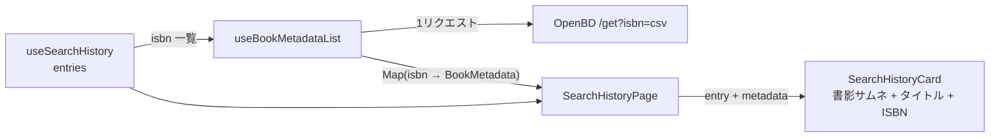

# #141 検索履歴に書籍タイトル・書影を表示 — Design

## 方針: 表示時に OpenBD 一括取得（スキーマ変更なし）

保存時永続化案（D1 に title カラム追加）は、スキーマ変更・既存履歴のタイトル欠落・
保存時取得失敗の恒久化というコストに対し、得られるのは表示の外部非依存のみ。
表示時取得なら **D1 に触れず・既存履歴にも効き・失敗時は現状表示に自然フォールバック**する。
OpenBD は `/get?isbn=a,b,c` の一括取得に対応（キー不要・CORS 開放）し、
履歴上限は 100 件（#115）なので常に 1 リクエストで済む。

## データフロー

## Component Design

1. **`OpenBdApiClient.getByIsbns(isbns: string[])`**（data・新規メソッド）
   - `/get?isbn=<csv>` を1回叩き、`(OpenBdResponse | null)[]`（要求順・該当なしは null）を返す
   - 空配列は即 `[]`。既存 `getByIsbn` のタイムアウト・エラー処理・パースを踏襲
2. **`BookMetadataRepository.getByIsbns(isbns): Promise<Map<string, BookMetadata>>`**（domain 契約追加）
   - 実装（`BookMetadataRepositoryImpl`）はクライアントの配列を Map に変換（null は含めない）
3. **`useBookMetadataList(isbns: string[])`**（hook・新規）
   - queryKey: `['bookMetadataList', sortedIsbns]`・`enabled: isbns.length > 0`
   - 書誌は不変データのため `staleTime: Infinity`。失敗は補助情報として retry 1
4. **`BookCoverThumbnail`**（widget・新規）
   - `BookMetadataCard` の書影フォールバック（Amazon → OpenBD → プレースホルダ、1x1 グレー検知）
     を小型サムネ（既定 44×62）として切り出し。`BookMetadataCard` も本コンポーネントを使う形に整理
5. **`SearchHistoryCard`**（変更）
   - `metadata?: BookMetadata | null` prop を追加
   - 左: BookIcon → 書影サムネに置換 / 1行目: タイトル（1行 ellipsis、未取得時は従来どおり ISBN）
   - タイトル表示時、ISBN は secondary の小さな等幅表記に降格
6. **`SearchHistoryPage`**（変更）
   - `useBookMetadataList(entries.map(e => e.isbn))` を呼び、カードへ配布

## 失敗時の挙動
- OpenBD 障害・オフライン: metadata が空 → 全カードが従来表示（ISBN 主表記）。履歴機能は無影響
- 一部 ISBN が OpenBD 未収載: そのカードのみ従来表示

## テスト（TDD）
- client: 一括 URL 生成・要求順・該当なし null・空配列ショートサーキット
- repo: Map 変換（null 除外）
- hook: 一括取得が1回であること・isbn 順序不問のキー安定
- card: タイトル表示 / metadata なしで ISBN 主表記 / サムネのフォールバック
- page: 一覧にタイトルが出る結合テスト
