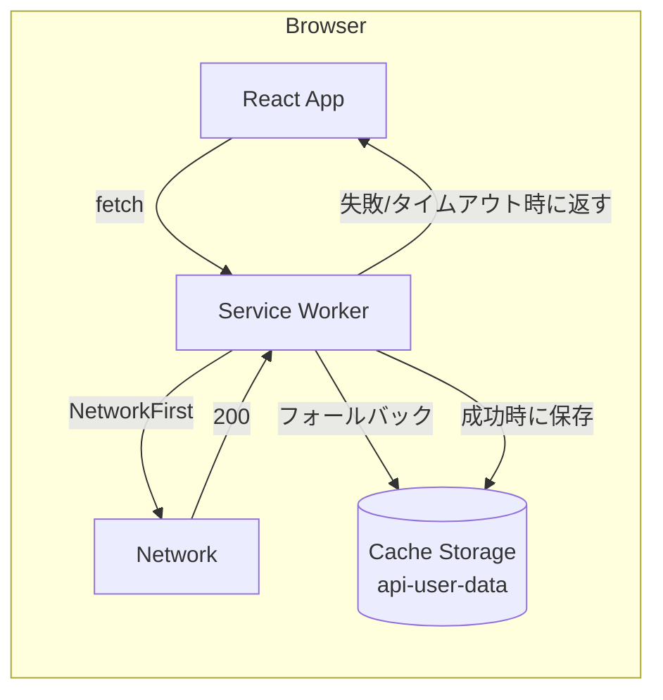

# #143 オフライン時に登録図書館・検索履歴を閲覧できるようにする（レベル2）— Design

## Architecture Overview

Workbox（`vite-plugin-pwa` の `workbox.runtimeCaching`、GenerateSW モード）に、
`GET /api/registered-libraries` と `GET /api/search-history` だけを対象にした
NetworkFirst ルートを追加する。アプリ側のリポジトリ・API クライアント・React Query
フックは変更しない — SW がネットワーク層で透過的にキャッシュするため、
「取得できないときはキャッシュを返す」という挙動はコード変更なしに実現できる。

## Component Design

1. **`vite.config.ts`（`workbox.runtimeCaching`）**
   - `urlPattern`: `({ url }) => url.pathname === "/api/registered-libraries" || url.pathname === "/api/search-history"`
   - `handler: "NetworkFirst"`, `method: "GET"`
   - `options.cacheName: "api-user-data"`、`networkTimeoutSeconds: 3`
   - `options.cacheableResponse: { statuses: [200] }`、`options.expiration: { maxEntries: 2, maxAgeSeconds: 7日 }`
   - `/api/calil/*` は対象パターンに含めない（意図的に除外）
   - コメントで「Workbox の Cache Storage は functions 側の `Cache-Control: no-store`（HTTP キャッシュ抑止）
     とは別レイヤーであり、影響を受けない」ことを明記する
2. **`src/presentation/utils/offlineCache.ts`（新規）**
   - `OFFLINE_API_CACHE_NAME = 'api-user-data'`（vite.config.ts の cacheName と手動で一致させる。
     tsconfig.node.json が root 直下のファイルしか含めずビルド設定と実行時コードの型プロジェクトが
     分かれているため、値を共有する軽量な仕組みを作るより文字列を重複させコメントで対応関係を明記する方を選んだ）
   - `clearOfflineApiCache(): Promise<void>` — `caches.delete(OFFLINE_API_CACHE_NAME)`。
     `typeof caches === 'undefined'` はガードして no-op（テスト環境・非対応環境向け）
3. **`AuthProvider.signOut`（変更）**
   - `clearOfflineApiCache()` を呼び、ログアウト時に該当キャッシュを削除する
4. **`AppShell`（変更）**
   - 既存のオフラインバナー（#145、`useOnlineStatus`）を拡張。
     現在のタブが「図書館」「履歴」のときだけ「オフラインです。表示中のデータは前回取得時点のものです」、
     それ以外（ホーム）は従来どおり「オフラインです」

## Data Flow

- オンライン時: `useRegisteredLibraries`/`useSearchHistory` → `fetch('/api/...')` → SW が
  NetworkFirst でネットワークへ転送 → 成功レスポンスを `api-user-data` キャッシュへ保存しつつページへ返す
- オフライン/タイムアウト時: SW のネットワーク取得が失敗 → `api-user-data` キャッシュにヒットがあれば
  それを返す（React Query 側は成功レスポンスとして扱うため、UI はローディングでもエラーでもなく
  一覧表示になる）→ AppShell のオフラインバナーが「前回取得時点」である旨を補足
- ログアウト時: `signOut()` → `clearOfflineApiCache()` → `api-user-data` 削除 → 次にログインした
  別ユーザーが同一端末で最初にオフラインになっても前ユーザーのデータは出ない

## Domain Models

このイシューはキャッシュ戦略のみで完結し、ドメインモデル（`Library`/`SearchHistoryEntry`）や
リポジトリ契約の変更は行わない。

## 検討した代替案
- **React Query の `persistQueryClient` 等でクライアント側にも永続化する**: Workbox 層だけで
  「取得できなければ最後の成功結果」という要件は満たせるため、二重のキャッシュ層を持つ複雑さを避けて見送った
- **キャッシュに正確な取得時刻を表示する（「最終更新: ○分前」）**: Workbox のプレーンな
  `runtimeCaching` 設定ではレスポンスへの時刻付与にカスタム `plugins` 実装が要り、GenerateSW の
  シリアライズ前提と比べて複雑度が増す。要件（AC-3）は「キャッシュ閲覧である旨の表示」までで
  正確な相対時刻までは求めていないため、まずはシンプルな文言で満たすことにした
