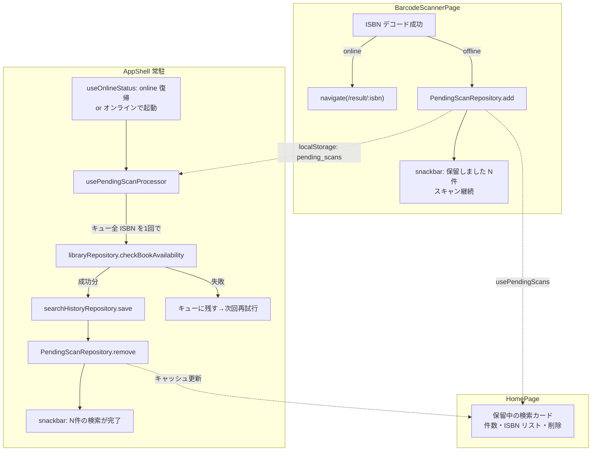
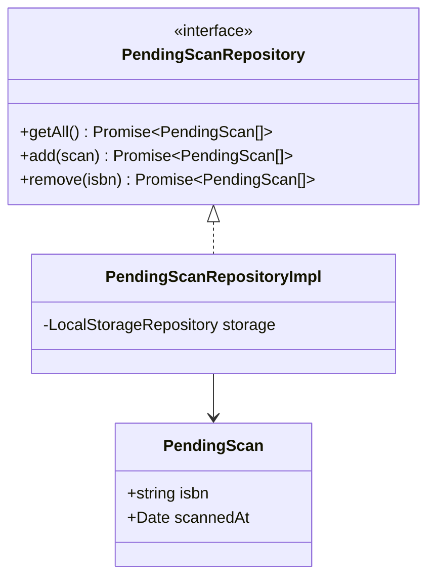

# #144 オフライン中にスキャンした ISBN を貯めて復帰後に自動検索（レベル3）— Design

## Architecture Overview

Service Worker（Background Sync）は使わず、アプリ内（フォアグラウンド）で完結させる。

- **保留キューの永続化**: `localStorage`（既存の `LocalStorageRepository` 抽象を再利用）。
  Issue 本文では IndexedDB（Workbox の Background Sync API が Queue を IndexedDB に
  保持するため）が挙がっていたが、Workbox の `BackgroundSyncPlugin` を使わないと
  決めた時点で IndexedDB の必然性は消える。保存するのは ISBN と読取時刻の小さな
  配列であり、既存の登録図書館・検索履歴（ローカル実装）と同じ
  `LocalStorageRepository` 経由の同期アクセスで十分。新しい依存も非同期の
  初期化も要らない。
- **自動再開**: `useOnlineStatus`（#145）でオンライン復帰を検知し、AppShell 配下に
  常駐するプロセッサフックがキューを処理する。Calil `/check` は複数 ISBN を
  1セッションで受けられるため、キュー全体を1回の `checkBookAvailability` に
  まとめて実行する（ポーリングセッションを ISBN 件数分張らない）。

## Component Design

### Domain 層（新規）

1. **`src/domain/models/pendingScan.ts`**
   - `PendingScan { isbn: string; scannedAt: Date }`
2. **`src/domain/repositories/pendingScanRepository.ts`**
   - `getAll(): Promise<PendingScan[]>`
   - `add(scan: PendingScan): Promise<PendingScan[]>` — 同一 ISBN は上書きせず既存を維持（重複排除、FR-3）
   - `remove(isbn: string): Promise<PendingScan[]>`
   - 戻り値は「更新後リスト」（#100 P2-6 で整理した検索履歴リポジトリと同じ契約。
     呼び出し側が React Query キャッシュを直接更新できる）

### Data 層（新規）

3. **`src/data/repositories/pendingScanRepositoryImpl.ts`**
   - `LocalStorageRepository` ベース。キー: `pending_scans`、値: JSON 配列
     （`scannedAt` は ISO 文字列で保存し復元時に `Date` へ）
   - 壊れた JSON は空配列として扱う（既存ローカル実装の慣例に合わせる）
   - `src/app/dependencies` に `pendingScanRepository` を追加（サーバ実装は作らない。
     NFR-2 のとおり端末ローカル専用で、認証ユーザーに紐づけない）

### Presentation 層

4. **`src/presentation/hooks/usePendingScans.ts`（新規）**
   - `usePendingScans()`: `useQuery({ queryKey: ['pendingScans'] })`
   - `usePendingScanMutations()`: `add` / `remove`。`onSuccess` で戻り値リストを
     `setQueryData`（`useSearchHistoryMutations` と同型）
   - **クエリ・ミューテーションとも `networkMode: 'always'` 必須**（実装時に
     ブラウザ検証で発覚）: React Query v5 の既定 `'online'` は offline イベントを
     受けるとフェッチ/ミューテーションを一時停止する。保留キューは localStorage
     しか触らず、しかも肝心の操作（追加）がオフライン中に行われるため、既定の
    ままでは「オフライン中に保留できない・カードが表示されない」。
5. **`src/presentation/hooks/usePendingScanProcessor.ts`（新規・中核）**
   - AppShell から1箇所だけマウントする常駐フック
   - 発火条件: `isOnline === true` かつ `pendingScans.length > 0` かつ
     `useRegisteredLibraries().isSuccess`（登録図書館 0 件なら何もしない）
   - 実行: キュー全 ISBN を `libraryRepository.checkBookAvailability({ isbn: [...], systemIds })`
     1回で検索 → ISBN ごとに結果が得られたものを検索履歴へ保存
     （`BookSearchResultPage.useSaveHistoryOnResult` と同じ分館単位ステータス変換。
     変換ロジックは `src/presentation/utils/availabilityToHistoryStatuses.ts` として
     抽出し両者で共用する）→ キューから削除 → 完了通知
     「保留していた N 件の検索が完了しました」
   - 失敗（例外）時: キューを触らず終了（FR-7。次の `online` イベント or 次回起動で再試行）
   - 多重実行ガード: `useRef` の実行中フラグ（`online` イベント連打・再レンダー対策）
   - 検索結果は `queryClient.setQueryData(['bookAvailability', isbn, systemIds], ...)` にも
     反映し、履歴から結果画面を開いたときに再検索なしで表示できるようにする
6. **`BarcodeScannerPage`（変更）**
   - `handleDecoded` の ISBN 分岐に割り込み: オフライン時は `add(isbn)` →
     snackbar「オフラインのため保留しました（N件）」→ `isProcessingRef` を
     立てずスキャン継続（FR-2）。連続通知は既存の非 ISBN 通知と同様に抑制
   - オンライン時は従来どおり即遷移（NFR-3）
7. **`HomePage`（変更）**
   - `usePendingScans()` が 1 件以上のとき「保留中の検索（N件）」カードを表示。
     各行: ISBN・読取時刻・削除ボタン（FR-4）。0 件なら何も出さない
8. **`AppShell`（変更）**
   - `usePendingScanProcessor()` をマウント

## Data Flow

1. **オフライン・スキャン時**: decode → `interpretScannedBarcode` → ISBN →
   `isOnline === false` → `pendingScanRepository.add` → localStorage 更新 →
   `['pendingScans']` キャッシュ更新 → snackbar → スキャン継続
2. **復帰時**: `online` イベント → `useOnlineStatus` が true →
   `usePendingScanProcessor` 発火 → 1回の `/check`（全 ISBN・全 systemId、
   ポーリング込み）→ ISBN ごとに履歴保存 + キュー削除 + `bookAvailability`
   キャッシュ反映 → 完了 snackbar → ホームの保留カードが消える
3. **起動時（オンライン・キューあり）**: マウント時に同じ条件判定で 2. を実行

## Domain Models

## 検討した代替案

- **Workbox `BackgroundSyncPlugin`（SW 完結）**: Calil `/check` がポーリング形式
  （最大60秒・セッション継続）でリプレイ1発では完結しない、認証 Bearer が
  アプリ側メモリにある、結果の履歴保存もアプリ側ロジック、の3点で不成立。
  Issue 本文の懸念どおりフォアグラウンド再実行に落とした。
- **IndexedDB 永続化**: 上記を捨てた時点で利点がない（前述）。
- **復帰時に `/result/:isbn` へ自動遷移**: 複数件保留時の遷移順・閲覧中操作の
  横取りが UX として悪い。履歴への自動保存 + 通知に統一し、単票表示は既存の
  履歴 → 結果画面の導線に乗せる。
- **ISBN 1件ずつ順次検索**: ポーリングセッションが件数分になり NFR-1 に反する。
  一括検索で1セッションに抑える。

## 未解決課題への回答（Issue 記載分）

- **Calil ポーリングと Background Sync の相性** → Background Sync は使わない（上記）。
- **複数 ISBN の検索順序・UI** → 一括1回検索のため順序問題は消える。表示は
  検索履歴（searchedAt 降順の既存仕様）に委ねる。
- **保留中に登録図書館の構成が変わった場合** → 実行時点の登録図書館で検索する
  （キューは ISBN のみ保持し、図書館構成をスナップショットしない）。
