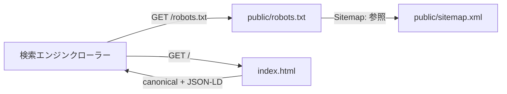

# #151 SEO対策: sitemap.xml・canonical・構造化データを追加 — Design

## Architecture Overview

静的ファイル（`public/sitemap.xml`）と `index.html` の `<head>` 追記のみで完結する。
アプリケーションコード（React/TS）の変更は無い。

## Component Design

1. **`public/robots.txt`（変更）**
   - 末尾に `Sitemap: https://libcheck.app/sitemap.xml` を追加。
2. **`public/sitemap.xml`（新規）**
   - `/` のみを1エントリとして登録するシンプルな `urlset`。
   - ログイン後の画面はそもそもクロール対象ではないため、他 URL は含めない。
3. **`index.html`（変更）**
   - `<head>` に以下を追加:
     - `<link rel="canonical" href="https://libcheck.app/" />`
     - `<script type="application/ld+json">` で `SoftwareApplication` の
       構造化データ（`name`, `description`, `url`, `applicationCategory`,
       `operatingSystem`, `offers`（無料である旨））。
   - 既存の OGP / Twitter カード（#116）はそのまま維持。

## Data Flow

- クローラーが `robots.txt` を取得 → `Sitemap:` 行から `sitemap.xml` を辿る →
  `/` を発見・取得 → HTML 内の canonical と JSON-LD を読み取る。
- ユーザー操作やランタイムの挙動には一切影響しない（ビルド時に静的出力される
  ファイルのみの変更）。

## Domain Models

該当なし（ドメインモデル・リポジトリの変更はない）。

## 検討した代替案

- **SSR / プリレンダリングの導入**: ランディングページのみプリレンダリングすれば
  クローラーの JS 実行に依存しなくなるが、ビルドパイプラインの変更が大きく、
  本 Issue の「最小改善」のスコープを超えるため見送り。将来、インデックス状況を
  Search Console で見てから要否を判断する。
- **複数ページのコンテンツ SEO（比較記事・使い方ガイド等）**: 製品が全機能
  ログイン必須のユーティリティアプリであり、コンテンツマーケティング型の SEO は
  費用対効果が低いと判断し対象外。
