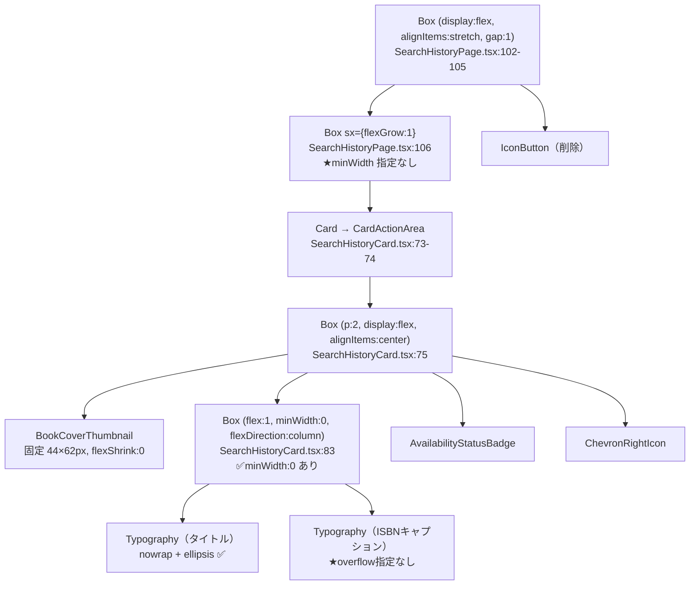

# Design — #153 履歴画面（モバイル）の横スクロールバー問題

## Architecture Overview

対象は `presentation` 層のみ。ロジック（`domain`/`data`）に変更はなく、`SearchHistoryPage` と `SearchHistoryCard` の MUI `sx` によるレイアウト調整に閉じる。

## Component Design

現在のコンポーネント構造（抜粋）:

### 原因

CSS Flexbox で flex item の `min-width` の初期値は `auto` であり、これは「0」ではなく「その要素の内容に基づく自動最小サイズ（≒折り返さずに描画したときの preferred/max-content 幅）」に解決される。

- `TextCol`（`SearchHistoryCard.tsx:83`）には `minWidth: 0` が設定済みなので、*その内部* のタイトルは正しく省略記号で切り詰められる。
- しかし `Wrapper`（`SearchHistoryPage.tsx:106`）は `Row` の flex item でありながら `minWidth: 0` が無い。`Card`・`CardActionArea`・`InnerRow` のいずれも幅を制約していないため、`Wrapper` の自動最小幅は実質「タイトル文字列を折り返さず描画した幅」に近い値まで膨らむ。
- 結果として `Wrapper` は `Row` の残り幅（`Delete` ボタン分を引いた幅）まで縮まりきれず、タイトルが長い書籍の行だけ画面幅を超えてはみ出す。
- タイトルが短い書籍は自動最小幅がそもそも画面幅未満なので問題が顕在化しない — これが「書籍によって横幅が異なる」現象の正体。

実測（Claude in Chrome, 390×844 相当, `document.querySelector` によるライブ計測）:

| 要素 | 幅 |
|---|---|
| スクロールコンテナ `clientWidth` | 591px |
| スクロールコンテナ `scrollWidth`（短いタイトルのみなら想定） | 591px |
| スクロールコンテナ `scrollWidth`（長いタイトル混在、修正前） | 853px |
| 短いタイトル行の幅 | 559px（コンテナ内に収まる） |
| 長いタイトル行の内部 `Wrapper` 相当要素の幅（修正前） | 763px |
| `Wrapper` に `minWidth:0` を当てた場合（検証パッチ） | 511px（行全体は 559px に収束） |

## Data Flow

変更なし（`useSearchHistory` / `useBookMetadataList` によるデータ取得フローは既存のまま）。

## Domain Models

変更なし。

## 修正方針

1. `SearchHistoryPage.tsx:106` の `Box sx={{ flexGrow: 1 }}` に `minWidth: 0` を追加する。
   - `Row` の flex item として正しく「利用可能幅まで縮む」ようになり、内部で既に効いているタイトルの ellipsis 省略と組み合わさって行全体が画面幅に収まる。
2. `SearchHistoryCard.tsx` の ISBN 表記（`:96-102` のキャプション、`:105-110` のフォールバック本文）にも、タイトルの `Typography` と同じ `overflow: 'hidden', textOverflow: 'ellipsis', whiteSpace: 'nowrap'` を追加する。
   - 現状 ISBN は固定 13 桁のため主要因ではないが、表示ロジックの対称性・将来の堅牢性のために合わせて修正する。

## テスト方針

jsdom は実レイアウトを行わないため `scrollWidth`/`clientWidth` によるオーバーフロー検証は unit test では不可能。したがって:

- Unit test（Vitest）: 既存の `SearchHistoryPage.test.tsx` / `SearchHistoryCard.test.tsx` の回帰を防ぐこと（描画内容・ISBN 表示・削除操作などは変更しないため、既存テストがそのまま regression guard になる）。加えて、該当 `sx`（`minWidth: 0`、ISBN 表記の `whiteSpace: nowrap` 等）が実装に反映されていることを、必要であれば軽量な構造アサーション（例: `getComputedStyle` で解決できる範囲）で補強する。過度に実装詳細に依存するテストは追加しない。
- ブラウザ実機検証（Claude in Chrome）: 360px/390px/430px の各幅で、タイトル長の異なる複数エントリ（短い・長い・ISBN のみ）を表示し、スクロールコンテナの `scrollWidth === clientWidth` であることと、screenshot 目視で横スクロールバーが出ないことを確認する。PR の Test Plan に手順と結果を記載する。
