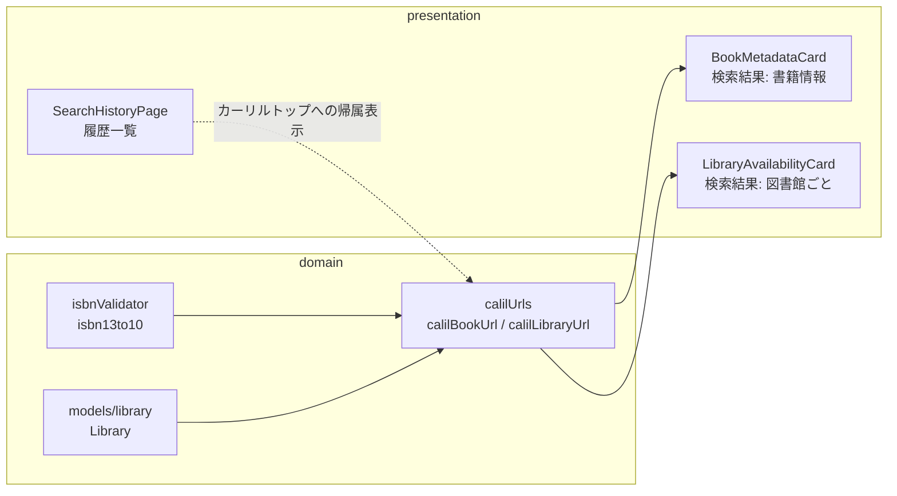
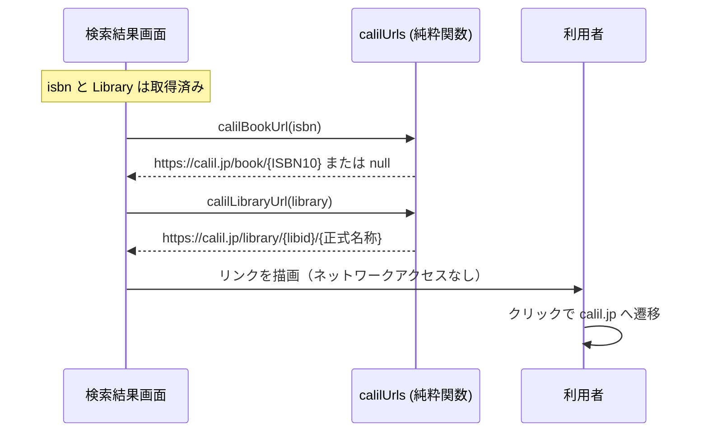

# Design — #156 カーリルAPI規約: リンクバックの実装

## Architecture Overview

変更は `domain`（URL 導出の純粋関数）と `presentation`（リンクの配置）に閉じる。`data` 層・API 呼び出しには一切変更を加えない。

既存の `src/domain/utils/amazonUrls.ts`（ISBN から Amazon の URL を純粋関数で導出する）と**同じ構成**を踏襲し、`src/domain/utils/calilUrls.ts` を新設する。依存の向きは `presentation → domain` で、Clean Architecture の制約を満たす。



## Component Design

### 1. `src/domain/utils/calilUrls.ts`（新規）

`amazonUrls.ts` と同じく、副作用のない純粋関数群として実装する。

#### `calilBookUrl(isbn: string): string | null`

- 仕様形式: `https://calil.jp/book/{ISBN10}`
- `isbnValidator.isbn13to10()` で ISBN10 を導出する。
- **導出できない場合（979 始まり等）は `null` を返す。**
  - `amazonProductUrl` は検索 URL にフォールバックするが、**カーリルの検索 URL は仕様書に記載がない**ため、未検証の URL を推測で使わない。
  - `null` の場合は書籍リンクを表示しない。後述のとおり、貸出状況を表示する画面には図書館リンクが必ず存在するため、規約充足は維持される。

#### `calilLibraryUrl(library: Library): string`

- 第一形式: `https://calil.jp/library/{libId}/{encodeURIComponent(formalName)}`
- **フォールバック**: `libId` または `formalName` が空の場合は、仕様書が定める第二形式
  `https://calil.jp/library/search?s={systemId}&k={libKey}` を使う。
  - `libraryResponseFromJson` は欠損フィールドを空文字にフォールバックするため（`stringOrDefault`）、空文字が現実に起こりうる。
  - 第二形式は実際に HTTP 200 が返ることを検証済み（`?s=Tokyo_Setagaya&k=中央`）。
- 正式名称には日本語・記号が含まれるため必ず URL エンコードする。

### 2. リンクの配置

規約の対象は「図書館名**または**貸出状況を表示するとき」であり、蔵書検索の画面だけでなく**図書館名を一覧表示する画面もすべて対象**になる。該当箇所は次のコマンドで洗い出した。

```bash
grep -rn "formalName\|shortName\|systemName" src/presentation --include="*.tsx" | grep -v "\.test\."
grep -rln "AvailabilityStatusBadge" src/presentation --include="*.tsx" | grep -v "\.test\."
```

| 画面 | 表示している規約対象 | 追加するリンク | 配置 |
|---|---|---|---|
| 検索結果 `/result/:isbn` | 図書館名・貸出状況 | 書籍ページ + 図書館ページ | `BookMetadataCard` / `LibraryAvailabilityCard` |
| 登録図書館の管理 `/library` | 図書館名 | 図書館ページ | `LibraryManagementPage`（図書館名をリンク化） |
| 図書館の選択 `/library/add/:pref/:city` | 図書館名 | カーリルへの帰属表示 | `LibraryListPage` 一覧下部 |
| 検索履歴 `/history` | 貸出状況（スナップショット） | カーリルへの帰属表示 | `SearchHistoryPage` 一覧下部 |

### リンク形態の使い分け（適用ルール）

同じ「図書館名の表示」でも、画面の構造によってリンクの付け方を変える。判断基準は次のとおり。

- **図書館名がコンテンツとして提示されている場合**（検索結果の蔵書状況カード、登録図書館の管理一覧）
  → **図書館名そのものをリンクにする。** 意味的に最も直接的で、要素を増やさない。
- **図書館名が別目的の操作コントロールの一部である場合**（図書館の選択画面はチェックボックス選択が目的で、行全体が `ListItemButton`）
  → **一覧単位の帰属表示にする。** `<button>` の内側に `<a>` を置くのは不正な入れ子でありアクセシビリティ上も問題があるため、名前自体はリンクにできない。

なお `LibraryManagementPage` の削除確認ダイアログ（「『X』の登録を解除します。」）にも図書館名が現れるが、破壊的操作の確認モーダル内に外部リンクを置くと誤タップで操作が中断されるため、リンクは付けない。同じ図書館は背後の一覧でリンク済みである。

#### `BookMetadataCard`（検索結果・書籍情報）

既存の「Amazonで見る」ボタン（`variant="outlined"` + `OpenInNewIcon` + `target="_blank" rel="noopener noreferrer"`）と**同じパターン**で「カーリルで見る」ボタンを追加する。既存の視覚言語に自然に馴染み、追加の学習コストがない。

`calilBookUrl` が `null` のときはボタンを描画しない。

#### `LibraryAvailabilityCard`（検索結果・図書館ごと）

**図書館名（`formalName`）そのものをリンクにする。** 規約が「図書館名を表示するときはリンクを貼る」と定めているため、名前自体をリンクにするのが意味的に最も直接的で、要素数も増えない。

既存の「予約する」ボタンとは役割が異なる（予約は各図書館システムへ、こちらはカーリルの図書館ページへ）ため併存させる。

#### `SearchHistoryPage`（履歴一覧）

一覧の下部に帰属表示を1つ置き、`https://calil.jp/` へリンクする。

**この設計判断の理由:**

1. 履歴カードは貸出状況（バッジ）を表示するが**図書館名は表示しない**ため、リンク先として図書館ページは選べない。
2. 行ごとに書籍ページへのリンクを置く案は却下した:
   - 履歴カード全体が `CardActionArea`（ボタン）であり、その内側に `<a>` を入れるのは不正な HTML かつアクセシビリティ上も問題がある。外側に置くと削除ボタンと合わせて1行に3つのタップ対象が並ぶ。
   - #153 で修正したばかりの横幅オーバーフロー問題を再発させるリスクがある。
3. 一覧全体に対する帰属表示であれば、書籍固有の文脈を持たない画面でも自然であり、「貸出状況を表示する画面にカーリルへのリンクが存在する」という要件を満たす。

なお履歴の貸出状況は過去の検索結果のスナップショットだが、**API 経由で取得したデータであることに変わりはない**ため、規約の対象として扱う。

## Data Flow

データ取得のフローは変更しない。リンク URL は既に画面が保持している値（`isbn`、`Library`）から純粋関数で導出するだけで、**追加の API 呼び出しは発生しない**（＝カーリルのレート制限を一切消費しない）。



## Domain Models

変更なし。`Library`（`src/domain/models/library.ts`）は既に `libId` / `formalName` / `systemId` / `libKey` を保持しており、両形式の URL 生成に必要な値がすべて揃っている。新たに取得・永続化すべきデータは無い。

## テスト方針

- **`calilUrls.test.ts`（新規）**: URL 生成の純粋関数を網羅する。`amazonUrls.test.ts` と同じ構成に揃える。
  - ISBN13 → `https://calil.jp/book/{ISBN10}` に変換されること
  - ISBN10 をそのまま渡した場合も正しく扱えること
  - 979 始まり・不正な ISBN で `null` を返すこと
  - 図書館 URL が第一形式で生成され、正式名称が URL エンコードされること
  - `libId` / `formalName` が空のとき第二形式にフォールバックすること
- **ウィジェットのテスト**: 既存の各テストファイルに、リンクが存在し `href` が期待値であることのアサーションを追加する。
- **ブラウザ実機確認**: リンクが実際にカーリルの正しいページへ遷移することを確認する（URL 形式の最終検証）。ただし calil.jp への不要なリクエストは避け、確認は必要最小限の回数に留める。
