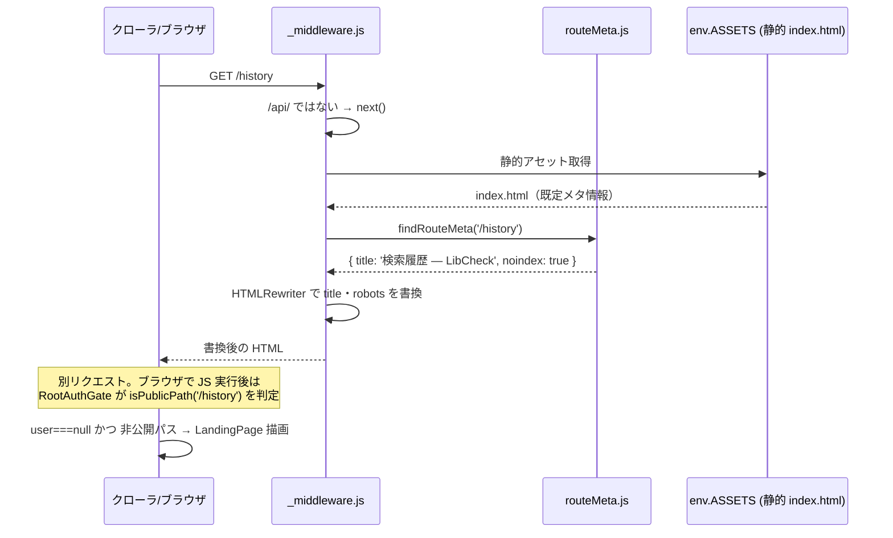

# Design — #157 SEO基盤: 公開ルートの分離とルート別メタ情報の配信

## Architecture Overview

```mermaid
graph TD
  subgraph "クライアント (src/)"
    App[App.tsx]
    RAG[RootAuthGate<br/>ルーター内・pathless layout route]
    Routes[router.tsx: routes<br/>★既存のまま・非ゲート]
    PP[publicPaths.ts<br/>isPublicPath(pathname)]
  end
  subgraph "エッジ (functions/)"
    MW[_middleware.js<br/>ルート直下]
    RM[_shared/routeMeta.js<br/>パス→メタ情報]
  end

  App --> RAG
  RAG -->|Outlet| Routes
  RAG -.->|参照| PP
  MW -.->|参照| RM
  Browser[ブラウザ / クローラ] -->|HTTPリクエスト| MW
  MW -->|env.ASSETS.fetch| Static[静的 index.html]
  MW -->|HTMLRewriter で書換| Browser
```

2つの独立した仕組みを組み合わせる。**クライアント側**（`RootAuthGate` + `isPublicPath`）は「未ログインでもそのページ自身を描画するか」を決め、**エッジ側**（`_middleware.js` + `routeMeta.js`）は「クローラー・SNSボットが見る HTML の `<head>` に何を出すか」を決める。両者は独立して動作し、どちらか一方だけでも意味を持つ（例: ログイン必須のまま `noindex` だけ出す、公開はするが特別なメタ情報は無い、等）。

## 既存アーキテクチャ上の制約（設計を決めた理由）

`src/test/testUtils.tsx` の `renderRouteWithProviders()` は `router.tsx` が export する `routes` 配列を直接 `createMemoryRouter(routes, ...)` に渡して使う。既存のページテスト（`LibraryListPage.test.tsx` 等、7ファイル以上）はこの経路を使い、**多くが `authUser` を省略している**（＝`AuthProvider initialUser={null}`）。既存の `AuthGate.tsx` のコメントにも明記されている設計判断だが、これは「`routes` 自体はログイン状態を問わずページを描画できる」という前提の上に成り立っている。

もし `routes` 配列自体（各ルートの `element`）を `RequireAuth` 的なラッパーで直接包む設計にすると、この前提が崩れ、**`authUser` を渡していない既存テストが軒並み「ランディングページが出る」に変わって壊れる**（実測: `grep` で `authUser` を渡していない route ベースのテストファイルが7つ該当）。これは #157 の本質的な変更ではない大量の副作用であり、避けるべきである。

そのため本設計では **`routes` 配列自体には手を入れず**、ゲーティングを `createAppRouter()` が組み立てる**実アプリ専用のルーター**のほうにだけ追加する。テスト用の `routes`（＝`renderRouteWithProviders` が使うもの）は今までどおり非ゲートのまま残るため、既存テストは無改修で動く。

## Component Design

### 1. `src/presentation/auth/publicPaths.ts`（新規）

```ts
// 現時点では空。#158・#159 が実際にルートを公開する際にここへ追加する。
export const PUBLIC_PATHS: readonly string[] = [];

// 完全一致、または ":seg" 部分をワイルドカードとして扱う。
// 例: pattern "/library/add/:pref" は "/library/add/東京都" にマッチする。
export function isPublicPath(
  pathname: string,
  publicPaths: readonly string[] = PUBLIC_PATHS,
): boolean {
  return publicPaths.some((pattern) => matchesPattern(pathname, pattern));
}
```

`PUBLIC_PATHS` は本Issueでは空配列のまま出荷する（＝挙動は変わらない）。#158・#159 はこの配列にパスパターンを追加するだけで、その画面を未ログインで描画できるようになる。

### 2. `src/presentation/auth/RootAuthGate.tsx`（新規、`AuthGate.tsx` を置き換え）

`createAppRouter()` が組み立てるルーターの**最上位 pathless レイアウトルート**として配置する。ルーター内部に置くため `useLocation()` / `<Outlet/>` が使える（現行の `AuthGate` は `<RouterProvider>` の外側にあり `useLocation()` が使えなかった）。

```tsx
export function RootAuthGate(): JSX.Element {
  const { user } = useAuth();
  const location = useLocation();
  const queryClient = useQueryClient();

  useEffect(() => {
    if (user === null) queryClient.clear();
  }, [user, queryClient]);

  if (user === null && !isPublicPath(location.pathname)) {
    return <LandingPage />;
  }
  return <Outlet />;
}
```

キャッシュクリアの副作用は今までどおり「ログアウトで1回だけ」発火する（`RootAuthGate` はアプリ生存期間中ずっとマウントされたままのため）。

### 3. `src/app/router.tsx`

```tsx
export const routes: RouteObject[] = [ /* 既存のまま、一切変更しない */ ];

export function createAppRouter() {
  return createBrowserRouter([
    {
      errorElement: <RouteErrorFallback />,
      element: <RootAuthGate />,   // ← 追加。ここだけが変更点
      children: routes,
    },
  ]);
}
```

### 4. `src/App.tsx`

`<AuthGate>` での全体ラップを外す。ゲーティングは `createAppRouter()` の内部（＝`RouterProvider` が実際に使うルーター）に移ったため、`App.tsx` 側は単純化される。

```tsx
<SelectedLibrariesProvider>
  <RouterProvider router={router} />
</SelectedLibrariesProvider>
```

### 5. `functions/_shared/routeMeta.js`（新規）

```js
// パスパターン → メタ情報。router.tsx のルート定義と対応関係にあるが、
// Pages Functions は src/ の React コンポーネントを import できないため
// 独立して持つ（#157 design.md 参照）。ルートを追加・変更したら両方を
// 更新すること。
export const ROUTE_META = [
  // '/' は #151 で作り込んだ index.html 既定のメタ情報をそのまま使う
  // （ランディングページは元々公開・indexable）。ここには含めない = 無変更。
  { pattern: '/library', title: '登録図書館 — LibCheck', noindex: true },
  { pattern: '/history', title: '検索履歴 — LibCheck', noindex: true },
  { pattern: '/library/add', title: '図書館を追加 — LibCheck', noindex: true },
  { pattern: '/library/add/:pref', title: '図書館を追加 — LibCheck', noindex: true },
  { pattern: '/library/add/:pref/:city', title: '図書館を追加 — LibCheck', noindex: true },
  { pattern: '/scan', title: 'バーコードスキャン — LibCheck', noindex: true },
  { pattern: '/isbn-input', title: 'ISBN入力 — LibCheck', noindex: true },
  { pattern: '/result/:isbn', title: '検索結果 — LibCheck', noindex: true },
];

export function findRouteMeta(pathname) { /* ROUTE_META から一致するものを探す。無ければ null */ }
```

`/` 以外の**既知の全ルート**に `noindex: true` を設定する（まだ公開していないため）。**未知のパス**（typo・存在しないURL）は `findRouteMeta` が `null` を返すが、この場合もミドルウェア側で安全側に倒し `noindex` を付与する（後述）。

### 6. `functions/_middleware.js`（新規、ルート直下）

```js
import { findRouteMeta } from './_shared/routeMeta.js';

export async function onRequest(context) {
  const { request, next } = context;
  const url = new URL(request.url);

  // /api/* は素通し。カーリル/OpenBD 連携や認証に一切影響を与えない
  // （スパイクで /api/me が変わらず 401 を返すことを確認済み）。
  if (url.pathname.startsWith('/api/')) {
    return next();
  }

  const response = await next();
  const contentType = response.headers.get('content-type') ?? '';
  if (!contentType.includes('text/html')) {
    return response; // 静的アセット（JS/CSS/画像）は素通し
  }

  const meta = findRouteMeta(url.pathname);
  if (meta === null && url.pathname === '/') {
    return response; // ランディングは #151 の既定メタをそのまま使う
  }

  const rewriter = new HTMLRewriter().on('meta[name="robots"]', {
    element(el) {
      el.setAttribute('content', 'noindex');
    },
  });
  if (meta !== null) {
    rewriter
      .on('title', { element(el) { el.setInnerContent(meta.title); } })
      .on('meta[property="og:title"]', {
        element(el) { el.setAttribute('content', meta.title); },
      });
  }
  return rewriter.transform(response);
}
```

`context.next()` を使うことで、`functions/api/*` の既存ハンドラや静的アセット配信には一切手を加えない（スパイクで実証済み）。

### 7. `index.html`

`<meta name="robots" content="index,follow">` を明示的に追加する。現状は robots メタタグが存在しないため（デフォルトは index,follow 相当だが暗黙的）、HTMLRewriter が `setAttribute` で書き換えられる**アンカーとして先に用意しておく**（要素が存在しないと `on('meta[name="robots"]', ...)` のコールバックは発火しない）。

## Data Flow



サーバ側（メタ情報）とクライアント側（実際に見せる内容）は独立して判断される。これは意図的な設計であり、両者が食い違う場合（＝サーバはルート名を出すがクライアントはランディングを見せる）は `noindex` によって検索結果への実害を防ぐ。

## Domain Models

変更なし。純粋にプレゼンテーション層とエッジ配信層の変更。

## PWA / Service Worker との相互作用（既知の制約）

`vite.config.ts` の `navigateFallback: '/index.html'` により、Service Worker はナビゲーションリクエストに対してプリキャッシュ済みの `index.html`（＝ビルド時点の既定メタ情報）を返しうる。これは以下の理由で許容する。

- Googlebot・SNS プレビュー bot は基本的に SW を経由しない（初回クロールに永続化されたキャッシュを持たない）ため、SEO上の実害はない。
- クライアント側ルーティング（アプリ内遷移）はそもそも HTML を再フェッチしない。影響があるのは「PWA インストール済みユーザーが外部リンク等からハードナビゲーションしたとき」に限られ、影響はブラウザタブのタイトル表示程度に留まる。

ただし CLAUDE.md の方針（SW 変更時は `waiting` に留まらないことを実機確認）に従い、本Issueの変更が **SW の更新配信自体を壊していないか**は実機で確認する。

## テスト方針

- `publicPaths.test.ts`: `isPublicPath` の完全一致・動的セグメント（`:pref` 等）・非公開デフォルトを網羅
- `RootAuthGate.test.tsx`: `createMemoryRouter` で最小構成のルートツリーを組み、(a) 非公開パス・未ログイン → ランディング、(b) 公開パス（テスト用に `publicPaths` を注入）・未ログイン → 子要素描画、(c) ログイン済みならパスに関わらず子要素描画、(d) ログアウトで `queryClient.clear()` が1回呼ばれる、を検証
- 既存の `AuthGate.test.tsx` は `RootAuthGate.test.tsx` に置き換え、`AuthGate.tsx` は削除する
- 既存のページテスト・`App.test.tsx` は**無改修のまま**パスすることを確認する（設計上の最重要検証項目）
- `functions/_shared/routeMeta.test.ts`: `findRouteMeta` のパターンマッチを網羅（Vitest で直接テスト可能。Cloudflare 固有 API に依存しない純粋関数のため）
- ブラウザ実機確認: `npx wrangler pages dev` で `/history` 等が `noindex` 付きで返り、`/api/me` が影響を受けず、静的アセットが壊れないことを `curl` で確認。あわせて PWA の SW 更新が `waiting` に留まらないことをブラウザで確認
