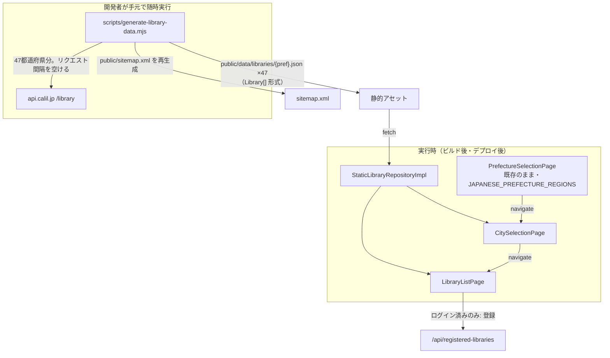
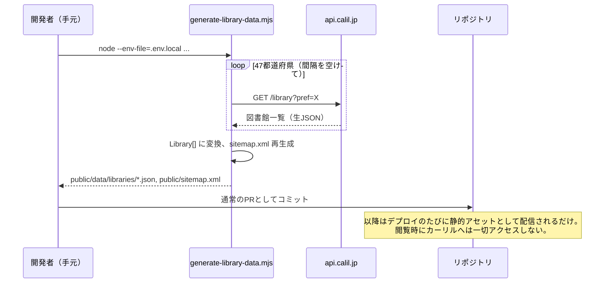

# Design — #158 地域（自治体×図書館）ページを認証なしで公開する

## Architecture Overview



データ取得（カーリル呼び出し）とデータ配信（アプリの実行時）を完全に分離する。実行時は静的JSONの `fetch` のみで、カーリルの利用制限を一切消費しない。

## Component Design

### 1. `scripts/generate-library-data.mjs`（新規）

- `node --env-file=.env.local scripts/generate-library-data.mjs` で実行する開発者手動実行スクリプト（`package.json` に `"generate:library-data"` として登録）。
- `src/domain/data/japanesePrefectures.ts` の `JAPANESE_PREFECTURE_REGIONS` から全47都道府県名を取得。
- 各都道府県について `https://api.calil.jp/library?appkey=...&pref=...&format=json&callback=no` を直接呼び出す（アプリの `/api/calil` プロキシは認証必須のため使えない。ビルド前提のスクリプトなので直接呼び出しが妥当）。
- リクエスト間に間隔（例: 500ms）を空け、カーリルへの配慮とする。
- レスポンスの各エントリを `Library` 型（camelCase）に変換する小さなマッピング関数を持つ。`src/data/models/libraryResponse.ts` の `libraryResponseFromJson` と同じフィールド対応だが、このスクリプトは素の Node（TSコンパイル無し）で動かすため、対応関係を保つコメント付きで**意図的に複製**する。
- `public/data/libraries/{pref}.json` に `Library[]` を書き出す（例: `public/data/libraries/東京都.json`）。ファイル名は既存ルーティング（`/library/add/:pref` が日本語の都道府県名をそのまま使う）に合わせ、日本語のまま使う。
- 全都道府県の書き出し完了後、都道府県ごとの市区町村一覧（`Set<string>` の重複排除）を使って `public/sitemap.xml` を再生成する（下記4）。
- 実行ログには件数のみ出力し、`CALIL_APP_KEY` の値は一切出力しない。

### 2. `src/data/datasources/staticLibraryDataSource.ts`（新規）

都道府県別の静的JSONを取得する薄いデータソース。既存の `OpenBdApiClient`/`CalilApiClient` と同じく `fetchFn` を注入可能にし、テストしやすくする。

```ts
export class StaticLibraryDataSource {
  constructor(private readonly options: { fetchFn?: typeof fetch; baseUrl?: string } = {}) {}

  async getByPrefecture(pref: string): Promise<Library[]> {
    const url = `${this.options.baseUrl ?? '/data/libraries'}/${encodeURIComponent(pref)}.json`;
    const res = await (this.options.fetchFn ?? fetch)(url);
    if (!res.ok) throw new Error(`Failed to load library data for ${pref}: ${res.status}`);
    return (await res.json()) as Library[];
  }
}
```

### 3. `LibraryRepositoryImpl.getLibraries()` の実装だけを差し替える

**重要な設計判断（当初案からの修正）**: 当初 `LibraryRepository` インターフェース全体を静的実装に差し替える案を検討したが、実装前の grep 調査で `checkBookAvailability`（同じインターフェースのもう一方のメソッド）が `useBookAvailability`（蔵書検索、認証必須）・`usePendingScanProcessor`（オフライン再開）から呼ばれていることが判明した。丸ごと差し替えるとこれらが壊れるため、**`LibraryRepositoryImpl` というクラスはそのまま残し、`getLibraries` メソッドの内部実装だけ**をカーリル呼び出しから `StaticLibraryDataSource` 経由に変更する。`checkBookAvailability` は無変更（引き続き認証必須のカーリルプロキシを呼ぶ）。

```ts
export class LibraryRepositoryImpl implements LibraryRepository {
  constructor(private readonly args: {
    apiClient: CalilApiClient; // checkBookAvailability 用。無変更。
    staticLibraryDataSource: StaticLibraryDataSource; // getLibraries 用。新規。
  }) {}

  async getLibraries({ pref, city }: { pref: string; city?: string }): Promise<Library[]> {
    const all = await this.args.staticLibraryDataSource.getByPrefecture(pref);
    return city === undefined ? all : all.filter((lib) => lib.city === city);
  }

  async checkBookAvailability(args): Promise<BookAvailability[]> {
    /* 無変更 */
  }
}
```

`AppDependencies`（`src/app/dependencies.tsx`）・テストの `makeFakeDeps`（`src/test/testUtils.tsx`）でのインスタンス化箇所を、新しいコンストラクタ引数に合わせて更新する（`libraryRepository` という依存名・型自体は変更しない）。この設計により、蔵書検索フロー（認証必須・カーリル利用制限あり）とデータ構造は完全に無傷のまま、地域ページ閲覧だけが静的データに切り替わる。

### 4. `scripts/generate-library-data.mjs` 内の `sitemap.xml` 生成

```xml
<url><loc>https://libcheck.app/</loc>...</url>
<url><loc>https://libcheck.app/library/add</loc>...</url>
<url><loc>https://libcheck.app/library/add/東京都</loc>...</url>  <!-- ×47 -->
<url><loc>https://libcheck.app/library/add/東京都/港区</loc>...</url>  <!-- ×約1700 -->
```

日本語パスは `sitemap.xml` 上でも URL エンコードする（`encodeURI` を使い、`&` 等は追加でエスケープする）。優先度は `/library/add` > 都道府県ページ > 市区町村ページの順で下げる（`changefreq`/`priority` は #151 の既存 `/` エントリに合わせた粒度）。

### 5. `src/presentation/auth/publicPaths.ts`

```ts
export const PUBLIC_PATHS: readonly string[] = [
  '/library/add',
  '/library/add/:pref',
  '/library/add/:pref/:city',
];
```

### 6. `functions/_shared/routeMeta.js`

3エントリを「`noindex: true` の汎用タイトル」から「`noindex` なし・固有タイトル/description」に変更する。動的セグメント（`:pref`, `:city`）はミドルウェア側で URL から実際の値を取り出し、タイトルに埋め込む（例: `${pref}${city}の図書館 — LibCheck`）。`findRouteMeta` はパターンだけでなくマッチした動的セグメントの値も返すようにシグネチャを拡張する。

### 7. `LibraryListPage.tsx` — 未ログインでの登録操作

`useAuth()` を参照し、`user === null` の状態で「登録する」を押した場合は API 呼び出しを行わず、ログインへの導線（ランディングへの遷移、またはメッセージ表示）を示す。

## Data Flow



## Domain Models

`Library`（`src/domain/models/library.ts`）は無変更。生成データはこの型にそのまま適合させる。

## テスト方針

- `scripts/generate-library-data.mjs` 内のマッピング関数・sitemap 生成関数は、スクリプトから切り出した純粋関数として Vitest でユニットテストする（実際のカーリル呼び出し部分はテスト対象外。ネットワークI/Oは手動実行時のみ発生する）。
- `StaticLibraryRepositoryImpl` はテスト用に固定JSONを返す `fetch` モックでユニットテストする（キャッシュ・city フィルタ・存在しない都道府県のエラーハンドリング）。
- `publicPaths.test.ts` / `RootAuthGate.test.tsx` は既存のテストで動的セグメントの公開パターンを既にカバーしているため、`PUBLIC_PATHS` への追加自体は回帰テスト不要（既存のパターンマッチ機構をそのまま使うため）。
- `routeMeta.test.ts` に、3エントリが `noindex` を持たなくなったこと・動的セグメントの値がタイトルに反映されることを追加する。
- ブラウザ実機確認: 未ログインで3ルートを表示し、Network タブ相当（`read_network_requests`）で `api.calil.jp` や `/api/calil/library` へのリクエストが発生しないことを確認。
