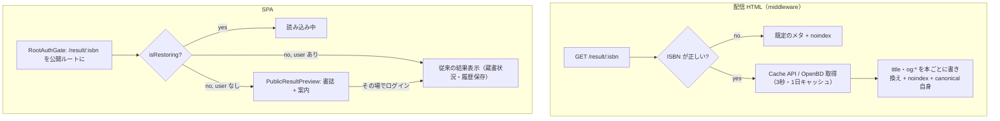

# 設計: ISBN 検索結果ページを未ログインでも部分表示する（#159）

## Architecture Overview



## Component Design

### 1. `AuthProvider` に `isRestoring` を追加

- `AuthContextValue` に `isRestoring: boolean` を追加（追加のみで、既存の利用箇所は影響を受けない）。
- 初期値は「`initialUser` が無ければ true」。`session.restore()` の完了（成功・失敗とも。`restore` は例外を投げず null を返す）で false にする。`signIn` / `signOut` でも false。

### 2. 公開ルート

- `src/presentation/auth/publicPaths.ts` の `PUBLIC_PATHS` に `/result/:isbn` を追加。
- `functions/_shared/routeMeta.js` の `/result/:isbn` は `noindex: true` のまま、本ごとのメタは middleware で組み立てる（`region` と同様に `kind: 'book'` のようなマッチ情報を返す形にする）。

### 3. `BookSearchResultPage` の分割

```tsx
export function BookSearchResultPage() {
  const { user, isRestoring } = useAuth();
  if (isRestoring) return <ResultPageShell isbn={isbn}><LoadingState … /></ResultPageShell>;
  return user ? <AuthenticatedResult isbn={isbn} /> : <PublicResultPreview isbn={isbn} />;
}
```

- `AuthenticatedResult`: 現在の `BookSearchResultPage` の中身をそのまま移す（登録図書館・蔵書状況・履歴保存・計測）。未ログインではマウントされないので、保護 API を呼ばない。
- `PublicResultPreview`（新規）: `IsbnSection`・`MetadataSection`（`useBookMetadata` は OpenBD で公開 API）と案内カード。
  - 案内: 「LibCheck は、本のバーコードを読み取るだけで、登録した図書館で借りられるか・予約できるかを確認できるアプリです。この本が近くの図書館にあるか調べるには、ログインして図書館を登録してください。」＋ `GoogleSignInControl` ＋「近くの図書館を探す（ログインなしで1冊試せます）」→ `/library/add`。
  - ログインすると `user` が入り、`AuthenticatedResult` に切り替わる（F3）。
- GA4: 未ログインの表示は既存の `book_search_result_view` を送らず、別イベント `book_preview_view` を ISBN ごとに1回送る（2026-10-11 ユーザー判断）。ISBN・書名は送らない。プライバシーポリシーの GA4 の説明にも追記する。

### 4. 配信 HTML の本ごとのメタ（`functions/_middleware.js` / `functions/_shared/bookMeta.js` 新規）

- `fetchBookTitleAndCover(isbn, { cache, fetchFn })`: `https://api.openbd.jp/v1/get?isbn={isbn}` を3秒のタイムアウトで取得し、`summary.title` と `summary.cover` を返す。Cache API（キーは ISBN、1日）。失敗・該当なしは null。
- 書き換え:
  - `title` / `og:title`: `『{書名}』が図書館で借りられるか、LibCheckで確認`（2026-10-11 ユーザーと決定。サイト名を文に含むため末尾の「— LibCheck」は付けない）
  - `og:description` / `description`: `『{書名}』が近くの図書館で借りられるか・予約できるかを、本のバーコードを読み取るだけで調べられます。`
  - `og:image`: OpenBD の書影（http(s) のみ）。無ければ既定のまま。書影は縦長のため `twitter:card` を `summary` にする
  - `og:url` / `canonical`: 自身。robots: `noindex`
- ISBN は `src/domain/utils/isbnValidator.ts` で検証し、不正なら OpenBD を呼ばず、従来の noindex のみ。

## Data Flow

1. 共有された URL を開く → middleware が本ごとの OGP と noindex で HTML を返す（SNS のプレビューはここまでで完結）。
2. SPA が起動 → セッション復元中は読み込み中 → 未ログインなら `PublicResultPreview`、ログイン済みなら従来の結果。

## Domain Models

追加なし（既存の `BookMetadata` を使う）。

## テスト

- `AuthProvider`: `isRestoring` が復元完了で false、`initialUser` 指定時は最初から false。
- `BookSearchResultPage`: 未ログインで書誌・案内を表示し保護 API を呼ばない／復元中は読み込み中で案内を出さない／未ログインからログインすると蔵書状況に切り替わる／ログイン済みの既存テストが通る。
- `publicPaths`: `/result/:isbn` が公開。
- `bookMeta` / middleware: 書名と書影で書き換え、OpenBD 失敗・該当なし・不正 ISBN は既定、キャッシュヒットは OpenBD を呼ばない、noindex と canonical。

## 懸念点

1. **`PUBLIC_PATHS` への追加で、未ログインの人が結果ページの URL を直接開くとランディングではなくなる**: 意図どおり（共有の受け手向け）。ただし未ログインでスキャン画面等から来ることはない。
2. **OpenBD への負荷**: 共有された URL のクロール（SNS のプレビュー取得）ごとに1回。キャッシュで抑える。
3. **共有ボタンが無い**: 受け手側の体験は改善するが、送り手が URL をコピーする必要がある。共有ボタン（Web Share API）は本Issueの範囲外とし、#191 に切り出した。
