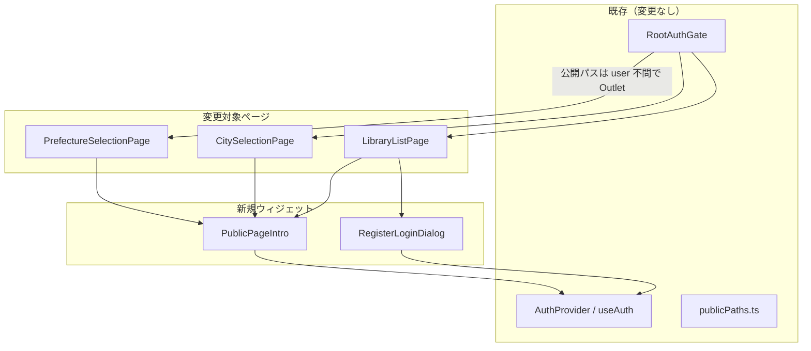
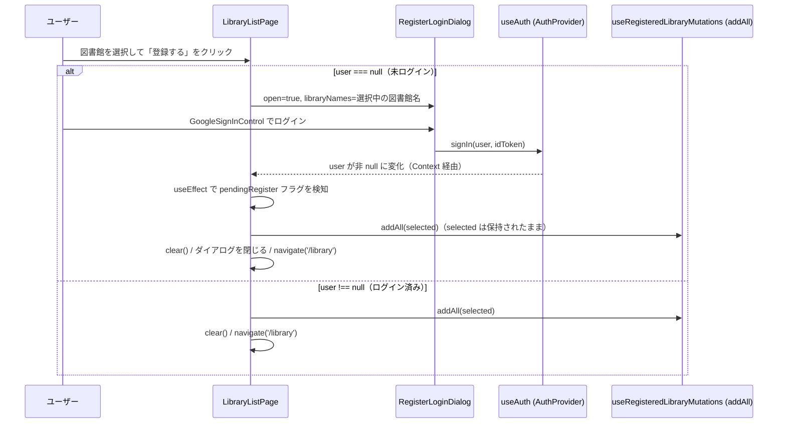

# 設計: 公開図書館追加ページに離脱防止の案内・ログイン導線を追加する（#167）

## Architecture Overview

既存の Clean Architecture 構成（`domain` / `data` / `presentation`）に対し、本Issueは `presentation` レイヤーのみを変更する。`domain`・`data` レイヤーへの変更はない。

- 新規ウィジェット `PublicPageIntro`（案内バナー）と `RegisterLoginDialog`（登録時のインラインログイン）を `src/presentation/widgets/` に追加する。
- 3つの公開ページ（`PrefectureSelectionPage` / `CitySelectionPage` / `LibraryListPage`）はこれらのウィジェットを呼び出すだけで、認証状態の判定ロジック自体（`RootAuthGate` / `publicPaths.ts` / `AuthProvider`）には手を入れない。



## Component Design

### `PublicPageIntro`

```ts
// src/presentation/widgets/PublicPageIntro.tsx
export function PublicPageIntro({ description }: { description: string }): JSX.Element | null
```

- `useAuth().user === null` の場合のみ描画（非 null なら `null` を返す）。
- `description` は呼び出し元ページごとに渡す（`functions/_shared/routeMeta.js` の対応ルートの `description` と揃える）。
- 内部で `GoogleSignInControl`（`src/presentation/auth/GoogleSignInControl.tsx`）を配置し、その場でログインできるようにする。
- スタイルは `src/presentation/landing/landingTokens.ts` の `LANDING_COLORS` / `LANDING_SERIF` を再利用し、ランディングページとの視覚的一貫性を持たせる。ヒーローほど大きくせず、コンパクトな帯（アプリ名＋説明文＋小さめのログインボタンを横並びまたは縦積み、モバイルでは2〜3行程度）にする。

呼び出し側（例: `LibraryListPage.tsx`）:

```tsx
<SubPageAppBar title={`${city}の図書館`} />
<PublicPageIntro description="ログインすると、この地域の図書館を登録して蔵書を検索できます。" />
{renderBody()}
```

### `RegisterLoginDialog`

```ts
// src/presentation/widgets/RegisterLoginDialog.tsx
export function RegisterLoginDialog({
  open,
  libraryNames,
  onClose,
}: {
  open: boolean;
  libraryNames: string[];
  onClose: () => void;
}): JSX.Element
```

- MUI `Dialog`。選択中の図書館名（`libraryNames`）を列挙して「ログインすると、選択した◯件の図書館を登録します」のような文言を表示し、`GoogleSignInControl` を配置する。
- ログイン成否の判定やその後の登録実行はこのコンポーネントの責務にしない（呼び出し元 `LibraryListPage` が `useAuth().user` の変化を見て行う）。このコンポーネントは表示とダイアログの開閉のみを担当し、単体テストしやすくする。

### `LibraryListPage` の変更

`handleRegister` を以下のように変更する。



実装のポイント:
- `selected`（`useSelectedLibraries()`）はページ内の React Context にあるため、ダイアログの開閉・ログインの間もアンマウントされず保持される。`RootAuthGate` は公開パスに対して `user` の値によらず常に同一の `<Outlet/>` を返す（`RootAuthGate.tsx:35-54`）ため、ログインによる `LibraryListPage` の再マウントは発生しない。
- 「ログイン待ちで登録を続行する」ことを表す状態は `LibraryListPage` 内のローカル `useState`（例: `pendingRegister: boolean`）で持つ。`useEffect` で `user` の non-null 化と `pendingRegister` を見て、登録処理（既存の「ログイン済みの場合」の分岐と同じロジック）を1回だけ実行する。
- 既存の `navigate('/')` フォールバックは削除する。

## Data Flow

- 認証状態の流れ（`AuthProvider` → `useAuth()`）は変更しない。`PublicPageIntro` と `RegisterLoginDialog` はどちらも `useAuth()` を読むだけで、`signIn` / `signOut` の実装には手を入れない。
- 図書館データの取得（`useLibraryList` → `libraryRepository.getLibraries()` → 静的 JSON）も変更しない。今回の変更はUI層の表示条件と、登録アクションのトリガー方法（全画面遷移 → インラインダイアログ）のみ。
- 新たな API 呼び出しは追加しない（カーリル API クォータへの影響なし）。

## Domain Models

変更なし。`Library` / `User` などの既存モデルをそのまま使う。
