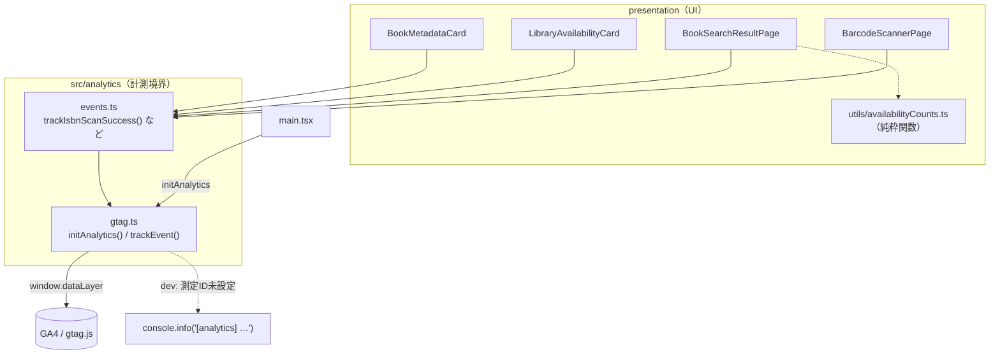
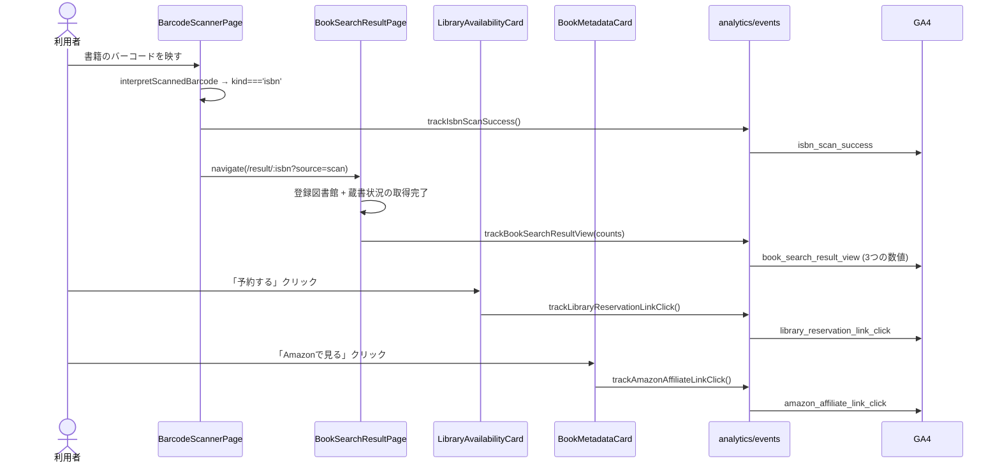
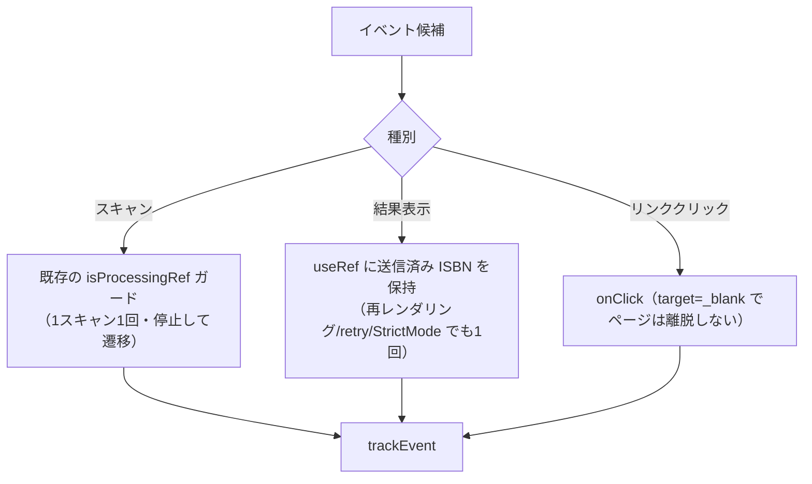
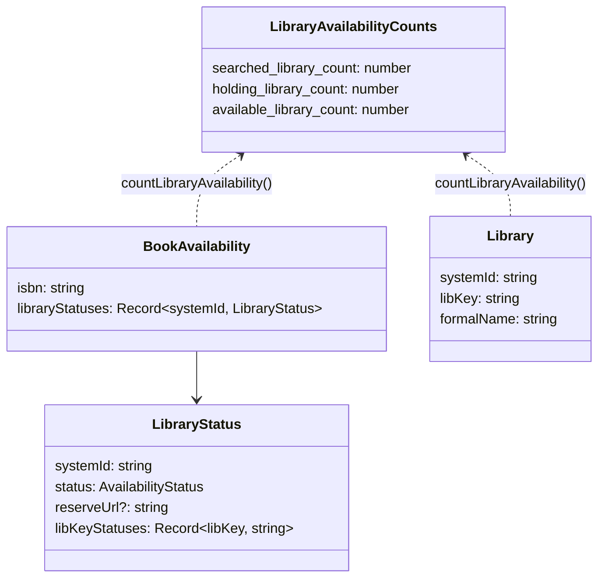

# 設計: GA4 によるユーザー価値到達のイベント計測（#169）

## Architecture Overview

GA4 固有の処理は `src/analytics/` の 2 ファイルに閉じ込め、UI からは「意味のある関数名」
だけを呼ぶ。UI コンポーネントは `gtag` もイベント名文字列も知らない。



### なぜ index.html にスニペットを置かないか

`public/_headers` の CSP は `script-src 'self' …` でインラインを許可せず、
`security-headers.test.ts` がそれを固定している。Google 公式スニペットはインライン
`<script>` を含むため使えない。そこで PWA の `registerSW`（`injectRegister: 'script'`）や
Sentry（`src/sentry.ts`）と同じく、**バンドル内モジュールから初期化**し、
`gtag/js` は `document.createElement('script')` で動的に読み込む。外部 `src` は
`script-src` のホスト許可で通るため、インライン禁止に抵触しない。

### SPA の page_view

GA4 の拡張計測（既定 ON）が history イベントで `page_view` を自動送信するため、
手動送信は一切行わない（手動で足すと二重計上になる）。`send_page_view` も既定のまま。

## Component Design

### `src/analytics/gtag.ts`

| 関数 | 責務 |
| --- | --- |
| `initAnalytics()` | 測定 ID があるときだけ dataLayer 初期化 → `gtag('js')` → `gtag('config')` → `gtag/js` を動的ロード。二重初期化しない |
| `trackEvent(name, params?)` | dev では console 出力。gtag 初期化済みなら `gtag('event', name, params)` |

- 測定 ID: `import.meta.env.VITE_GA_MEASUREMENT_ID`（未設定なら完全に no-op）。
- `debug_mode`: **development で実送信するときだけ** `true` を付与。production では
  `config` に第3引数を渡さない（`debug_mode: false` すら送らない）。
- dataLayer への push は公式スニペットと同じく `arguments` を push する形にする。
- 送信は best-effort。例外でアプリを壊さない。

### `src/analytics/events.ts`

イベント名とパラメータ名の唯一の定義場所。UI はここだけを import する。

```ts
trackIsbnScanSuccess(): void
trackBookSearchResultView(counts: LibraryAvailabilityCounts): void
trackLibraryReservationLinkClick(): void
trackAmazonAffiliateLinkClick(): void
```

### `src/presentation/utils/availabilityCounts.ts`（新規・純粋関数）

既存の `availabilityToHistoryStatuses.ts` と同じく `statusForLibKey` を使い、
**画面表示と同じ分館（libKey）単位**で数える。

| パラメータ | 定義 |
| --- | --- |
| `searched_library_count` | 登録図書館（分館）の件数 |
| `holding_library_count` | ステータスが `notFound` / `error` / `unknown` 以外の件数 |
| `available_library_count` | ステータスが `available`（貸出可）の件数。「館内のみ」は含めない |

## Data Flow

### ファネル全体



### 重複送信の防止



- `isbn_scan_success`: `handleDecoded` の ISBN 分岐で `isProcessingRef.current = true` の直後、
  `navigate` の前に送る。zxing は同じコードを毎フレーム読むが、このガードで 1 回に収束する。
  **オフライン保留パス（#144）では送らない**（そもそも送信できず、3 秒スロットルで重複し得るため）。
- `book_search_result_view`: 既存 `useSaveHistoryOnResult` と同型の `useTrackBookSearchResultView`
  を追加。送信済み ISBN を ref に持ち、ISBN が変わったときだけ再送する。
  発火条件は「結果状態」＝ `registeredQuery.data.length > 0 && availabilityQuery.isSuccess`。
  登録0件（onboarding 表示）・loading・error では送らない。保留スキャンのバックグラウンド検索
  （`usePendingScanProcessor`）は画面表示を伴わないため対象外。
- リンククリック: `target="_blank"` なのでページは離脱せず、送信が欠落しない。

## Domain Models

計測のためにドメインモデルは追加・変更しない。既存モデルからの導出のみ。



## 設定・配信

| 対象 | 変更 |
| --- | --- |
| `public/_headers` | `script-src` に `https://www.googletagmanager.com`、`connect-src` に `https://*.google-analytics.com https://*.analytics.google.com https://www.googletagmanager.com` を追加（`img-src` は既に `https:` で充足。広告連携は使わないので doubleclick 等は追加しない） |
| `.github/workflows/cloudflare-pages.yml` | ビルド env に `VITE_GA_MEASUREMENT_ID: ${{ vars.GA_MEASUREMENT_ID }}`（SENTRY_DSN と同経路）。ビルド時インラインのため Cloudflare Pages の環境変数は使わず、プレーン変数が deploy で消える罠を回避 |
| `vite.config.ts` の `test.env` | `VITE_GA_MEASUREMENT_ID: ''`（ローカルの `.env.local` がテストに漏れないように。`VITE_GOOGLE_CLIENT_ID` と同じ理由） |
| `src/vite-env.d.ts` / `.env.local.example` | `VITE_GA_MEASUREMENT_ID` の型と説明を追記 |
| `public/privacy-policy.html` | 外部送信サービス表に GA4 を追加。「2-4. Cookie」に GA4 の Cookie（`_ga` 等、分析目的・広告用途なし）を追記 |

## 開発時の確認方法

- 既定（`VITE_GA_MEASUREMENT_ID` 未設定）: GA4 へは送信せず `console.info('[analytics] …')` のみ。
- 実送信を確認したいとき: `.env.local` に本番と同じ測定 ID を一時的に設定する。
  dev では `debug_mode: true` が自動付与されるため GA4 の DebugView に出る。
  テストイベントが本番プロパティに混ざることは許容する（開発専用プロパティは作らない）。
  確認後は `.env.local` の設定を戻す。広告ブロッカーのないプロファイルで実施すること。

## 今回やらないこと（将来の候補）

- 手動 `page_view` 送信・カスタム画面名（拡張計測で足りるうちは不要）
- オフライン保留スキャン（#144）／手動 ISBN 入力（`/isbn-input`）の計測
- 「カーリルで見る」等リンクバック（#156）のクリック計測
- `user_id` / ログイン状態の付与、ISBN・書名・図書館名などのパラメータ
- 登録図書館 0 件ユーザーの結果画面到達の計測
- 同意バナー（別途検討）
- 開発専用 GA4 プロパティ、開発トラフィックの除外フィルタ
