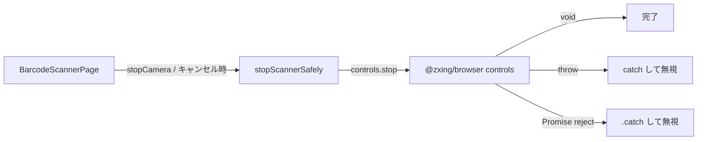
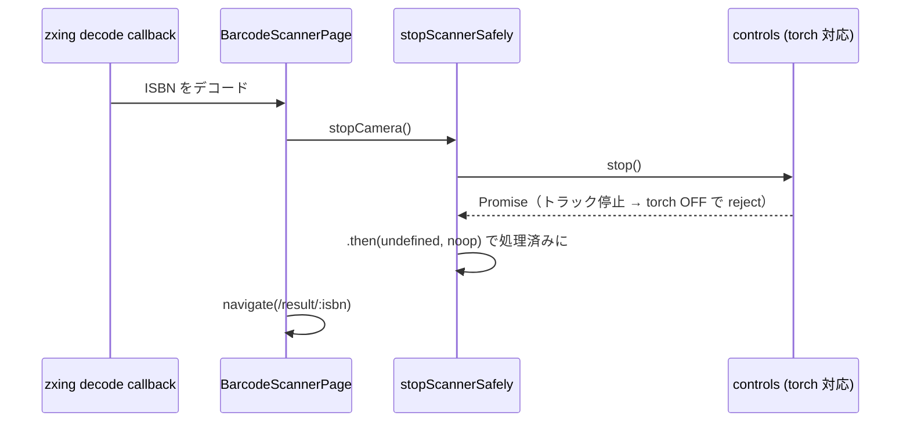

# 設計: スキャン終了時の未処理 rejection の解消（#175）

## Architecture Overview

停止処理を「同期 throw・非同期 reject の両方を握りつぶす」小さなユーティリティに集約し、
`BarcodeScannerPage` の停止呼び出し箇所すべてから使う。



## Component Design

### `src/presentation/utils/stopScannerSafely.ts`（新規）

```ts
export function stopScannerSafely(controls: Pick<IScannerControls, 'stop'>): void
```

- `controls.stop()` を try/catch で呼ぶ。
- 戻り値が thenable（`then` 関数を持つ）なら `.then(undefined, () => {})` を付けて reject を処理済みにする。
- `IScannerControls.stop` の型は `() => void` のため、戻り値は `unknown` として受けて実行時に判定する。

### `BarcodeScannerPage.tsx`（変更）

- `stopCamera()` 内の `try { controlsRef.current.stop() } catch {}` を `stopScannerSafely(controlsRef.current)` に置き換える。
- 起動完了前にアンマウントされた場合の `controls.stop()` も `stopScannerSafely(controls)` に置き換える。

## Data Flow



## Domain Models

ドメインモデルの変更はない（presentation 層のみの変更）。
