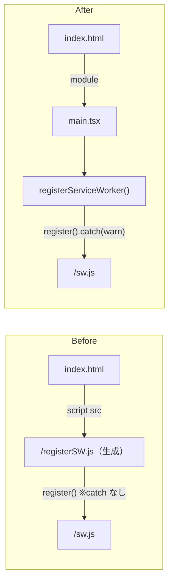
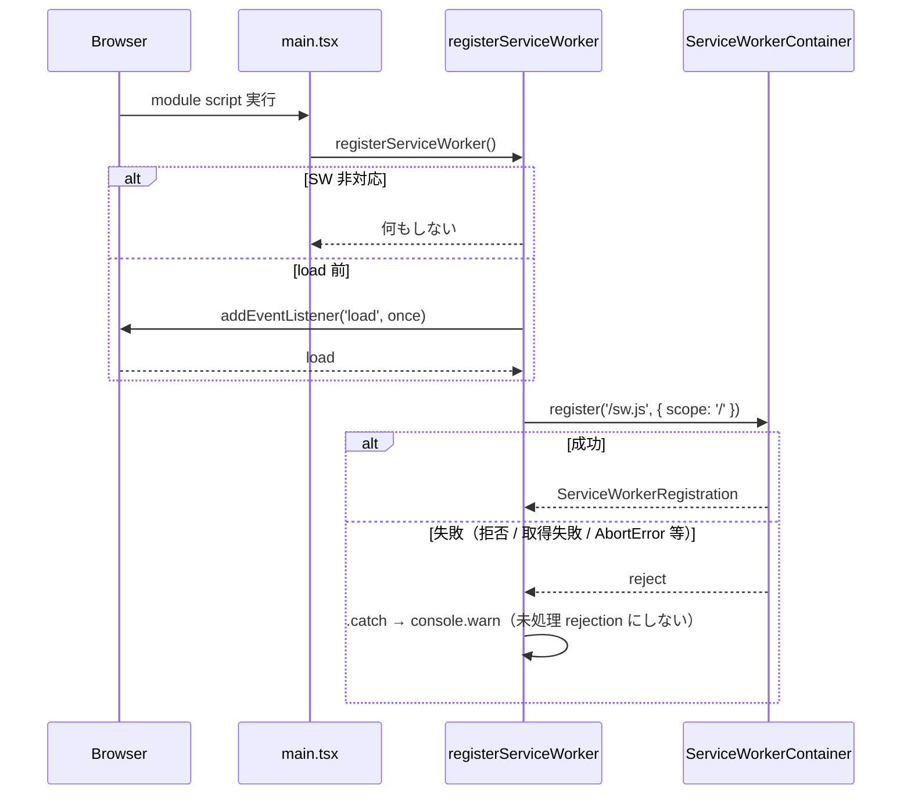

# 設計: Service Worker 登録失敗の未処理 rejection の解消（#176）

## Architecture Overview

vite-plugin-pwa による登録スクリプトの自動注入（`injectRegister: 'script'`）をやめ（`injectRegister: false`。公式の「手動登録」モード）、
アプリのエントリポイント（`main.tsx`）から自前の `registerServiceWorker()` で登録する。
登録処理は現行の生成スクリプトと同じで、`.catch` を加えるだけにする。

### 方式の比較

| 方式 | 内容 | 採否 | 理由 |
|---|---|---|---|
| A | `public/registerSW.js` を置いて生成スクリプトを差し替える | 不採用 | プラグインのコード上は publicDir にあれば生成をスキップするが、公式ドキュメントに記載が無い挙動に依存する |
| B | `injectRegister: false` + `main.tsx` から自前で登録 | **採用** | 公式記載の手動登録モード。現行と同じ挙動＋ catch。ユニットテスト可能。追加依存なし |
| C | `virtual:pwa-register` の `registerSW({ onRegisterError })` | 不採用 | autoUpdate 時に SW 更新で強制リロードする（現行に無い挙動）。workbox-window がバンドルに加わる |



## Component Design

### `src/pwa/registerServiceWorker.ts`（新規）

`src/sentry.ts`・`src/analytics/gtag.ts` と同じく、アプリ起動時に一度呼ぶ初期化モジュールとして置く（Clean Architecture の 3 層外のブートストラップ）。

```ts
export function registerServiceWorker(
  env?: { navigator: Navigator; window: Window; document: Document },
): void
```

- `'serviceWorker' in navigator` でなければ何もしない。
- `document.readyState === 'complete'` なら即登録、それ以外は `window` の `load` を一度だけ待って登録する（`main.tsx` は module script のため通常は `load` 前に実行されるが、順序に依存しない）。
- `navigator.serviceWorker.register('/sw.js', { scope: '/' })` の reject は `.catch` で処理し、`console.warn` のみ出す（Sentry には送らない。Sentry の既定の Console 連携は `console.warn` をイベントとして送らず breadcrumb に残すだけ）。
- テスト容易性のため、グローバルを引数で差し替え可能にする（既定は実グローバル）。

### `src/main.tsx`（変更）

- `initSentry()`・`initAnalytics()` に続けて `registerServiceWorker()` を呼ぶ。
- **本番ビルドでのみ呼ぶ（`import.meta.env.PROD`）**。dev では SW を生成しない設定（`devOptions.enabled: false`）で、従来はプラグインが dev では何も注入しなかった。無条件に呼ぶと dev サーバで存在しない `/sw.js` を登録しに行ってしまう（実装中に判明し設計に追記）。

### `vite.config.ts`（変更）

- `injectRegister: "script"` → `injectRegister: false`。コメントを新方式に更新。
- SW のパス・スコープ（既定の `sw.js` / `/`）は変更しない。`registerServiceWorker.ts` 側の定数と対応する旨をコメントで明記。

### `pwa.test.ts`（変更）

- 「SW 登録は外部スクリプト」の回帰ガードを「自動注入しない（`injectRegister: false`）かつ `main.tsx` から `registerServiceWorker()` を呼ぶ」に更新。

## Data Flow



### 移行時の考慮

- 旧 SW が制御中のクライアントは、precache 済みの旧 `index.html` と旧 `registerSW.js` で起動する（どちらも旧 SW のキャッシュから配信されるため 404 にならない）。
- 旧 `registerSW.js` が `/sw.js` を登録し直すと新 SW が取得され、`skipWaiting` / `clientsClaim` で即 activate する。次のロードから新 `index.html`（`registerSW.js` 参照なし）になる。
- 新 SW の precache には `registerSW.js` が含まれなくなり、`cleanupOutdatedCaches` で旧キャッシュが整理される。

## Domain Models

ドメインモデルの変更はない。
