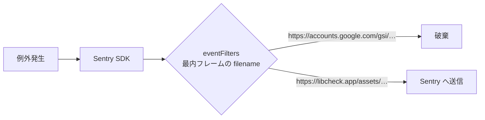
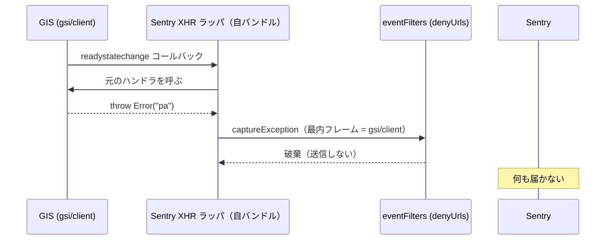

# 設計: Google Identity Services 内部の例外を Sentry 送信から除外する（#179）

## Architecture Overview

`src/sentry.ts` の `Sentry.init` に `denyUrls` を追加する。除外パターンはモジュールの定数として export し、テストから SDK の実フィルタに通して検証する。



### 方式の比較

| 方式 | 内容 | 採否 | 理由 |
|---|---|---|---|
| A | `denyUrls` で GIS スクリプト URL を除外 | **採用** | 公式オプション。最内フレームで判定するため、GIS から呼ばれた自コードの例外は残る |
| B | `ignoreErrors` でメッセージ `pa` / `ta` を除外 | 不採用 | minify 名は GIS のリリースで変わる。短い文字列の部分一致は他の例外も巻き込む |
| C | `beforeSend` で mechanism も併せて判定 | 不採用 | 公式オプションで足りる範囲に独自ロジックを書くことになり、SDK の変更に追従が必要 |

## Component Design

### `src/sentry.ts`（変更）

```ts
/** 対応不能な第三者スクリプト由来の例外を送らない（#179）。 */
export const SENTRY_DENY_URLS: RegExp[] = [
  // Google Identity Services（@react-oauth/google が読み込む）
  /^https:\/\/accounts\.google\.com\/gsi\//,
];

Sentry.init({ dsn, sendDefaultPii: false, denyUrls: SENTRY_DENY_URLS });
```

- 前方一致の正規表現にする（`accounts.google.com.evil.example` のような別ホストや、パス中に `gsi` を含む自サイトの URL を巻き込まない）。

### `src/sentry.test.ts`（新規）

- `eventFiltersIntegration()`（`@sentry/react` が再 export する SDK の実フィルタ）の `processEvent` に、`denyUrls: SENTRY_DENY_URLS` を返す最小限の client を渡してイベントを通す。
  - LIBCHECK-6 と同じフレーム構成（外側: 自バンドルの Sentry XHR ラッパ → 内側: `gsi/client`）→ `null`（破棄）
  - 外側が `gsi/client`、最内が自バンドル（GIS から呼ばれた自コードのコールバックで throw）→ 送信される
  - 自バンドルのみ → 送信される
- `initSentry()` が `denyUrls: SENTRY_DENY_URLS` を渡すこと（`@sentry/react` の `init` を spy、`VITE_SENTRY_DSN` を `vi.stubEnv`、`DEV` を false に）。

## Data Flow



## Domain Models

ドメインモデルの変更はない。
