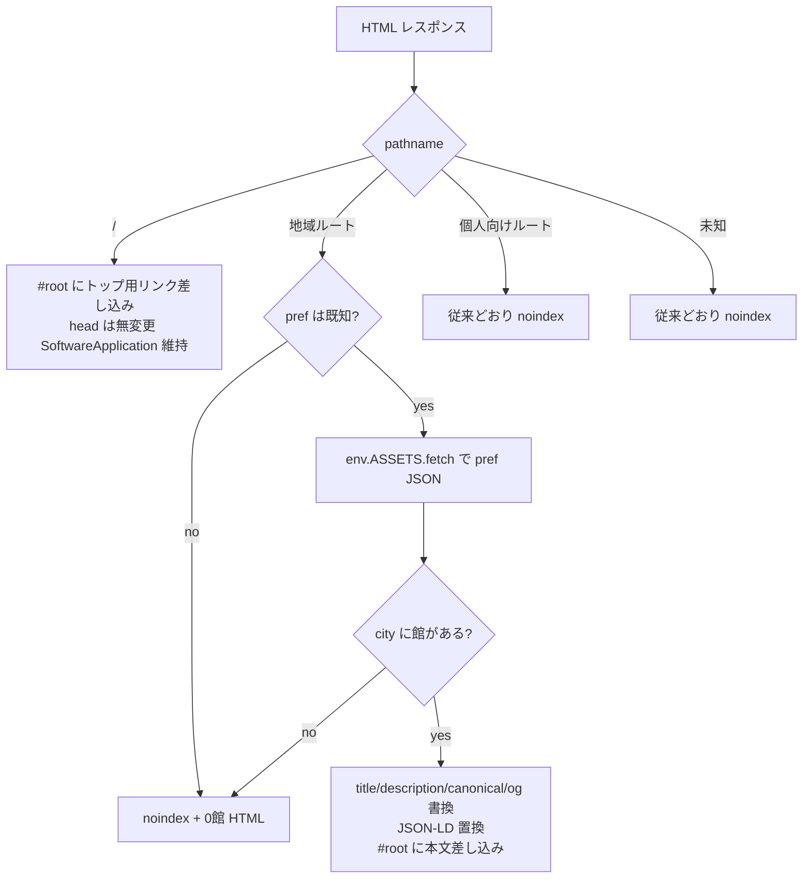
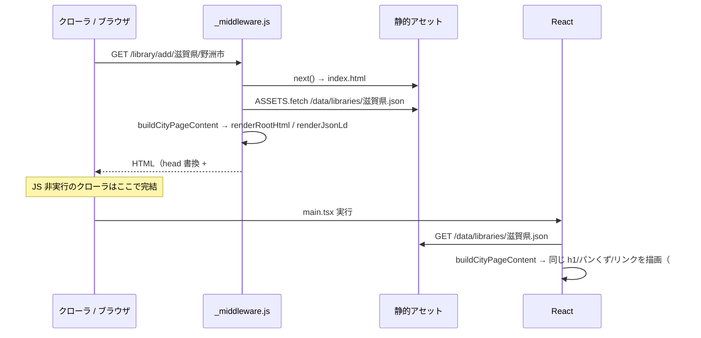

# 設計: 地域ページの基本構造（h1・メタ・パンくず・内部リンク・構造化データ・sitemap）（#182）

## Architecture Overview

### 調査結果（現状）

| 項目 | 現状 |
|---|---|
| 地域ページの生成 | プリレンダリングなし。`public/_redirects` の SPA フォールバックで全ルートが `index.html` を返し、`functions/_middleware.js` が `HTMLRewriter` で `<head>` の title / description / canonical / og / robots だけを書き換える（`functions/_shared/routeMeta.js`）。`<body>` は `<div id="root"></div>` のまま |
| 本文の描画 | SPA（`LibraryListPage` / `CitySelectionPage` / `PrefectureSelectionPage`）が静的 JSON `public/data/libraries/{pref}.json` を取得して描画（`StaticLibraryDataSource`）。一覧は `ListItemButton` + `navigate()` で `<a href>` を持たない |
| sitemap.xml | `scripts/generateLibraryData.mjs` がカーリル `/library` を47都道府県分取得して JSON を書き出すついでに生成し、コミットする（1,530 URL、lastmod なし、priority 固定） |
| 構造化データ | `index.html` に `SoftwareApplication` が1つ。全ページ共通で配信 |
| 公開判定 | クライアント: `src/presentation/auth/publicPaths.ts`（`RootAuthGate`）。エッジ: `routeMeta.js` の `noindex` |
| トップページ `/` | ミドルウェアは無変更で返す。未ログイン時は `LandingPage`（地域ページへのリンクなし） |
| データ | 47都道府県・1,481市区町村・7,500館。市区町村は図書館データから導出しているため、データ上の市区町村は必ず1館以上ある。0館になるのは「データにない都道府県・市区町村の URL」だけ |

### 方針

**エッジ（ミドルウェア）で、JS 非実行でも読める HTML を `#root` の中に差し込む。SPA は起動時にそれを置き換え、同じ内容を描画する。**

- `createRoot(container).render()` は `#root` の既存の子要素を置き換えるため、差し込んだ HTML は JS 起動までの「初期表示」として働き、起動後は SPA の描画に替わる（ハイドレーションはしない）。
- 文言（title / description / h1 / パンくず）と「都道府県 JSON → ページ内容」の変換は、**純粋な TS モジュール1つ**にまとめ、ミドルウェアと SPA の両方から import する（NF3）。
- `<head>` の JSON-LD はミドルウェアだけが出す（SPA 内遷移では更新しない。title / description の既存の扱いと同じ）。

```mermaid
flowchart LR
  Req[ブラウザ / クローラ] --> MW[functions/_middleware.js]
  MW -->|next| Static[index.html<br/>SPA フォールバック]
  MW -->|env.ASSETS.fetch| JSON[/data/libraries/{pref}.json]
  MW --> Content[regionPageContent.ts<br/>純粋関数: 文言・ページ内容]
  MW --> Html[regionPageHtml.js<br/>HTML / JSON-LD 生成・エスケープ]
  Html --> Res[配信 HTML<br/>head: title/description/canonical/robots/JSON-LD<br/>#root: h1/パンくず/一覧/リンク]
  SPA[React ページ] --> Content
  SPA -->|createRoot で #root を置換| DOM[描画後 DOM<br/>同じ h1/パンくず/リンク]
```

### 検討した代替案

| 案 | 内容 | 判断 |
|---|---|---|
| A. エッジで `#root` に差し込む（採用） | 既存の HTMLRewriter 基盤を拡張。URL もデプロイ方式も変わらない | 採用。データは静的 JSON を `env.ASSETS.fetch` で読む |
| B. ビルド時プリレンダリング | 1,530 ページ分の HTML をビルドで生成 | 不採用。Pages の静的ファイルは SPA フォールバックより優先されるため、ルーティング・SW の `navigateFallback`・ミドルウェアの robots 書き換えとの関係を作り直す必要があり、変更範囲が大きい |
| C. SSR フレームワーク移行 / ハイドレーション | MUI の SSR 対応を含む | 不採用。#157 で不要と判断済み。規模に見合わない |
| D. `<noscript>` に入れる | | 不採用。JS 実行時の DOM には出ない |

## Component Design

### 1. `src/presentation/regionPage/regionPageContent.ts`（新規・純粋関数）

ミドルウェアと SPA の両方が使う。`import type` 以外の import を持たない（Pages Functions の esbuild バンドルでパスエイリアス `@/` を解決させないため）。都道府県リストは `src/domain/data/japanesePrefectures.ts` を相対パスで import する。

```ts
export interface RegionLibrary { name: string; address: string; url?: string; tel?: string; geocode?: string; category: string; }
export interface BreadcrumbItem { name: string; path: string; }

export interface CityPageContent {
  kind: 'city'; pref: string; city: string;
  title: string; description: string; h1: string;
  breadcrumbs: BreadcrumbItem[];
  libraries: RegionLibrary[];
  otherCities: { name: string; path: string; libraryCount: number }[];
}
export interface PrefecturePageContent { kind: 'prefecture'; pref: string; title; description; h1; breadcrumbs; cities: {...}[]; libraryCount: number; }
export interface PrefectureIndexContent { kind: 'index'; title; description; h1; breadcrumbs; regions: { name: string; prefectures: { name: string; path: string }[] }[]; }
export interface NotFoundContent { kind: 'notFound'; title: string; h1: string; }

export function isKnownPrefecture(pref: string): boolean;
export function buildCityPageContent(pref: string, city: string, prefLibraries: Library[]): CityPageContent | NotFoundContent;
export function buildPrefecturePageContent(pref: string, prefLibraries: Library[]): PrefecturePageContent | NotFoundContent;
export function buildPrefectureIndexContent(): PrefectureIndexContent;
export function regionPath(pref?: string, city?: string): string; // encodeURIComponent 済み
```

- `formalName` は前後の空白を除く（データに `'野洲市野洲図書館 '` のような末尾空白がある）。
- 市区町村の並び順は既存 `useCityList` と同じ（文字列ソート）。

#### 文言（案）

| ページ | title | h1 | description |
|---|---|---|---|
| 市区町村 | `{pref}{city}の図書館に対応｜本のバーコードで予約可否をチェック — LibCheck` | `{pref}{city}の図書館（{n}館）` | `{pref}{city}の図書館{n}館（{館名1}、{館名2}、{館名3}ほか）に対応。本のバーコードを読み取るだけで、登録した図書館で借りられるか・予約できるかをまとめて確認できます。`（4館以上のとき「ほか」） |
| 都道府県 | `{pref}の図書館に対応｜市区町村から選んで予約可否をチェック — LibCheck` | `{pref}の図書館（{m}市区町村・{n}館）` | `{pref}の{m}市区町村・図書館{n}館に対応。市区町村を選んで図書館を登録すると、本のバーコードを読み取るだけで借りられるか・予約できるかを確認できます。` |
| `/library/add` | `対応している図書館を都道府県から探す — LibCheck` | `対応している図書館を都道府県から探す` | `全国の公共図書館・大学図書館などに対応しています。都道府県・市区町村を選んで図書館を登録すると、本のバーコードを読み取るだけで借りられるか・予約できるかを確認できます。` |
| 0館 | `ページが見つかりません — LibCheck` | `この地域の図書館は見つかりませんでした` | （既定のまま） |

- Issue の例は市区町村名だけだが、同名の市区町村（例: 府中市＝東京都・広島県）があるため都道府県名を前に付ける。
- 「蔵書を検索」の表現は使わない（NF4）。
- `PublicPageIntro` の description は従来どおり routeMeta の description と同じ文言を出す（#158 の方針）。

#### パンくず

`トップ（/）` > `都道府県から探す（/library/add）` > `{pref}` > `{city}`。最後の項目はリンクなし（`aria-current="page"`）。JSON-LD では最後の項目の `item` を省略する（Google のガイドで省略可）。

### 2. `functions/_shared/regionPageHtml.js`（新規）

ページ内容 → 文字列の変換と、エスケープを担う。

- `renderRootHtml(content)`: `#root` に差し込む HTML。`<main>` に h1、`<nav aria-label="パンくずリスト">`、説明文、一覧（`<ul>` の `<a href>`）、カーリルのクレジット（#156）、同じ都道府県の他の市区町村リンク。最小限のインライン style（CSP は `style-src 'unsafe-inline'` 許可済み）。
- `renderJsonLd(content)`: `@graph` に `BreadcrumbList` と、市区町村ページでは `Library`（name / address(PostalAddress) / telephone / url / geo(GeoCoordinates)）を入れる。移動図書館（`category: 'BM'`）は固定の所在地を持たないため `Library` に含めない（一覧表示には含める）。
- `escapeHtml(s)`、JSON-LD は `JSON.stringify` 後に `<` を `<` に置換して `</script>` を無害化する（NF2）。

### 3. `functions/_shared/routeMeta.js`（変更）

- 3つの地域ルートの `title` / `description` を、静的な関数ではなく「ページ内容から取る」形に変える。`findRouteMeta(pathname)` は従来どおり同期で、地域ルートには `region: { pref, city }` などのマッチ情報を返す。
- 個人向けルート（`noindex: true`）は変更しない。

### 4. `functions/_middleware.js`（変更）



- JSON 取得は `env.ASSETS.fetch(new URL('/data/libraries/{pref}.json', request.url))`。`_redirects` の SPA フォールバックで未知のパスは `index.html` が 200 で返るため、取得前に `isKnownPrefecture` で弾き、取得後も `content-type` / `JSON.parse` を検証して失敗時は 0館扱い（noindex）にする。
- トップ `/` は `<head>` を変えず、`#root` に「対応している図書館を地域から探す」（`/library/add` と47都道府県のリンク）を差し込む。

### 5. SPA（変更）

| ファイル | 変更 |
|---|---|
| `widgets/RegionBreadcrumbs.tsx`（新規） | MUI `Breadcrumbs` + `RouterLink`。`BreadcrumbItem[]` を受け取る |
| `pages/LibraryListPage.tsx` | `buildCityPageContent` を使い、h1・パンくず・`PublicPageIntro` の文言を出す。一覧（チェックボックスで選択 → 登録）と登録フローは変更しない。一覧の下に「{pref}の他の市区町村」リンク一覧を追加 |
| `pages/CitySelectionPage.tsx` | h1・パンくず。市区町村の `ListItemButton` を `component={RouterLink}`（`<a href>`）にし、館数を併記。検索フィルタは維持 |
| `pages/PrefectureSelectionPage.tsx` | h1・パンくず。都道府県の `ListItemButton` を `<a href>` に |
| `landing/RegionLinks.tsx`（新規）+ `LandingPage.tsx` | 「対応している図書館を地域から探す」セクション（地方ごとの47都道府県リンク + `/library/add`） |

- `SubPageAppBar` はそのまま残す（タイトルは h1 にせず、h1 は本文側に1つだけ置く）。
- 市区町村ページの館数・他の市区町村は、既存の `useLibraryList` / `useCityList` が使う都道府県 JSON から計算する（追加の通信なし。React Query のキャッシュを共有できるよう、都道府県 JSON を返すクエリを1つにまとめるかは実装時に判断）。

### 6. sitemap（変更）

- `scripts/generateSitemap.mjs`（新規）: `public/data/libraries/*.json` を読み、sitemap.xml を書き出す。カーリル API キー不要。`--lastmod=YYYY-MM-DD`（既定は実行日）。`npm run generate:sitemap`。
- `buildSitemapXml` を `generateLibraryData.mjs` から移し、図書館データ（館数）を受け取る形にする。`generateLibraryData.mjs` は JSON 書き出し後にこれを呼ぶ。
- 出力: トップ（1.0）、`/library/add`（0.8）、都道府県 47（0.7）、市区町村 1,481（館数で段階化: 10館以上 0.6 / 5〜9館 0.5 / 2〜4館 0.4 / 1館 0.3）。全 URL に `lastmod`。0館の都道府県・市区町村は出さない（現データでは発生しないが、関数として保証する）。
- 新しい URL は増えない（都道府県ページは既存）。

## Data Flow



## Domain Models

- 既存の `Library`（`src/domain/models/library.ts`）をそのまま入力に使う。新しいドメインモデルは追加しない。
- ページ内容（`CityPageContent` など）は表示用のビューモデルなので `src/presentation/regionPage/` に置く。`domain` からは参照しない。

## 懸念点とリスク

1. **Pages Functions から `src/` の TS を import できるか**（最重要・タスク1でスパイク）: wrangler の esbuild は相対パスの TS を解決できるはずだが、#157 の時点では「別ビルドなので import しない」としていた。`npx wrangler pages dev` で確認し、ダメなら文言モジュールを `functions/_shared/` 側の JS に置いて SPA から import する、もしくは二重管理 + 一致を検証するテストに切り替える。
2. **初期表示のちらつき**: JS 起動までの一瞬、差し込んだ簡素な HTML が見え、その後 SPA の画面に替わる。ログイン済みユーザーがトップを開いたときも地域リンクが一瞬見える。最小限のスタイルで見た目の差を抑え、ブラウザで許容範囲かを確認する。
3. **Googlebot が見るのは JS 実行後の DOM**: エッジの HTML と SPA の描画内容がずれると、評価が割れる。共通モジュールで同じビューモデルから描画することで防ぐ。
4. **ミドルウェアの負荷**: 1リクエストごとに都道府県 JSON（最大約340KB）を読み、パースする。静的アセットはエッジでキャッシュされるため取得は速いが、実測（`wrangler pages dev` と本番の応答時間）で確認する。
5. **SW の navigateFallback**: PWA インストール済みユーザーのハードナビゲーションでは差し込み HTML が届かない。SPA が同じ内容を描画するため問題ない（#157 と同じ扱い）。
6. **0館ページのステータスコード**: 今回は Issue どおり `noindex`（200）にとどめる。ソフト404の解消に 404 ステータスが必要かは #174 で判断する。
