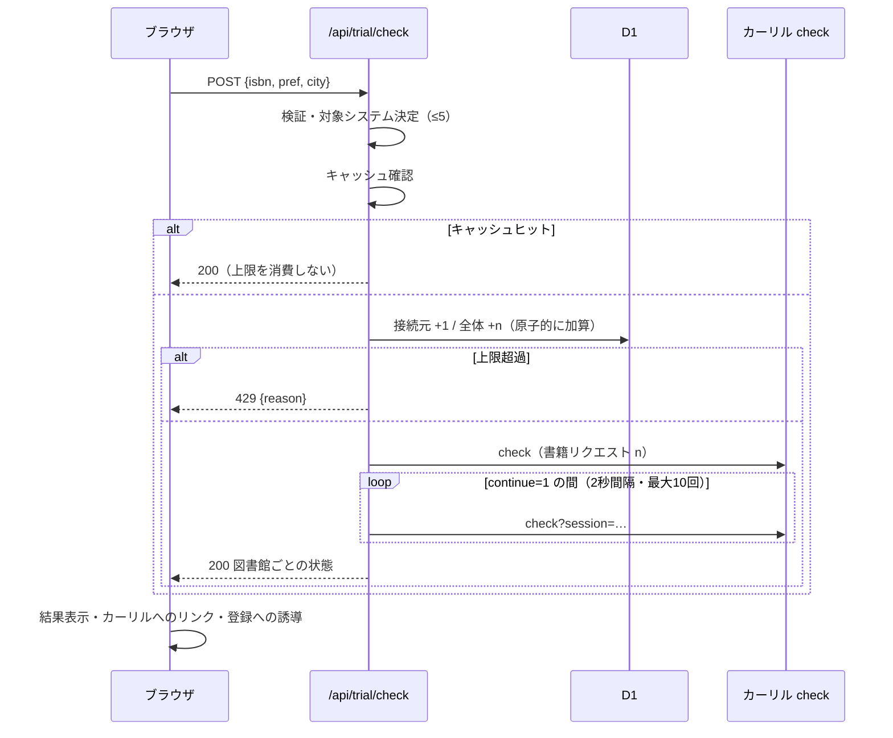

# 設計: 地域ページにログインなしの体験版（ISBN 1件の予約可否チェック）を置く（#183）

## Architecture Overview

```mermaid
flowchart LR
  U[ブラウザ<br/>市区町村ページ] -->|POST /api/trial/check<br/>isbn, pref, city| T[functions/api/trial/check.js]
  T -->|1. 入力検証| V[ISBN・地域の検証]
  T -->|2. 対象システム決定| A[env.ASSETS<br/>/data/libraries/pref.json]
  T -->|3. キャッシュ確認| C[Cache API<br/>isbn × systemIds, 10分]
  T -->|4. 上限の確認と加算| D[(D1 trial_usage)]
  T -->|5. check + ポーリング| K[api.calil.jp/check]
  T -->|JSON| U
  U -->|書名| O[OpenBD]
  L[ログインユーザー] -->|従来どおり| P[/api/calil/check<br/>認証必須・変更なし]
  P --> K
```

- 体験版は**新しいエンドポイント `POST /api/trial/check`** にする。既存の `/api/calil/*`（認証必須）には手を入れない。
- **サーバ側でポーリングを完結**させ、クライアントへは最終結果だけを返す。クライアントに `session` を渡さないため、ポーリングを悪用した問い合わせや、任意の図書館システムの指定ができない。
- **クライアントは都道府県・市区町村だけを送る**。調べる図書館システムはサーバが静的データから決める（F3）。

### 上限の考え方（#159 の懸念への答え）

カーリルの上限は「appkey × IP ごとに 1000書籍リクエスト/時」。サーバ経由のため全ユーザーで共有している前提で、次のように枠を分ける。

| 枠 | 上限（初期値・定数で調整可） | 管理方法 |
|---|---|---|
| 体験版全体 | **300書籍リクエスト/時** | D1 の時間バケット `global` |
| 接続元ごと | **5回/時**（1回 = ISBN 1件 × 最大5システム） | D1 の時間バケット `ip:{ハッシュ}` |
| ログインユーザー | 残り（約700書籍リクエスト/時） | 従来どおり（体験版の上限とは独立） |

- 体験版の消費は全体上限で頭打ちになるため、乱用されても**ログインユーザーの枠（約700）は残る**（NF1）。乱用されたときに止まるのは体験版だけ。
- 初期値のまま開始する（2026-10-10 ユーザー判断）。リリース後に `trial_usage` の実績を見て調整する。
- ログインユーザーの `check` は現在サーバ側キャッシュがない（`no-store`）。ここにもキャッシュを入れて共有上限の消費を減らす案は #186 で検討する。
- Cloudflare の Rate Limiting binding は Pages Functions で使えず、拠点ごとの概算でもあるため使わない。D1 は単一の一貫したカウンタとして使える。
- Turnstile（ボット判定）は今回は入れない。全体上限があるので最悪でも体験版が止まるだけで、ログインユーザーに影響しない。乱用が観測されたら追加を検討する（サイトキーの発行と CSP 変更が必要）。

### 1回あたりの消費を抑える

- **図書館システム数の上限: 5**。千代田区のように最大46システムある市区町村があるため（分布: 1システム 1,016 / 2システム 229 / … / 10以上 25）。公共図書館（`category` が `LARGE` / `MEDIUM` / `SMALL` / `BM`）のシステムを優先し、続いて大学（`UNIV`）・専門（`SPECIAL`）。上限で外れた図書館は「ほか N 館は登録すると調べられます」と表示する。
- **結果キャッシュ: 10分**（Cache API、キーは ISBN と対象システム ID の組）。キャッシュヒットは上限を消費しない。

## Component Design

### 1. `infra/d1/migrations/0002_trial_usage.sql`（新規）

```sql
CREATE TABLE IF NOT EXISTS trial_usage (
  bucket   TEXT    NOT NULL,  -- 'global' または 'ip:{sha256}'
  hour     INTEGER NOT NULL,  -- Unix 時間 / 3600（時間バケット）
  count    INTEGER NOT NULL,
  PRIMARY KEY (bucket, hour)
);
```

- 加算は `INSERT … ON CONFLICT(bucket, hour) DO UPDATE SET count = count + ? RETURNING count` で原子的に行い、返った値が上限を超えたら拒否する（超過分のわずかな加算は許容）。
- 2時間より古い行は、加算と同じ `batch` で `DELETE FROM trial_usage WHERE hour < ?` して溜めない（F9 の「2時間以内」）。
- IP は `SHA-256(TRIAL_IP_SALT + ip)`。`TRIAL_IP_SALT` は新しいシークレット（`secret_text`。CLAUDE.md の Known Pitfalls どおり）。

### 2. `functions/_shared/trialLimiter.js`（新規）

```js
export const TRIAL_LIMITS = { globalBookRequestsPerHour: 300, perIpChecksPerHour: 5, maxSystemsPerCheck: 5 };
export async function consumeTrialQuota(db, { ipHash, bookRequests, now }) // → { ok: true } | { ok: false, reason: 'ip' | 'global' }
```

- 先に接続元の枠を加算し、超えていれば全体の枠は消費しない。

### 3. `functions/_shared/trialTargets.js`（新規）

- `selectTrialSystems(cityLibraries)`: 公共優先で最大5システムを選び、`{ systemIds, libraries, omittedLibraryCount }` を返す。
- ISBN 検証は `src/domain/utils/isbnValidator.ts` を相対 import して共用する（#182 で Functions から `src/` の TS を import できることを確認済み。`@/` エイリアスは使わない）。

### 4. `functions/_shared/calilCheck.js`（新規）

- `checkWithPolling(fetchFn, appKey, { isbn, systemIds }, { intervalMs: 2000, maxPolls: 10 })`: 初回 `check` → `continue === 1` の間 2秒間隔でポーリング（仕様書どおり）。最長約20秒。超えたら現時点の結果を「確認中」として返す。

### 5. `functions/api/trial/check.js`（新規・`onRequestPost`）

1. JSON 本文 `{ isbn, pref, city }` を検証（サイズ上限・ISBN チェックディジット・既知の都道府県）。不正は 400。
2. `env.ASSETS` で都道府県 JSON を読み、市区町村の図書館を取得（0館は 400）。`selectTrialSystems` で対象を決める。
3. キャッシュヒットならそのまま返す（`X-Trial-Cache: hit`）。
4. `consumeTrialQuota`。超過なら 429 と `{ error: 'rate_limited', reason }`、`Retry-After`（次の時間帯の開始まで）。
5. `checkWithPolling` → 図書館ごとの状態に整形して返す。カーリルの失敗は 502。
6. 成功結果を `waitUntil` でキャッシュに保存。

レスポンス:

```json
{
  "isbn": "9784...",
  "libraries": [
    { "name": "野洲市野洲図書館", "systemId": "Shiga_Yasu", "libKey": "野洲", "libId": "…", "status": "貸出可", "reserveUrl": "https://…" }
  ],
  "omittedLibraryCount": 0,
  "complete": true
}
```

### 6. 配信 HTML（`functions/_shared/regionPageHtml.js`）

市区町村ページの本文に「この本、{市区町村}の図書館で借りられる？」の見出し・説明・ISBN 入力欄（`<form>`）を追加する（NF4）。JS 非実行時は送信しても何も起きないため、「JavaScript を有効にすると調べられます」と添える。

### 7. SPA

| ファイル | 内容 |
|---|---|
| `src/data/datasources/trialCheckClient.ts`（新規） | `POST /api/trial/check` を呼び、429 を `TrialRateLimitedError` に変換 |
| `src/domain/repositories/trialCheckRepository.ts` + `src/data/repositories/trialCheckRepositoryImpl.ts`（新規） | Clean Architecture に沿ったリポジトリ。`AppDependencies` に追加 |
| `src/presentation/hooks/useTrialCheck.ts`（新規） | React Query の `useMutation` |
| `src/presentation/widgets/TrialCheckSection.tsx`（新規） | 入力欄・ISBN のクライアント側検証・進捗表示・結果（`AvailabilityStatusBadge` を再利用、図書館名はカーリルの図書館ページへのリンク、予約リンク）・上限到達時の案内とログイン導線・登録への誘導 |
| `LibraryListPage.tsx` | 見出しの直下、登録一覧の上に `TrialCheckSection` を置く |
| `src/analytics/events.ts` | `trackTrialCheckSubmit()` / `trackTrialCheckResult(outcome)` を追加（GA4） |

- 書名は既存の `useBookMetadata`（OpenBD）で取得する（匿名で利用可・CORS 開放）。
- 結果の状態表示は既存の `AvailabilityStatusBadge` と `availabilityFromApiString` を再利用する。

### 8. プライバシーポリシー（`public/privacy-policy.html`）

- 「利用には Google アカウントでのログインが必要です」→「一部の機能（図書館の登録・検索履歴）の利用には…」に改める。
- 「体験版の乱用防止のため、接続元 IP アドレスを復元できない形（ハッシュ値）に変換し、最大2時間保存します」を追加。

## Data Flow



## Domain Models

```ts
// src/domain/models/trialCheckResult.ts
export interface TrialLibraryResult {
  name: string; systemId: string; libKey: string; libId: string;
  status: AvailabilityStatus; reserveUrl: string | null;
}
export interface TrialCheckResult {
  isbn: string; libraries: TrialLibraryResult[]; omittedLibraryCount: number; complete: boolean;
}
```

## 懸念点とリスク

1. **上限の初期値の妥当性**: ログインユーザーの実際の消費は未計測のまま 300 で開始する。`trial_usage` の実績と、ログインユーザーの検索失敗（HTTP エラー）が増えていないかを見て調整する。
2. **カーリル側の IP 判定**: Cloudflare の送信元 IP が分散していれば実際の上限はもっと緩いが、保証はないため共有前提で設計する。
3. **応答時間**: 図書館システムによってはポーリングが長引く。最大10回（約20秒）で打ち切り、`complete: false` で「確認中の図書館があります」と表示する。Pages Functions で I/O を待つ時間は CPU 時間に数えられない前提で、`wrangler pages dev` と本番で確認する。
4. **キャッシュの鮮度**: 貸出状況は変わるため TTL は10分にとどめる。
5. **新しいシークレット `TRIAL_IP_SALT`**: 本番への登録が必要（`wrangler pages secret put`。CI の wrangler-action か `npx` で）。登録前にデプロイされた場合はハッシュ化できないため、体験版を 503 で止める（安全側）。
6. **#159 との整合**: #159 の「未ログインでの蔵書状況表示は却下」は、体験版を上限付きで導入する本設計で更新される。#159 に本Issueでの判断を追記する。
