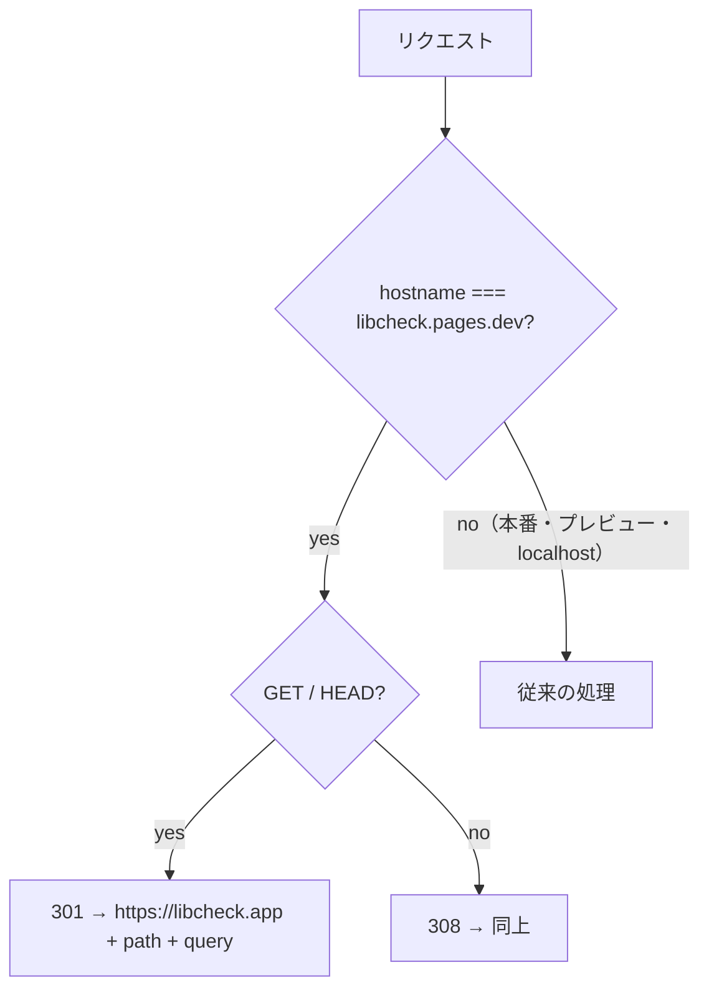

# 設計: libcheck.pages.dev へのアクセスを本番ドメインへ 301 転送する（#189）

## Architecture Overview

### 方式の比較

| 案 | 内容 | 判断 |
|---|---|---|
| A. middleware で転送（採用） | `functions/_middleware.js` の先頭で、ホスト名がちょうど `libcheck.pages.dev` なら転送する | 採用。リポジトリで管理でき、テストで検証できる。ホスト名の完全一致なのでプレビュー（`<ハッシュ>.libcheck.pages.dev`）に影響しない。追加の Cloudflare 設定・権限が要らない |
| B. Bulk Redirects | Cloudflare 公式の手順（[Redirecting *.pages.dev to a Custom Domain](https://developers.cloudflare.com/pages/how-to/redirect-to-custom-domain/)）。アカウントのリダイレクトリストとルールを作る | 不採用。設定がリポジトリの外に残る。公式手順は「Include subdomains」を有効にするが、プレビュー用のホスト名への影響が記載されておらず、検証環境を壊すおそれがある。API で設定する場合は追加のトークン権限（リストとルールセットの編集）が要る |

案Aでは、`pages.dev` へのリクエストも Function の呼び出しとして数えられる。ただし現状でも root の middleware はすべてのリクエストで動いている（非 HTML も middleware を通って素通りしている）ため、増加はない。



## Component Design

### `functions/_middleware.js`

`onRequest` の最初で判定する（`/api/*` の素通しや HTML の書き換えより前）。

```js
/** Cloudflare Pages の既定ドメイン。プレビュー（<ハッシュ>.libcheck.pages.dev）は含まない。 */
const PAGES_DEV_HOST = 'libcheck.pages.dev';

const redirect = redirectToCanonicalHost(request);
if (redirect) return redirect;
```

`redirectToCanonicalHost(request)`: ホスト名が `PAGES_DEV_HOST` と完全一致するときだけ、`https://libcheck.app` + `pathname` + `search` への `Response`（GET/HEAD は 301、それ以外は 308）を返し、それ以外は `null`。転送先の origin は既存の `SITE_ORIGIN`（`https://libcheck.app`）を使う。

## Data Flow

上図のとおり。転送後のリクエストは `libcheck.app` で従来どおり処理される。

## Domain Models

なし。

## テスト

`functions/_middleware.test.ts` に追加:

- `https://libcheck.pages.dev/library/add/…?x=1` の GET → 301、`location` が `https://libcheck.app/library/add/…?x=1`、`next()` を呼ばない
- HEAD → 301、POST → 308
- `/api/*`・静的アセットのパスも転送される
- `https://abc123.libcheck.pages.dev/`（プレビュー）・`https://feature-x.libcheck.pages.dev/`・`https://libcheck.app/`・`http://localhost:8788/` は転送しない
