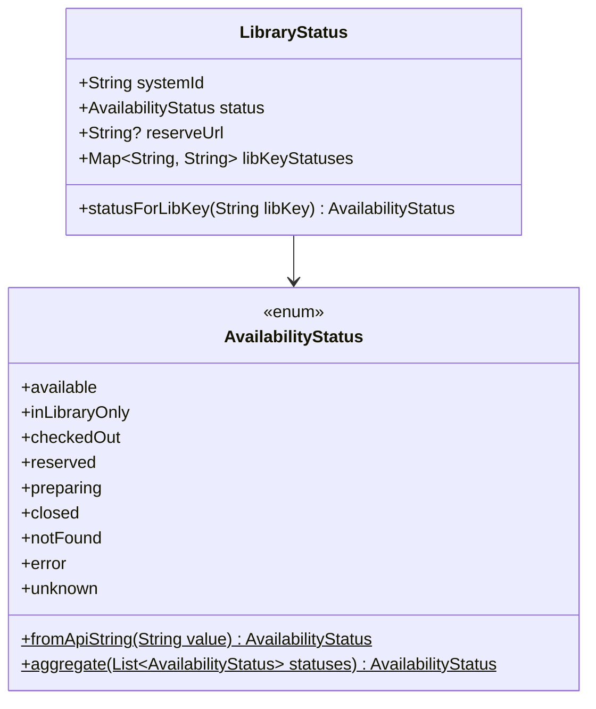
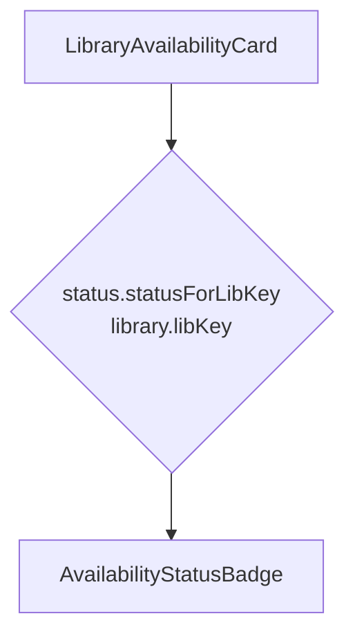
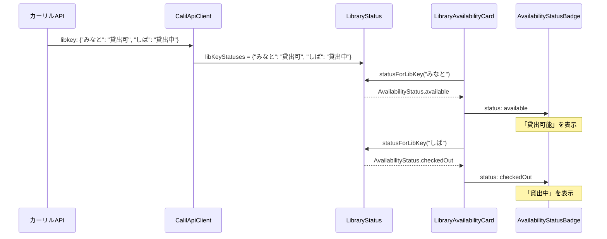

# 設計: 蔵書状況の表示バグ修正 (#19)

## Architecture Overview

現在のデータフローでは、カーリルAPIから取得した分館（libKey）ごとのステータスが`LibraryStatus.libKeyStatuses`に保存されているが、表示時にはシステム全体の集約ステータス（`LibraryStatus.status`）のみが使用されている。

本修正では、`LibraryStatus`に分館ごとのステータスを取得するメソッドを追加し、`LibraryAvailabilityCard`がそれを利用するように変更する。

## Component Design

### LibraryStatus モデル（修正）

`statusForLibKey(String libKey)` メソッド:
- `libKeyStatuses`マップからlibKeyに対応するAPI文字列を取得
- `AvailabilityStatus.fromApiString()`で変換して返す
- libKeyが存在しない場合は`AvailabilityStatus.notFound`を返す

### LibraryAvailabilityCard ウィジェット（修正）

変更前: `AvailabilityStatusBadge(status: status.status)`
変更後: `AvailabilityStatusBadge(status: status.statusForLibKey(library.libKey))`

## Data Flow

## Domain Models

変更対象のドメインモデルは`LibraryStatus`のみ。メソッド追加であり、既存フィールドへの変更はなし。
