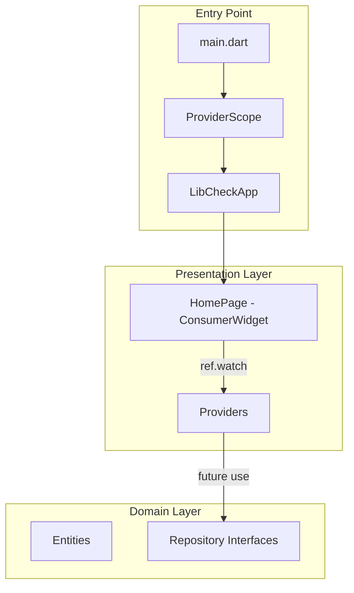
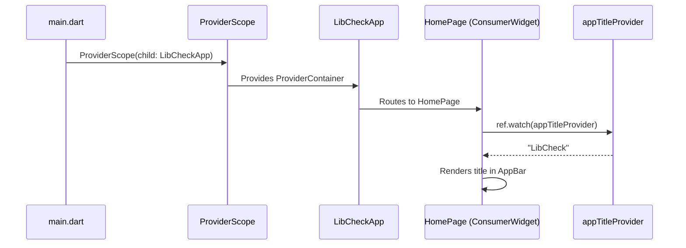

# Issue #2: 状態管理の導入 - Design

## Architecture Overview

Riverpod integrates with the existing Clean Architecture by providing dependency injection and state management across layers. `ProviderScope` at the root enables providers throughout the widget tree.



### Provider Architecture

Riverpod providers serve as the bridge between the presentation and domain layers:

- **Presentation providers**: UI state (loading, error, display values)
- **Domain/Use case providers**: Business logic that depends on repository interfaces
- **Data providers**: Repository implementations, API clients (injected via Riverpod)

## Component Design

### Modified Files

#### `lib/main.dart`
- Wrap `LibCheckApp` with `ProviderScope`

```dart
void main() {
  runApp(
    const ProviderScope(
      child: LibCheckApp(),
    ),
  );
}
```

#### `lib/presentation/pages/home_page.dart`
- Convert `HomePage` from `StatelessWidget` to `ConsumerWidget`
- Use `ref.watch(appTitleProvider)` to read the app title from the provider

### New Files

#### `lib/presentation/providers/app_providers.dart`
- `appTitleProvider`: A simple `Provider<String>` that returns the app title
- Demonstrates the Riverpod pattern for future feature providers

### Directory Structure (changes)

```
lib/
├── main.dart                              # Updated: ProviderScope wrapper
├── app.dart                               # Unchanged
├── presentation/
│   ├── pages/
│   │   └── home_page.dart                 # Updated: ConsumerWidget
│   └── providers/
│       └── app_providers.dart             # New: appTitleProvider
├── domain/
│   └── .gitkeep
└── data/
    └── .gitkeep
```

## Data Flow



## Domain Models

Not applicable for this issue. This issue only introduces the state management infrastructure. Domain-specific providers will be added in subsequent issues.
