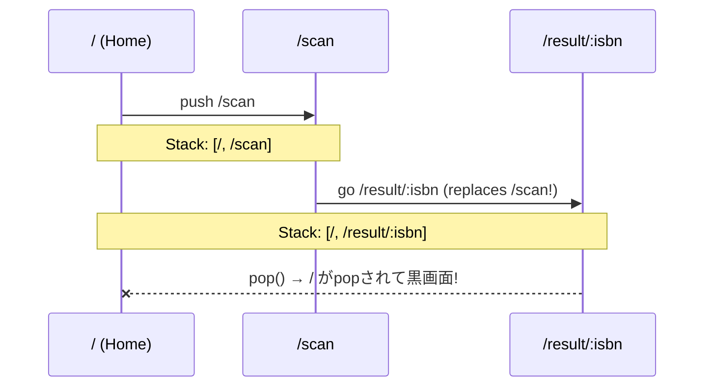
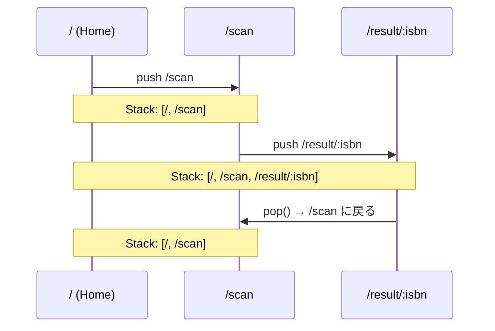

# 設計: 「別の本をスキャンする」ボタンで画面が真っ黒になるバグ修正 (#21)

## Architecture Overview

GoRouterには2つの主要な遷移メソッドがある：
- `context.go()`: 現在のルートを**置き換える**（スタックから消える）
- `context.push()`: 現在のルートの上に**積む**（スタックに残る）

本修正では、`BarcodeScannerPage`の遷移を`go()`から`push()`に変更する。

## Data Flow

### 修正前（バグあり）

### 修正後

## Component Design

変更対象: `BarcodeScannerPage._navigateToResult()`

変更前: `context.go('/result/$isbn');`
変更後: `context.push('/result/$isbn');`
