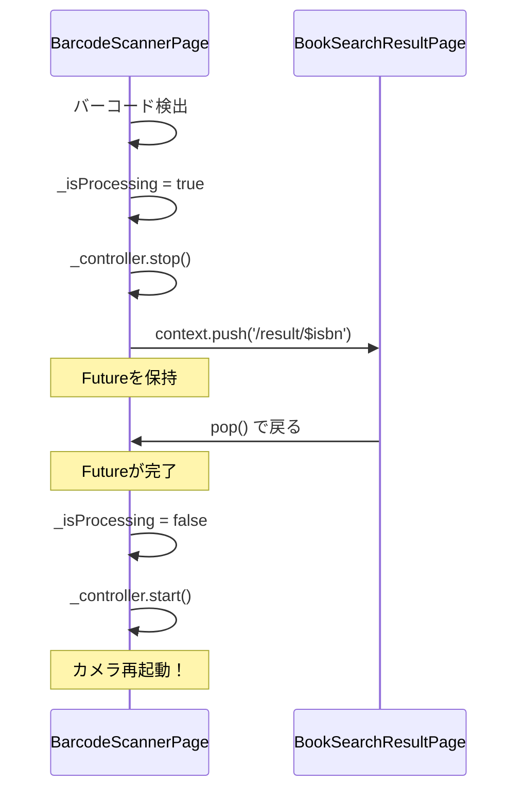

# 設計: バーコードスキャン画面に戻るとカメラが起動しないバグ修正 (#23)

## Architecture Overview

`context.push()`は`Future`を返し、pushされたルートがpopされた時に完了する。この`Future`のコールバックでカメラの再起動とフラグのリセットを行う。

## Data Flow

### 修正後



## Component Design

変更対象: `BarcodeScannerPage._navigateToResult()`

変更前:
```dart
void _navigateToResult(String isbn) {
  context.push('/result/$isbn');
}
```

変更後:
```dart
void _navigateToResult(String isbn) {
  context.push('/result/$isbn').then((_) {
    if (mounted) {
      _isProcessing = false;
      _controller.start();
    }
  });
}
```
