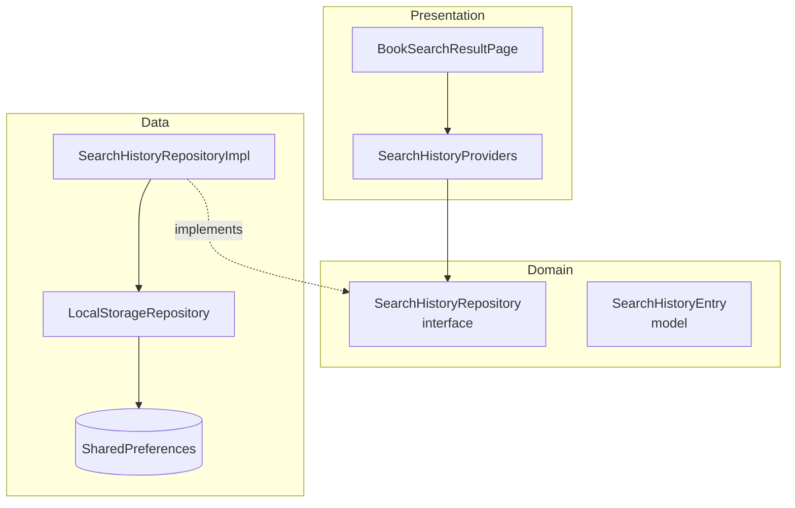
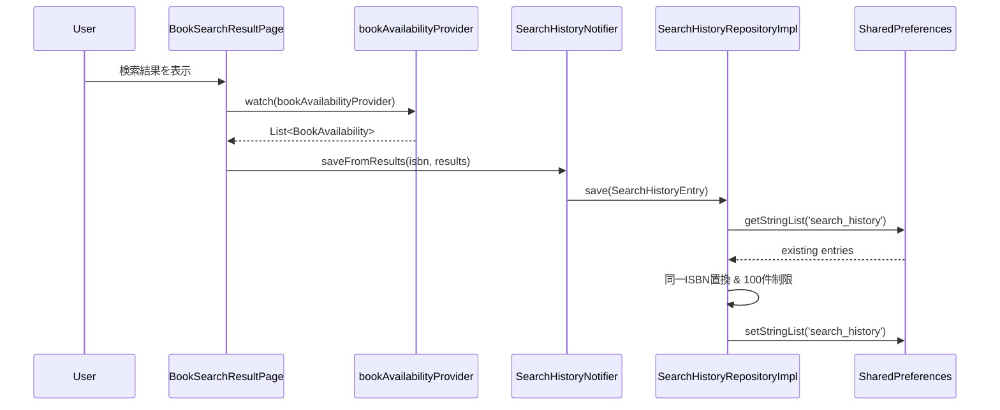
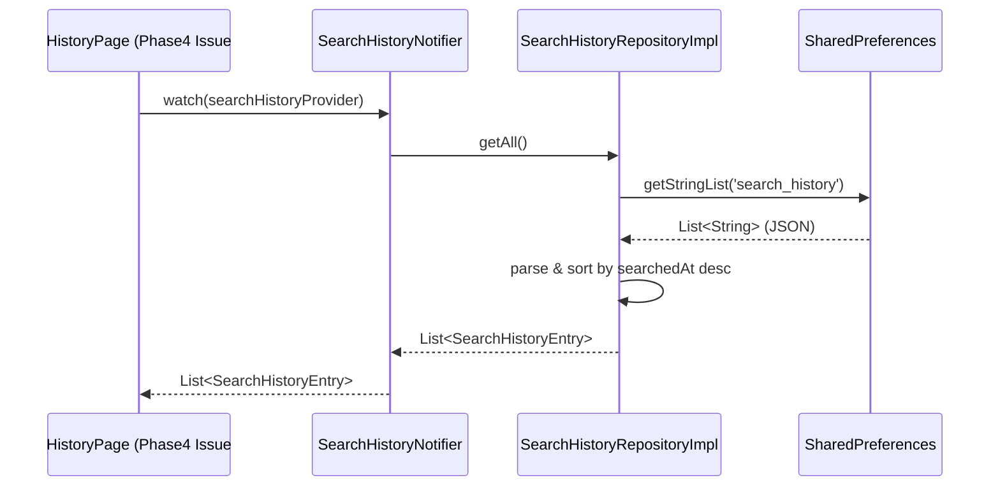
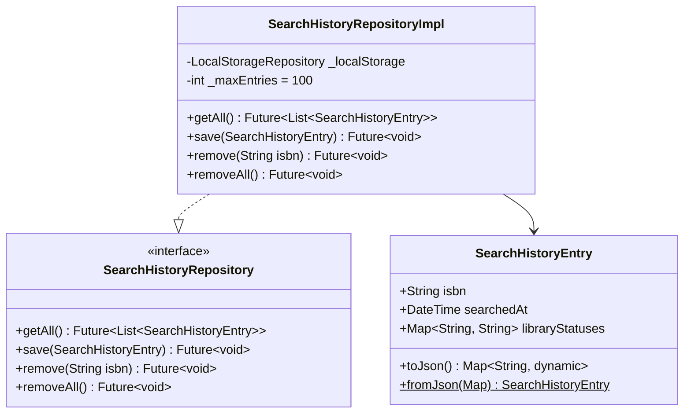

# Issue #25: 検索履歴の保存 — 設計

## Architecture Overview

既存の Clean Architecture に従い、検索履歴機能を domain / data / presentation の各レイヤーに分けて実装する。



## Component Design

### Domain Layer

#### `SearchHistoryEntry` モデル

検索履歴の1件を表すドメインモデル。

```dart
class SearchHistoryEntry {
  final String isbn;
  final DateTime searchedAt;
  final Map<String, String> libraryStatuses; // systemId → status文字列

  const SearchHistoryEntry({
    required this.isbn,
    required this.searchedAt,
    required this.libraryStatuses,
  });
}
```

**設計判断**:
- `libraryStatuses` は `Map<String, String>` として保存する。`AvailabilityStatus` enum の文字列表現（`available`, `checkedOut` 等）をそのまま保存し、表示時に enum へ変換する。これにより JSON シリアライズが単純になる。
- `reserveUrl` や `libKeyStatuses` の詳細は保存しない。履歴から再検索する際に最新データを取得するため。

#### `SearchHistoryRepository` インターフェース

```dart
abstract class SearchHistoryRepository {
  Future<List<SearchHistoryEntry>> getAll();
  Future<void> save(SearchHistoryEntry entry);
  Future<void> remove(String isbn);
  Future<void> removeAll();
}
```

### Data Layer

#### `SearchHistoryRepositoryImpl`

- SharedPreferences を使用して JSON 文字列のリストとして保存
- ストレージキー: `search_history`
- 保存形式: `List<String>`（各要素は `SearchHistoryEntry` の JSON 文字列）
- `save()` 時に同一 ISBN の既存エントリを置換し、最大100件に制限

**JSON フォーマット**:
```json
{
  "isbn": "9784003101018",
  "searchedAt": "2026-02-15T10:30:00.000",
  "libraryStatuses": {
    "Tokyo_Chiyoda": "available",
    "Tokyo_Shibuya": "checkedOut"
  }
}
```

### Presentation Layer

#### Provider 設計

```dart
// 検索履歴リポジトリの Provider
final searchHistoryRepositoryProvider = Provider<SearchHistoryRepository>((ref) {
  final localStorage = ref.watch(localStorageRepositoryProvider);
  return SearchHistoryRepositoryImpl(localStorage);
});

// 検索履歴リストの Provider（AsyncNotifier）
final searchHistoryProvider =
    AsyncNotifierProvider<SearchHistoryNotifier, List<SearchHistoryEntry>>(() {
  return SearchHistoryNotifier();
});
```

#### 検索結果保存のトリガー

既存の `bookAvailabilityProvider` の検索完了時に、検索結果を `SearchHistoryRepository` に保存する。`BookSearchResultPage` から Provider 経由で保存を呼び出す。

## Data Flow

### 検索履歴の保存フロー



### 検索履歴の取得フロー



## Domain Models


