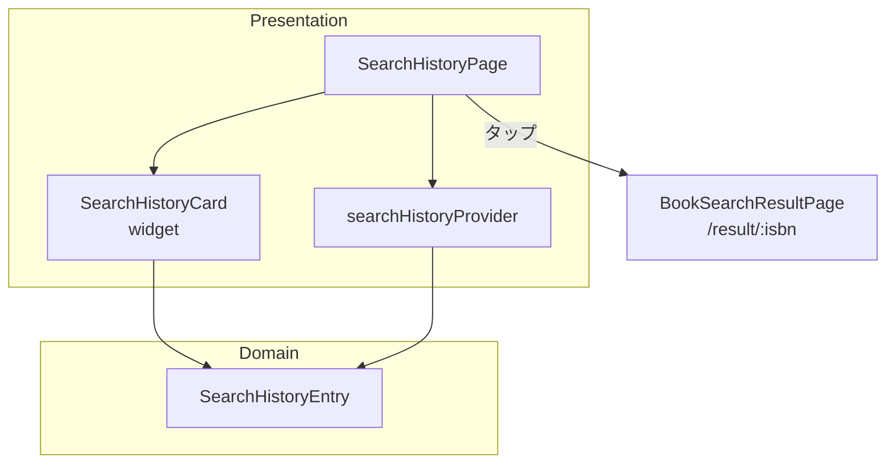
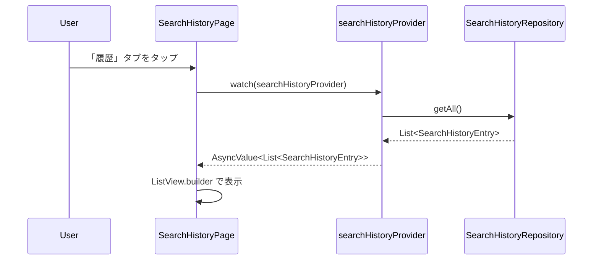
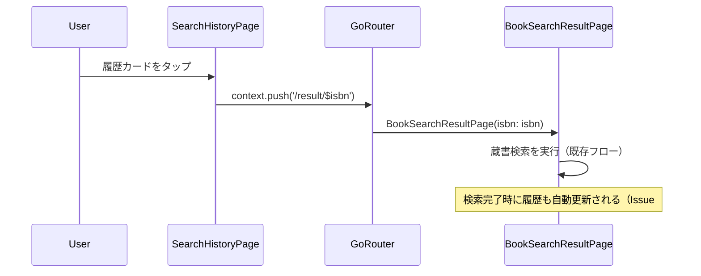
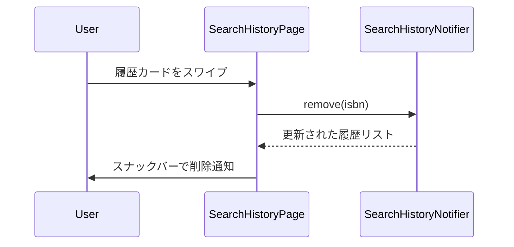

# Issue #26: 検索履歴一覧・再検索 — 設計

## Architecture Overview

既存の `HistoryPlaceholderPage` を `SearchHistoryPage` に置き換える。Issue #25 で実装した `searchHistoryProvider` を利用してデータを表示する。

## Component Design

### `SearchHistoryPage` (StatelessWidget / ConsumerWidget)

既存の `HistoryPlaceholderPage` を置き換えるメイン画面。

**構成要素:**
- AppBar: タイトル「検索履歴」+ 全削除アクション（アイコンボタン）
- Body: `searchHistoryProvider` の状態に応じて表示を切り替え
  - Loading: `CircularProgressIndicator`
  - Error: エラーメッセージ + リトライボタン
  - Data (empty): 空状態メッセージ（アイコン + テキスト）
  - Data (non-empty): `ListView.builder` で `SearchHistoryCard` をリスト表示

### `SearchHistoryCard` (StatelessWidget)

履歴1件を表示するカードウィジェット。

**表示要素:**
- ISBN テキスト
- 検索日時（フォーマット済み）
- 蔵書状況サマリーバッジ（最も良い `AvailabilityStatus` をバッジ表示）

**操作:**
- タップ: `/result/:isbn` に遷移して再検索
- スワイプ（Dismissible）: 個別削除（確認スナックバー付き）

### 日時フォーマット

`SearchHistoryEntry.searchedAt` を以下のルールで表示:
- 今日: 「HH:mm」
- 昨日: 「昨日」
- 2〜7日前: 「○日前」
- それ以上: 「yyyy/MM/dd」

## Data Flow

### 履歴一覧表示フロー

### 再検索フロー

### 個別削除フロー

## Domain Models

既存の `SearchHistoryEntry` モデル（Issue #25）をそのまま使用。追加のモデルは不要。
