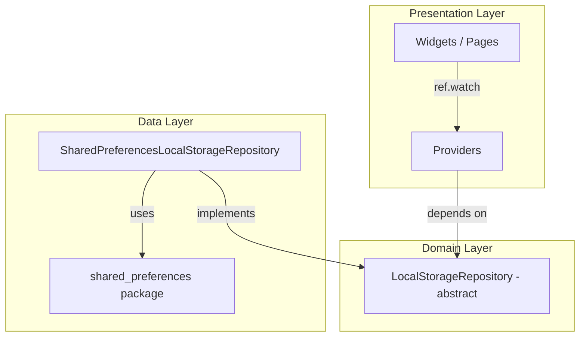
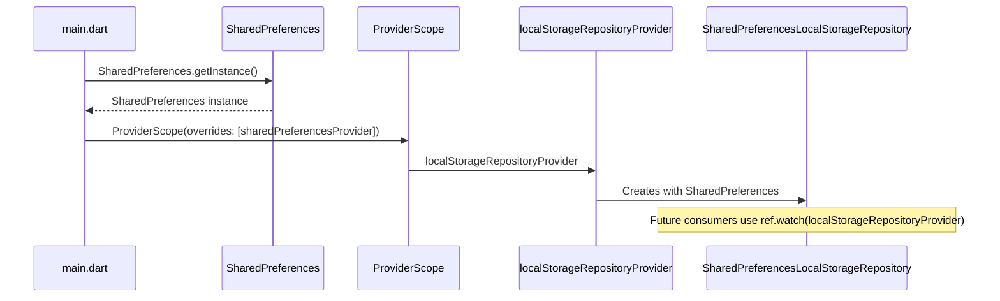

# Issue #3: ローカルストレージの導入 - Design

## Architecture Overview

Local storage follows Clean Architecture with the interface in the domain layer and the implementation in the data layer. Riverpod provides dependency injection.



### Dependency Rule

- **Domain**: Defines `LocalStorageRepository` abstract class — no external package dependencies.
- **Data**: Implements the repository using `shared_preferences`.
- **Presentation**: Accesses storage through the repository provider (future issues).

## Component Design

### New Files

#### `lib/domain/repositories/local_storage_repository.dart`
Abstract interface defining storage operations:

```dart
abstract class LocalStorageRepository {
  Future<String?> getString(String key);
  Future<bool> setString(String key, String value);
  Future<List<String>?> getStringList(String key);
  Future<bool> setStringList(String key, List<String> value);
  Future<bool> remove(String key);
}
```

#### `lib/data/repositories/shared_preferences_local_storage_repository.dart`
Concrete implementation using `shared_preferences`:

```dart
class SharedPreferencesLocalStorageRepository implements LocalStorageRepository {
  final SharedPreferences _prefs;

  SharedPreferencesLocalStorageRepository(this._prefs);
  // ... delegates to _prefs
}
```

#### `lib/data/providers/local_storage_providers.dart`
Riverpod providers for dependency injection:

```dart
final sharedPreferencesProvider = Provider<SharedPreferences>((ref) {
  throw UnimplementedError('Must be overridden in ProviderScope');
});

final localStorageRepositoryProvider = Provider<LocalStorageRepository>((ref) {
  final prefs = ref.watch(sharedPreferencesProvider);
  return SharedPreferencesLocalStorageRepository(prefs);
});
```

The `sharedPreferencesProvider` is designed to throw by default and must be overridden at app startup after asynchronously initializing `SharedPreferences.getInstance()`.

### Directory Structure (changes)

```
lib/
├── main.dart                                          # Updated: async init SharedPreferences
├── domain/
│   └── repositories/
│       └── local_storage_repository.dart              # New: abstract interface
└── data/
    ├── repositories/
    │   └── shared_preferences_local_storage_repository.dart  # New: implementation
    └── providers/
        └── local_storage_providers.dart               # New: Riverpod providers
```

## Data Flow



## Domain Models

### `LocalStorageRepository`

| Method | Parameters | Return | Description |
|--------|-----------|--------|-------------|
| `getString` | `String key` | `Future<String?>` | Retrieve a string value |
| `setString` | `String key, String value` | `Future<bool>` | Store a string value |
| `getStringList` | `String key` | `Future<List<String>?>` | Retrieve a list of strings |
| `setStringList` | `String key, List<String> value` | `Future<bool>` | Store a list of strings |
| `remove` | `String key` | `Future<bool>` | Remove a stored value |
