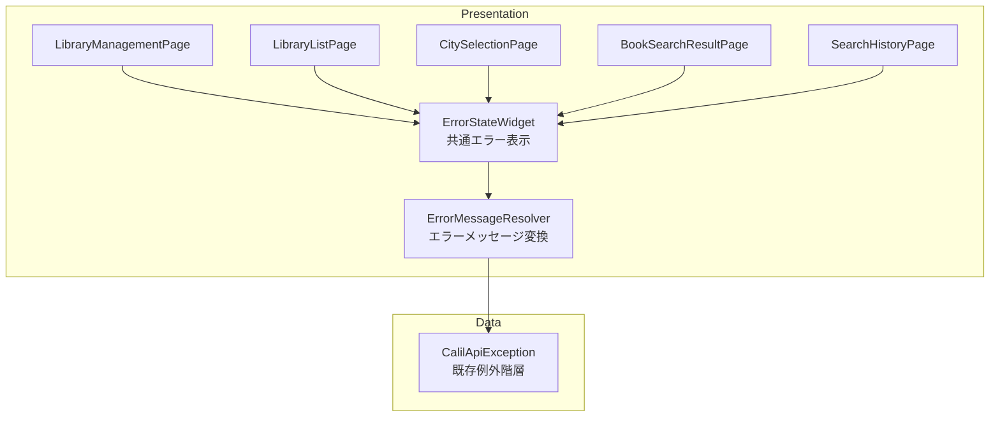
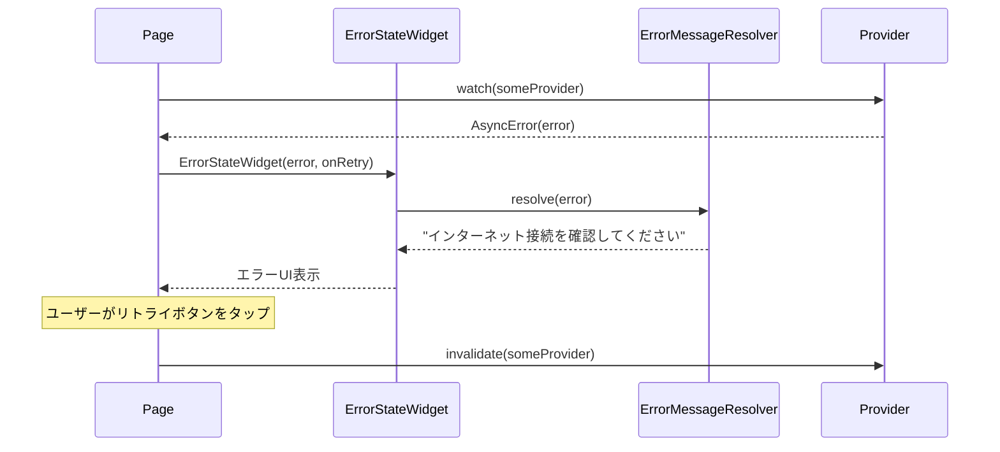

# Issue #30: エラーハンドリング・UX改善 — 設計

## Architecture Overview

共通ウィジェット `ErrorStateWidget` と エラーメッセージマッピングユーティリティ `ErrorMessageResolver` を追加し、各画面のエラー/ローディング表示を統一する。



## Component Design

### `ErrorStateWidget`

全画面で使用する共通エラー表示ウィジェット。

```dart
class ErrorStateWidget extends StatelessWidget {
  const ErrorStateWidget({
    super.key,
    required this.error,
    required this.onRetry,
  });

  final Object error;
  final VoidCallback onRetry;
}
```

**表示内容:**
- エラーアイコン（`Icons.error_outline`、色: `#D32F2F`）
- ユーザーフレンドリーなエラーメッセージ（`ErrorMessageResolver` で変換）
- リトライボタン（`FilledButton`）

### `ErrorMessageResolver`

例外の種類に応じてユーザー向けメッセージを返すユーティリティ。

```dart
class ErrorMessageResolver {
  static String resolve(Object error) {
    return switch (error) {
      CalilNetworkException _ => 'インターネット接続を確認してください',
      CalilTimeoutException _ => '応答に時間がかかっています。再度お試しください',
      CalilHttpException _ => 'サーバーとの通信に失敗しました',
      CalilParseException _ => 'データの読み取りに失敗しました',
      _ => 'エラーが発生しました',
    };
  }
}
```

### ローディング表示の統一

各画面のローディング状態に補助テキストを追加:

| 画面 | 補助テキスト |
|------|-------------|
| LibraryManagementPage | 「読み込み中...」 |
| LibraryListPage | 「図書館を検索中...」 |
| CitySelectionPage | 「読み込み中...」 |
| BookSearchResultPage | 既存の「蔵書を検索中...」（変更なし） |
| SearchHistoryPage | 「読み込み中...」 |

## Data Flow



## 修正対象ページ一覧

| ページ | 現状の問題 | 修正内容 |
|--------|-----------|----------|
| LibraryManagementPage | 生エラー表示 `Text('エラー: $error')` | `ErrorStateWidget` に置換 |
| LibraryListPage | アイコンの色指定なし、TextButton | `ErrorStateWidget` に置換 |
| CitySelectionPage | アイコンの色指定なし、TextButton | `ErrorStateWidget` に置換 |
| BookSearchResultPage | 個別実装済みだがスタイル不統一 | `ErrorStateWidget` に置換 |
| SearchHistoryPage | 個別実装済みだがスタイル不統一 | `ErrorStateWidget` に置換 |
