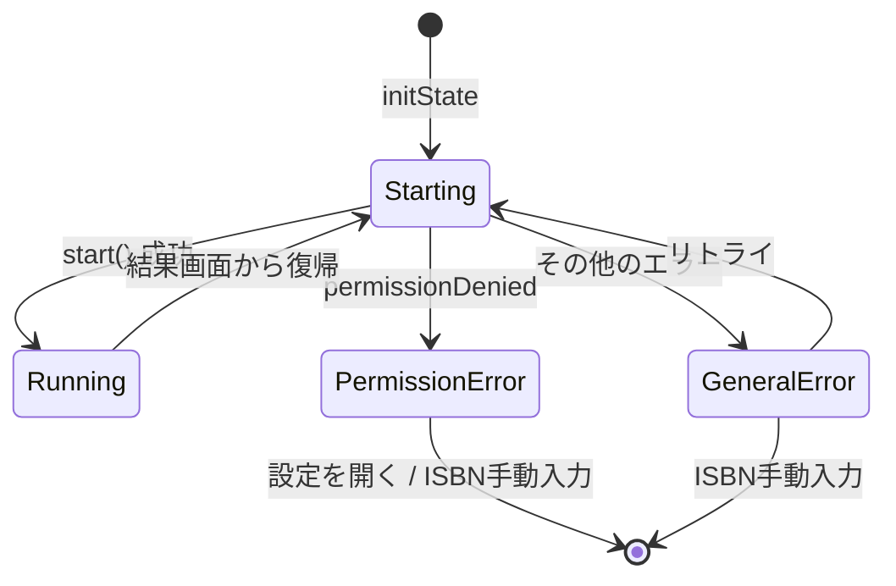

# Issue #36: バーコードスキャン画面のエラーハンドリング修正 — 設計

## Architecture Overview

`BarcodeScannerPage` のエラーハンドリングを改善し、エラー種別に応じて適切な UI を表示する。

## Component Design

### エラー状態の分類

### 変更対象ファイル

| ファイル | 変更内容 |
|---------|---------|
| `lib/presentation/pages/barcode_scanner_page.dart` | エラーコード判別、状態管理の改善 |
| `test/presentation/pages/barcode_scanner_page_test.dart` | エラーパターン別のテスト追加 |

### BarcodeScannerPage の状態管理変更

**Before:**
- `bool _hasPermissionError` — 全エラーを一括管理

**After:**
- `MobileScannerErrorCode? _errorCode` — エラーコードを保持し、null なら正常状態

### UI 分岐

- `_errorCode == null` → カメラプレビュー表示
- `_errorCode == permissionDenied` → 既存の `CameraPermissionErrorWidget`
- `_errorCode != null && _errorCode != permissionDenied` → リトライ可能なエラー画面（`ErrorStateWidget` を活用）

## Data Flow

1. `initState` → `_startCamera()` 呼び出し
2. `_startCamera()` 内で `_controller.start()` を await
3. 成功 → `_errorCode = null`
4. 失敗 → `_errorCode = exception.errorCode` をセット
5. リトライ → `_errorCode = null` にリセットして `_startCamera()` を再呼び出し

## Domain Models

変更なし。
