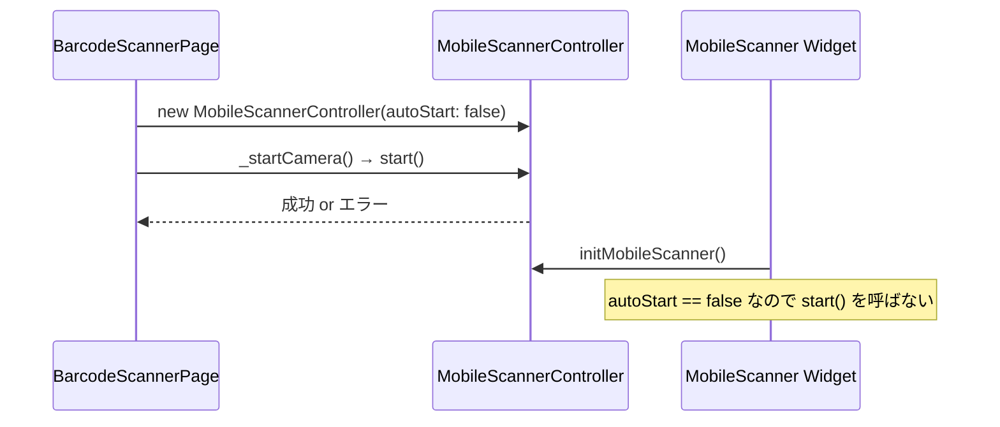

# Issue #38: バーコードスキャン画面でカメラ映像が真っ白になる — 設計

## Architecture Overview

`MobileScannerController` の `autoStart` を `false` に設定し、`MobileScanner` ウィジェット側の自動起動を無効化する。カメラの起動は `BarcodeScannerPage` の `_startCamera()` のみが担当する。

## Component Design

### 変更点

| 変更前 | 変更後 |
|--------|--------|
| `MobileScannerController()` | `MobileScannerController(autoStart: false)` |

この1行の変更により、`MobileScanner` ウィジェットの `initMobileScanner()` 内で `controller.autoStart` が `false` となり、ウィジェット側の `controller.start()` がスキップされる。

### カメラ起動フロー

## Data Flow

変更なし。

## Domain Models

変更なし。
