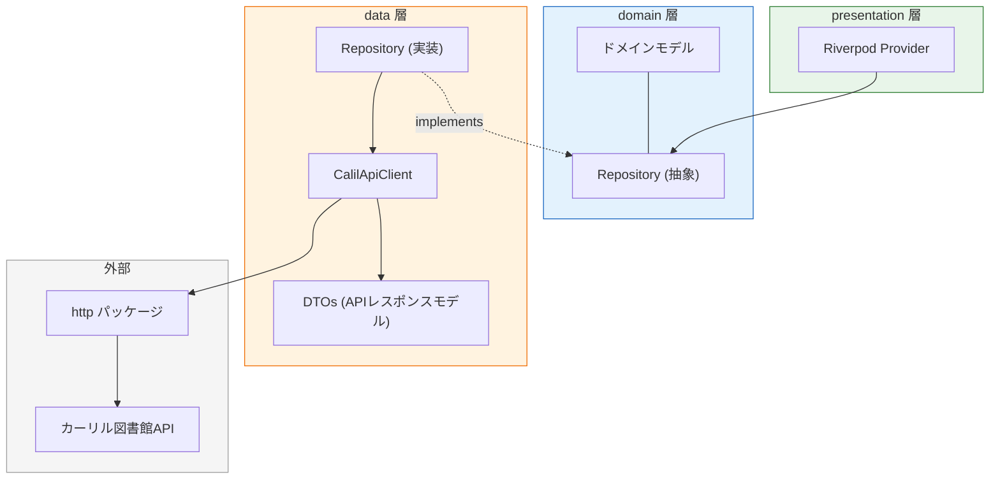
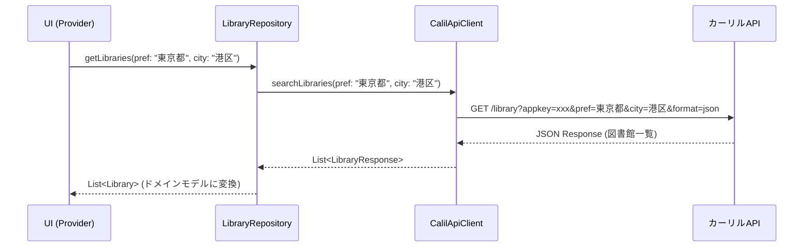
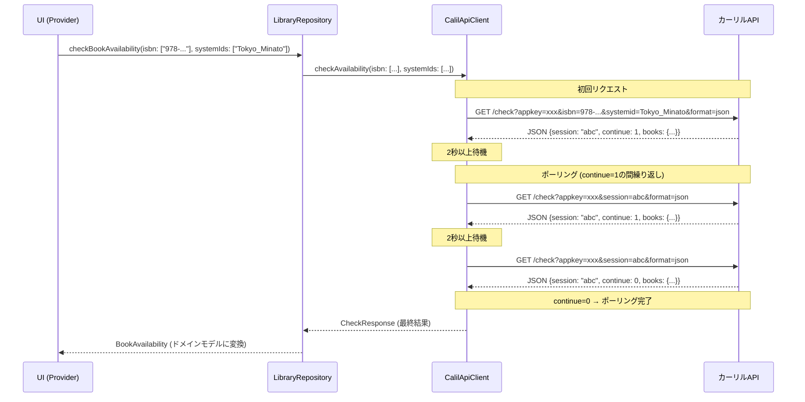
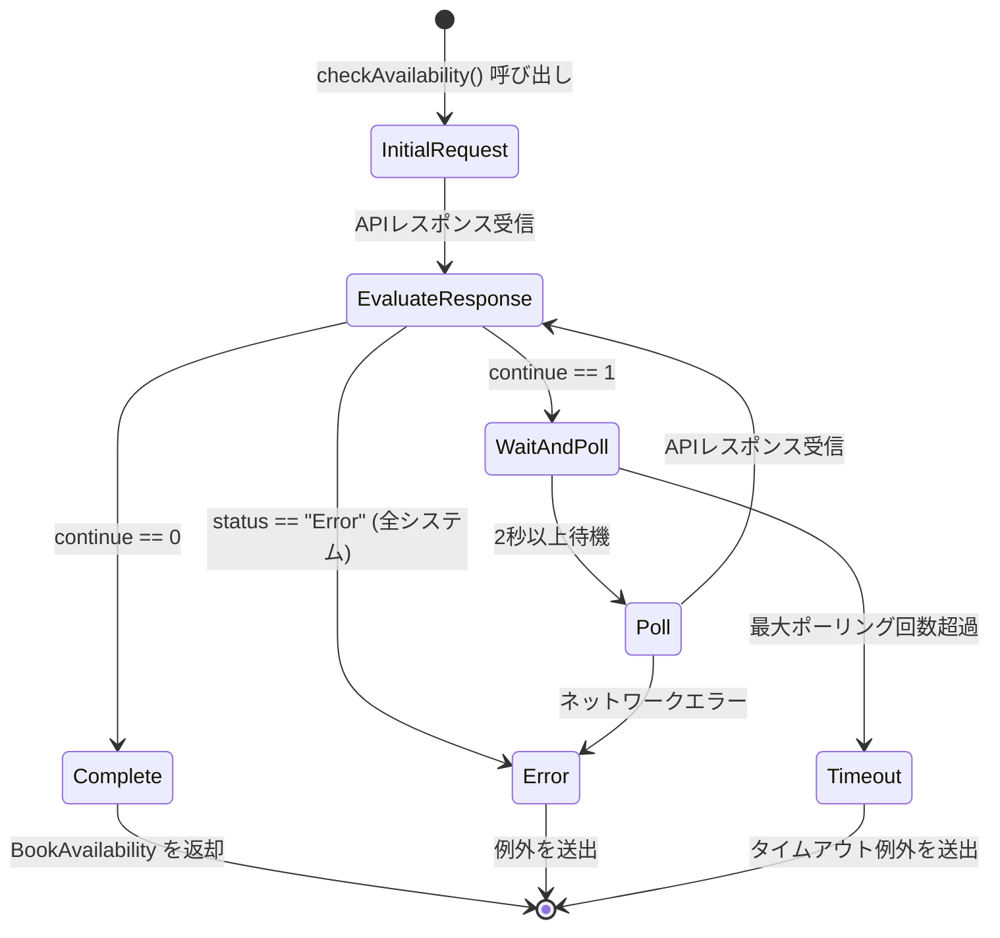
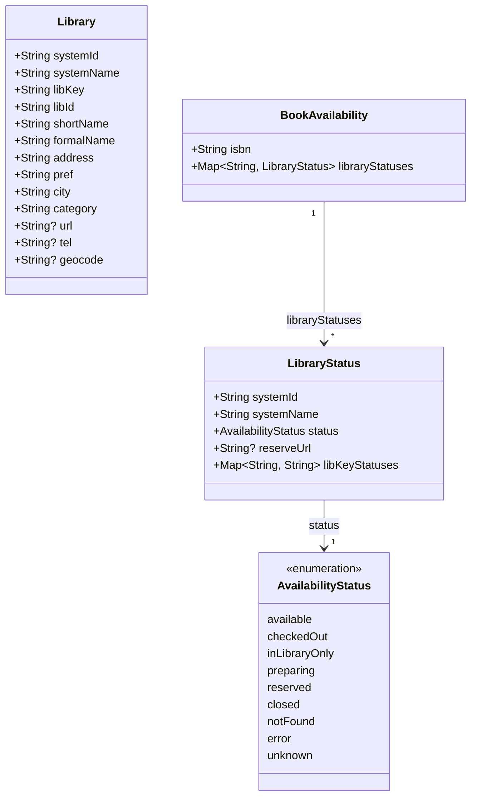
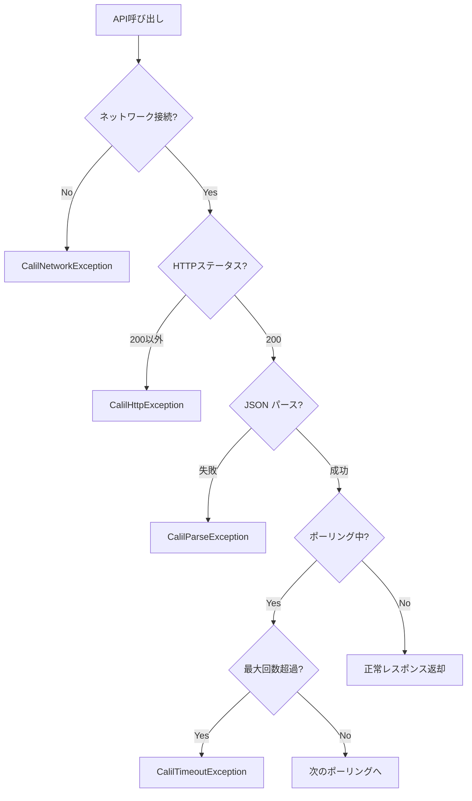

# Issue #4: カーリルAPIクライアントの実装 — 設計書

## アーキテクチャ概要

Clean Architectureのレイヤー分離に従い、以下の構成でカーリルAPIクライアントを実装する。



### レイヤー責務

| レイヤー | 責務 | 配置先 |
|---------|------|--------|
| **domain** | ドメインモデル定義、Repository抽象インターフェース | `lib/domain/` |
| **data** | API通信の実装、DTOからドメインモデルへの変換、Repository実装 | `lib/data/` |
| **presentation** | Riverpod Providerを通じたデータ提供 | `lib/presentation/providers/` |

## コンポーネント設計

### ディレクトリ構成

```
lib/
├── data/
│   ├── datasources/
│   │   └── calil_api_client.dart       # APIクライアント実装
│   ├── models/
│   │   ├── library_response.dart        # /library レスポンスDTO
│   │   └── check_response.dart          # /check レスポンスDTO
│   └── repositories/
│       └── library_repository_impl.dart # Repository実装
├── domain/
│   ├── models/
│   │   ├── library.dart                 # 図書館モデル
│   │   ├── book_availability.dart       # 蔵書検索結果モデル
│   │   └── library_status.dart          # 図書館別蔵書状態モデル
│   └── repositories/
│       └── library_repository.dart      # Repository抽象
└── presentation/
    └── providers/
        └── library_providers.dart       # Riverpod Provider定義
```

### コンポーネント一覧

#### 1. `CalilApiClient` — APIクライアント

カーリルAPIとの直接通信を担当する。

```dart
/// カーリル図書館APIクライアント
class CalilApiClient {
  CalilApiClient({
    required String appKey,
    http.Client? httpClient,
  });

  /// 図書館検索 API (/library)
  ///
  /// [pref] 都道府県名（必須）
  /// [city] 市区町村名（オプション）
  /// Returns: APIレスポンスのDTO
  Future<List<LibraryResponse>> searchLibraries({
    required String pref,
    String? city,
  });

  /// 蔵書検索 API (/check) — ポーリング込み
  ///
  /// [isbn] ISBN（1件〜複数件）
  /// [systemIds] 図書館システムID（1件〜複数件）
  /// Returns: ポーリング完了後の最終結果DTO
  Future<CheckResponse> checkAvailability({
    required List<String> isbn,
    required List<String> systemIds,
  });
}
```

**設計ポイント:**
- `http.Client` をコンストラクタ注入で受け取り、テスト時にモック可能
- APIキーもコンストラクタ注入
- ポーリングロジックは `checkAvailability` 内部にカプセル化

#### 2. DTOs — APIレスポンスモデル

APIのJSONレスポンスを忠実にマッピングするデータクラス。

```dart
/// /library レスポンスの1件分
class LibraryResponse {
  final String systemId;
  final String systemName;
  final String libKey;
  final String libId;
  final String shortName;
  final String formalName;
  final String? urlPc;
  final String address;
  final String pref;
  final String city;
  final String? post;
  final String? tel;
  final String? geocode;
  final String category;

  factory LibraryResponse.fromJson(Map<String, dynamic> json);
}
```

```dart
/// /check レスポンス全体
class CheckResponse {
  final String session;
  final int continueFlag;  // 0: 完了, 1: 継続
  final Map<String, Map<String, BookSystemStatus>> books;
  // books[isbn][systemId] = BookSystemStatus

  factory CheckResponse.fromJson(Map<String, dynamic> json);
}

/// /check レスポンス内のシステム別ステータス
class BookSystemStatus {
  final String status;  // OK, Cache, Running, Error
  final String? reserveUrl;
  final Map<String, String> libKeys;
  // libKeys[libKey] = "貸出可" | "貸出中" | "蔵書あり" | "館内のみ" | "蔵書なし" ...

  factory BookSystemStatus.fromJson(Map<String, dynamic> json);
}
```

#### 3. ドメインモデル

アプリケーション内部で使用するビジネスモデル。APIレスポンスの構造に依存しない。

#### 4. `LibraryRepository` — Repository抽象

```dart
/// 図書館データのリポジトリ（抽象）
abstract class LibraryRepository {
  /// 指定地域の図書館一覧を取得
  Future<List<Library>> getLibraries({
    required String pref,
    String? city,
  });

  /// 蔵書検索を実行
  Future<BookAvailability> checkBookAvailability({
    required List<String> isbn,
    required List<String> systemIds,
  });
}
```

#### 5. `LibraryRepositoryImpl` — Repository実装

```dart
/// LibraryRepository の実装
/// CalilApiClient を使用してAPIを呼び出し、
/// DTOからドメインモデルへの変換を担当
class LibraryRepositoryImpl implements LibraryRepository {
  LibraryRepositoryImpl({required CalilApiClient apiClient});

  @override
  Future<List<Library>> getLibraries({...});

  @override
  Future<BookAvailability> checkBookAvailability({...});
}
```

## データフロー

### 図書館検索フロー



### 蔵書検索フロー（ポーリング）



### ポーリング状態遷移



## ドメインモデル

### クラス図



### `Library` — 図書館

```dart
/// 図書館を表すドメインモデル
class Library {
  const Library({
    required this.systemId,
    required this.systemName,
    required this.libKey,
    required this.libId,
    required this.shortName,
    required this.formalName,
    required this.address,
    required this.pref,
    required this.city,
    required this.category,
    this.url,
    this.tel,
    this.geocode,
  });

  /// 図書館システムID（例: "Tokyo_Minato"）
  final String systemId;

  /// 図書館システム名（例: "港区図書館"）
  final String systemName;

  /// 図書館キー（例: "みなと"）— 蔵書検索結果のマッピングに使用
  final String libKey;

  /// 図書館ID
  final String libId;

  /// 図書館略称
  final String shortName;

  /// 図書館正式名称
  final String formalName;

  /// 住所
  final String address;

  /// 都道府県
  final String pref;

  /// 市区町村
  final String city;

  /// カテゴリ（SMALL, MEDIUM, LARGE, UNIV, SPECIAL）
  final String category;

  /// ウェブサイトURL
  final String? url;

  /// 電話番号
  final String? tel;

  /// 緯度経度（"経度,緯度" 形式）
  final String? geocode;
}
```

### `BookAvailability` — 蔵書検索結果

```dart
/// ISBNに対する蔵書検索結果
class BookAvailability {
  const BookAvailability({
    required this.isbn,
    required this.libraryStatuses,
  });

  /// 検索対象のISBN
  final String isbn;

  /// システムID -> 図書館別蔵書状態
  final Map<String, LibraryStatus> libraryStatuses;
}
```

### `LibraryStatus` — 図書館別蔵書状態

```dart
/// 特定の図書館システムにおける蔵書状態
class LibraryStatus {
  const LibraryStatus({
    required this.systemId,
    required this.status,
    this.reserveUrl,
    required this.libKeyStatuses,
  });

  /// 図書館システムID
  final String systemId;

  /// 集約された蔵書状態
  final AvailabilityStatus status;

  /// 予約ページURL（あれば）
  final String? reserveUrl;

  /// 図書館キーごとの個別ステータス
  /// libKey -> ステータス文字列（"貸出可", "貸出中" など）
  final Map<String, String> libKeyStatuses;
}
```

### `AvailabilityStatus` — 蔵書状態列挙型

```dart
/// 蔵書の利用可否状態
enum AvailabilityStatus {
  /// 貸出可能
  available,

  /// 貸出中
  checkedOut,

  /// 館内のみ利用可
  inLibraryOnly,

  /// 準備中
  preparing,

  /// 予約中
  reserved,

  /// 休館中
  closed,

  /// 蔵書なし
  notFound,

  /// エラー（取得失敗）
  error,

  /// 不明（未知のステータス文字列）
  unknown,
}
```

### ステータス文字列からEnumへのマッピング

| APIレスポンス文字列 | `AvailabilityStatus` |
|--------------------|---------------------|
| `"貸出可"` | `available` |
| `"蔵書あり"` | `available` |
| `"館内のみ"` | `inLibraryOnly` |
| `"貸出中"` | `checkedOut` |
| `"予約中"` | `reserved` |
| `"準備中"` | `preparing` |
| `"休館中"` | `closed` |
| `"蔵書なし"` | `notFound` |
| `""` (空文字列) | `notFound` |
| その他 | `unknown` |

**集約ルール:** 1つのシステム内に複数のlibKeyがある場合、最も利用可能性が高いステータスを代表値とする。優先順位: `available` > `inLibraryOnly` > `checkedOut` > `reserved` > `preparing` > `closed` > `notFound` > `error` > `unknown`

## エラーハンドリング

### カスタム例外クラス

```dart
/// カーリルAPI関連の例外基底クラス
abstract class CalilApiException implements Exception {
  final String message;
  const CalilApiException(this.message);
}

/// ネットワーク接続エラー
class CalilNetworkException extends CalilApiException {
  const CalilNetworkException(super.message);
}

/// APIレスポンスエラー（非200ステータスコード）
class CalilHttpException extends CalilApiException {
  final int statusCode;
  const CalilHttpException(super.message, {required this.statusCode});
}

/// APIレスポンスのパースエラー
class CalilParseException extends CalilApiException {
  const CalilParseException(super.message);
}

/// ポーリングタイムアウト
class CalilTimeoutException extends CalilApiException {
  const CalilTimeoutException(super.message);
}
```

### エラーハンドリングフロー



## APIキー管理

- APIキーは `--dart-define` を使用してビルド時に注入する
- デバッグ用に `.env` ファイルからの読み込みも可能とする（`flutter_dotenv` は使用せず、`String.fromEnvironment` を使用）
- `.env` ファイルは `.gitignore` に追加済みであること

```dart
class CalilApiConfig {
  /// ビルド時の --dart-define で注入
  static const String appKey = String.fromEnvironment(
    'CALIL_APP_KEY',
    defaultValue: '',
  );

  static const String baseUrl = 'https://api.calil.jp';
  static const Duration pollingInterval = Duration(seconds: 2);
  static const int maxPollingCount = 30;
  static const Duration httpTimeout = Duration(seconds: 10);
}
```
