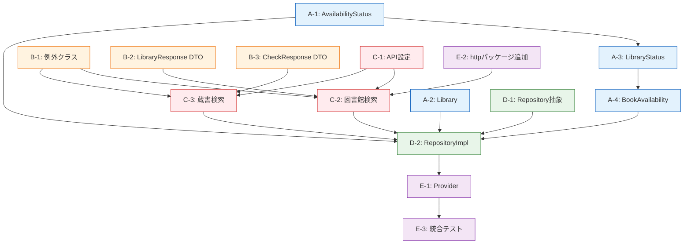

# Issue #4: カーリルAPIクライアントの実装 — タスクリスト

## 前提条件

- [x] Issue #1（プロジェクト構造の整理）が完了していること
- [x] Issue #2（状態管理の導入 — Riverpod）が完了していること

## タスク一覧

### Phase A: ドメインモデルの定義

- [x] **A-1**: `AvailabilityStatus` 列挙型の作成
  - ファイル: `lib/domain/models/availability_status.dart`
  - 蔵書状態の列挙値定義（available, checkedOut, inLibraryOnly, ...）
  - APIレスポンス文字列からEnumへの変換メソッド `fromApiString()`
  - 集約優先順位の比較メソッド
  - テスト: `test/domain/models/availability_status_test.dart`

- [x] **A-2**: `Library` モデルの作成
  - ファイル: `lib/domain/models/library.dart`
  - 図書館情報を表す immutable クラス（systemId, systemName, libKey, formalName, address, ...）
  - `==` / `hashCode` のオーバーライド
  - テスト: `test/domain/models/library_test.dart`

- [x] **A-3**: `LibraryStatus` モデルの作成
  - ファイル: `lib/domain/models/library_status.dart`
  - 図書館別蔵書状態（systemId, status, reserveUrl, libKeyStatuses）
  - テスト: `test/domain/models/library_status_test.dart`

- [x] **A-4**: `BookAvailability` モデルの作成
  - ファイル: `lib/domain/models/book_availability.dart`
  - ISBN と図書館別状態のマップ
  - テスト: `test/domain/models/book_availability_test.dart`

### Phase B: 例外クラスとAPIレスポンスDTO

- [x] **B-1**: カスタム例外クラスの作成
  - ファイル: `lib/data/exceptions/calil_api_exception.dart`
  - `CalilApiException`（基底）、`CalilNetworkException`、`CalilHttpException`、`CalilParseException`、`CalilTimeoutException`
  - テスト: `test/data/exceptions/calil_api_exception_test.dart`

- [x] **B-2**: `/library` レスポンスDTOの作成
  - ファイル: `lib/data/models/library_response.dart`
  - `LibraryResponse` クラス + `fromJson()` ファクトリ
  - テスト: `test/data/models/library_response_test.dart`（サンプルJSONからのパーステスト）

- [x] **B-3**: `/check` レスポンスDTOの作成
  - ファイル: `lib/data/models/check_response.dart`
  - `CheckResponse` クラス + `BookSystemStatus` クラス + `fromJson()` ファクトリ
  - テスト: `test/data/models/check_response_test.dart`（サンプルJSONからのパーステスト、continue=0/1の両ケース）

### Phase C: APIクライアントの実装

- [x] **C-1**: API設定クラスの作成
  - ファイル: `lib/data/datasources/calil_api_config.dart`
  - APIキー、ベースURL、ポーリング間隔、最大ポーリング回数、タイムアウト設定
  - `--dart-define` による外部注入対応

- [x] **C-2**: `CalilApiClient` — 図書館検索メソッドの実装
  - ファイル: `lib/data/datasources/calil_api_client.dart`
  - `searchLibraries(pref, city?)` メソッドの実装
  - HTTPリクエスト組み立て、レスポンスパース、エラーハンドリング
  - テスト: `test/data/datasources/calil_api_client_search_libraries_test.dart`
    - 正常系: 都道府県のみ / 都道府県+市区町村
    - 異常系: ネットワークエラー、非200レスポンス、不正JSON

- [x] **C-3**: `CalilApiClient` — 蔵書検索メソッドの実装（ポーリング含む）
  - ファイル: `lib/data/datasources/calil_api_client.dart`（C-2と同一ファイルに追加）
  - `checkAvailability(isbn, systemIds)` メソッドの実装
  - 初回リクエスト + ポーリングループ（continue判定、2秒待機、最大回数制限）
  - テスト: `test/data/datasources/calil_api_client_check_availability_test.dart`
    - 正常系: 即座完了（continue=0）、ポーリング1回後完了、複数回ポーリング
    - 異常系: ネットワークエラー、最大ポーリング超過、不正レスポンス

### Phase D: Repository実装

- [x] **D-1**: `LibraryRepository` 抽象クラスの作成
  - ファイル: `lib/domain/repositories/library_repository.dart`
  - `getLibraries()` と `checkBookAvailability()` の抽象メソッド定義

- [x] **D-2**: `LibraryRepositoryImpl` の実装
  - ファイル: `lib/data/repositories/library_repository_impl.dart`
  - DTOからドメインモデルへの変換ロジック
  - `AvailabilityStatus` の集約ロジック（複数libKeyの場合、最も可用性の高いステータスを採用）
  - テスト: `test/data/repositories/library_repository_impl_test.dart`
    - DTO→ドメインモデル変換の正確性
    - ステータス集約ロジックのテスト

### Phase E: Riverpod Provider と仕上げ

- [x] **E-1**: Riverpod Provider の定義
  - ファイル: `lib/presentation/providers/library_providers.dart`
  - `calilApiClientProvider`、`libraryRepositoryProvider` の定義
  - テスト: Provider の生成テスト

- [x] **E-2**: `http` パッケージの追加
  - `pubspec.yaml` に `http` パッケージを追加
  - `flutter pub get` の実行

- [x] **E-3**: 統合テスト・全テスト実行
  - `flutter test` で全テストがパスすることを確認
  - コードカバレッジの確認

## 実装順序の依存関係

## 注意事項

- 各タスクはTDDで実施する（テスト先行 → 実装 → リファクタリング）
- `http.Client` のモックには `http` パッケージの `MockClient` を使用する
- APIキーはテストではダミー値を使用する（`"test_api_key"`）
- ポーリングテストでは実際に2秒待機せず、タイマーをモック化する
