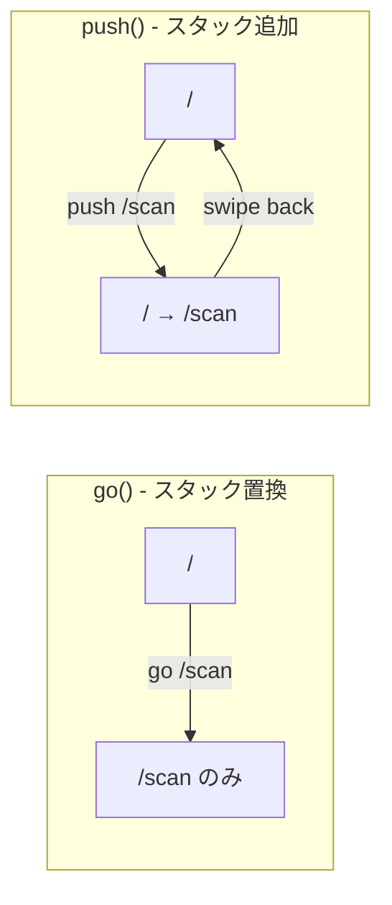

# Issue #40: バーコードスキャン画面からスワイプバックするとアプリが閉じる — 設計

## Architecture Overview

`HomePage` から `/scan` と `/isbn-input` への遷移を `context.go()` から `context.push()` に変更する。

## Component Design

### go() と push() の違い

### 変更対象

| ファイル | 行 | 変更内容 |
|---------|-----|---------|
| `lib/presentation/pages/home_page.dart` | 36 | `context.go('/scan')` → `context.push('/scan')` |
| `lib/presentation/pages/home_page.dart` | 45 | `context.go('/isbn-input')` → `context.push('/isbn-input')` |

## Data Flow

変更なし。

## Domain Models

変更なし。
