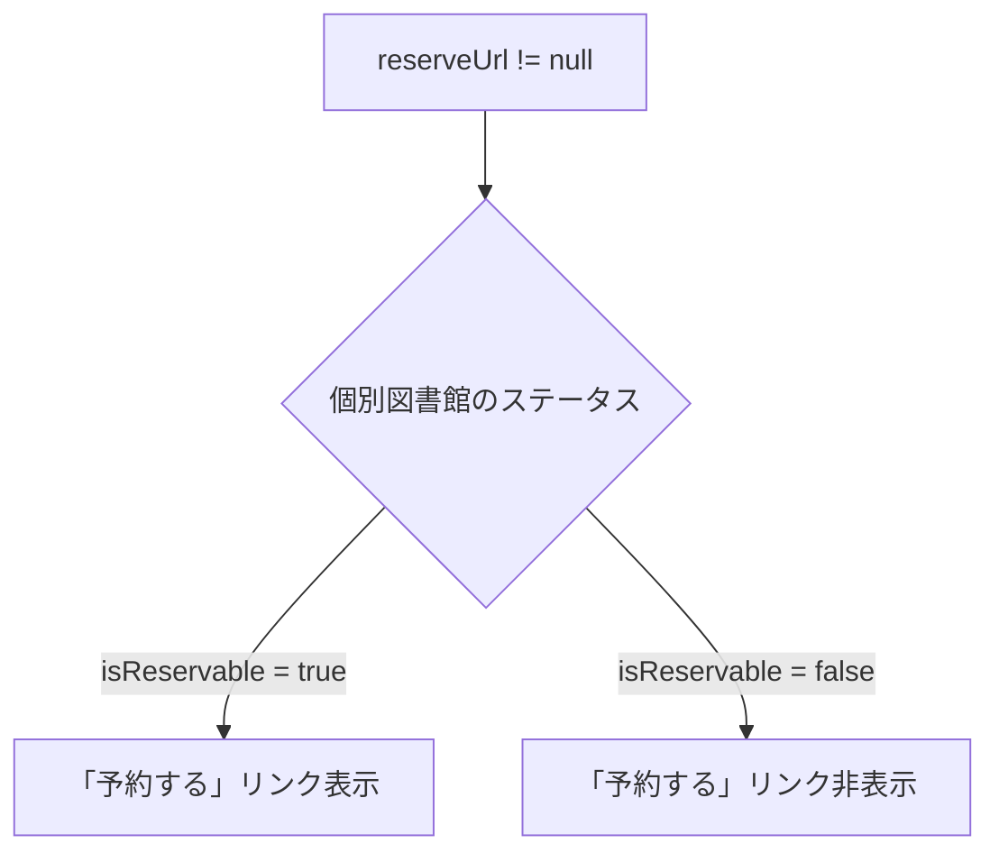
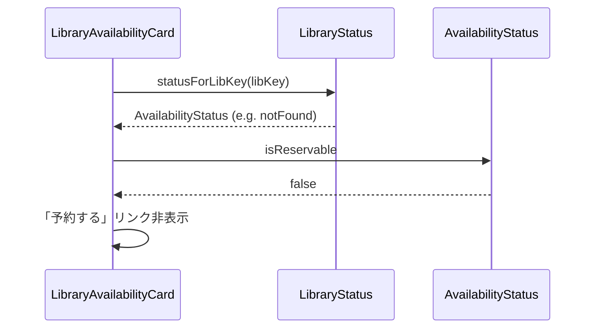

# Issue #42: Design

## Architecture Overview

ドメイン層の `AvailabilityStatus` enum に `isReservable` プロパティを追加し、各ステータスが予約可能かどうかを判定する。UI層ではこのプロパティと `reserveUrl` の両方を条件として「予約する」リンクの表示を制御する。

## Component Design

### 1. `AvailabilityStatus` (ドメイン層)

`isReservable` getter を追加する。

```dart
bool get isReservable => switch (this) {
  available || inLibraryOnly || checkedOut || reserved || preparing => true,
  notFound || closed || error || unknown => false,
};
```

### 2. `LibraryAvailabilityCard` (UI層)

個別図書館のステータスに基づいて予約リンクの表示を制御する。



**変更前:**
```dart
if (status.reserveUrl != null) ...[
```

**変更後:**
```dart
final libKeyStatus = status.statusForLibKey(library.libKey);
// ...
if (status.reserveUrl?.isNotEmpty ?? false && libKeyStatus.isReservable) ...[
```

## Data Flow



## Domain Models

### AvailabilityStatus (変更)

```dart
enum AvailabilityStatus {
  // ... existing values ...

  bool get isReservable => switch (this) {
    available || inLibraryOnly || checkedOut || reserved || preparing => true,
    notFound || closed || error || unknown => false,
  };
}
```
