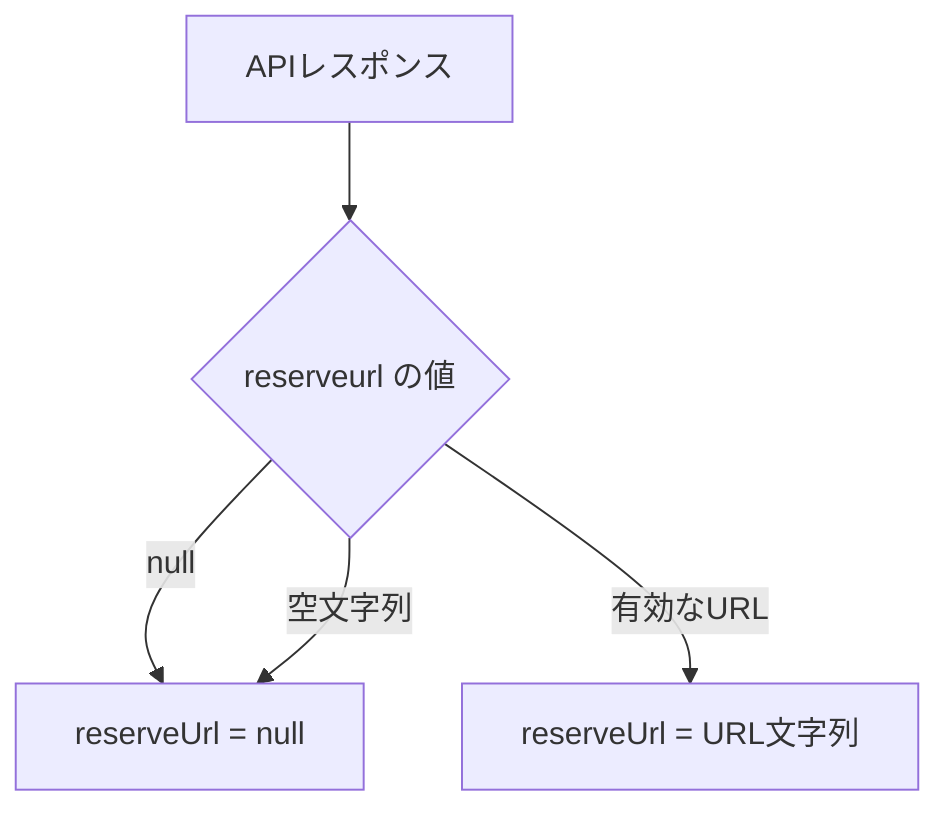
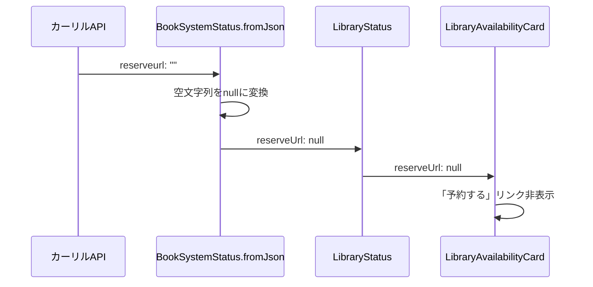

# Issue #43: Design

## Architecture Overview

データ層（API レスポンスのパース時）で空文字列を `null` に正規化する方針を採用する。これにより、ドメイン層・プレゼンテーション層に無効なデータが伝播することを防ぐ。

## Component Design

### 修正対象

#### 1. `BookSystemStatus.fromJson()` (データ層)



`lib/data/models/check_response.dart` の `BookSystemStatus.fromJson()` で、`reserveurl` が空文字列の場合に `null` に変換する。

**変更前:**
```dart
final reserveUrl = json['reserveurl'] as String?;
```

**変更後:**
```dart
final rawReserveUrl = json['reserveurl'] as String?;
final reserveUrl = (rawReserveUrl != null && rawReserveUrl.isNotEmpty) ? rawReserveUrl : null;
```

### 修正しない箇所

- `LibraryStatus` (ドメイン層): データ層で正規化済みのため変更不要
- `LibraryAvailabilityCard` (UI層): データ層で正規化済みのため変更不要

## Data Flow



## Domain Models

既存のドメインモデル (`LibraryStatus`, `BookSystemStatus`) の構造変更は不要。`reserveUrl` フィールドの型 (`String?`) はそのまま維持する。
