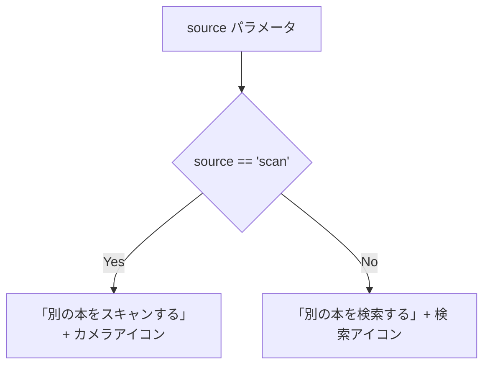
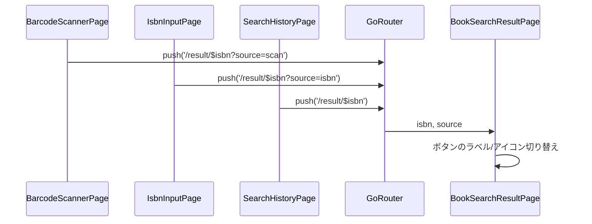

# Issue #45: Design

## Architecture Overview

ルーターのクエリパラメータ `source` を使って遷移元を `BookSearchResultPage` に伝え、ボタンのラベルとアイコンを動的に切り替える。

## Component Design

### 1. ルーター (`app_router.dart`)

クエリパラメータ `source` を `BookSearchResultPage` に渡す。

```dart
GoRoute(
  path: '/result/:isbn',
  builder: (context, state) {
    final isbn = state.pathParameters['isbn']!;
    final source = state.uri.queryParameters['source'];
    return BookSearchResultPage(isbn: isbn, source: source);
  },
),
```

### 2. 遷移元の変更

- バーコードスキャン: `context.push('/result/$isbn?source=scan')`
- ISBN入力: `context.push('/result/$isbn?source=isbn')`
- 検索履歴: `context.push('/result/${entry.isbn}')` (sourceなし)

### 3. `BookSearchResultPage`

`source` パラメータに基づいてボタンを切り替え。



## Data Flow


