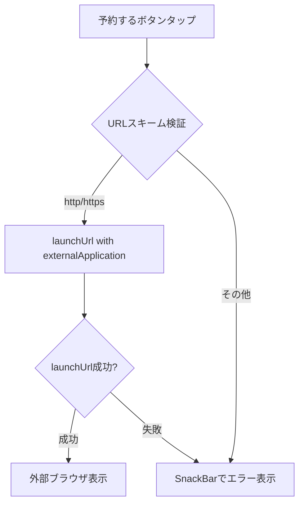

# Issue #50: Design - reserveUrlのURLスキーム検証

## Architecture Overview

URLバリデーションをプレゼンテーション層のウィジェット内に追加する。URLの安全性検証はリンク表示判定とは別の関心事であるため、ヘルパーメソッドとして分離する。

## Component Design

### 変更対象

#### `LibraryAvailabilityCard`

### 実装方針

1. `_launchReserveUrl` メソッドを追加し、URLスキーム検証とエラーハンドリングを行う
2. `Uri.parse` で解析し、`scheme` が `http` または `https` であることを確認
3. `launchUrl` に `mode: LaunchMode.externalApplication` を明示
4. `launchUrl` の失敗時にも `SnackBar` でフィードバックを表示

## Data Flow

変更なし（UI層のみの修正）。

## Domain Models

変更なし。
