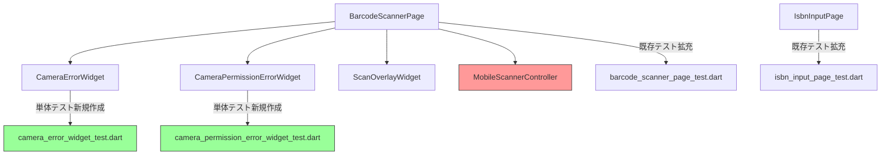

# Issue #51: Design - ウィジェットテスト追加

## Architecture Overview

既存のテストファイルにテストケースを追加し、新規のウィジェットテストファイルを作成する。カメラ依存の処理は子ウィジェットの単体テストでカバーする。

## Component Design

### テスト対象と戦略

### 新規テストファイル

#### `test/presentation/widgets/camera_error_widget_test.dart`

- エラーメッセージ「カメラの起動に失敗しました」が表示されること
- 説明文が表示されること
- 「再試行」ボタンのコールバックが呼ばれること
- 「ISBNを手動入力する」ボタンのコールバックが呼ばれること

#### `test/presentation/widgets/camera_permission_error_widget_test.dart`

- 権限エラーメッセージ「カメラへのアクセスが許可されていません」が表示されること
- 説明文が表示されること
- 「設定を開く」ボタンのコールバックが呼ばれること
- 「ISBNを手動入力する」ボタンのコールバックが呼ばれること

### 既存テスト拡充

#### `barcode_scanner_page_test.dart`

- 「ISBNを手動入力する」ボタンタップで `/isbn-input` へ遷移すること

#### `isbn_input_page_test.dart`

- 桁数不正（11桁や12桁）のエラーメッセージ表示
- ISBN-10 で X チェックディジットが有効であること

## Data Flow

変更なし（テストコードのみ）。

## Domain Models

変更なし。
