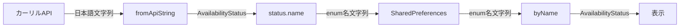

# Issue #55: Design - 検索履歴の保存形式ドキュメント化

## Architecture Overview

検索履歴の `libraryStatuses` は `Map<String, String>` として SharedPreferences に JSON 形式で保存される。Value には `AvailabilityStatus` の Dart enum 名を使用する。

## 設計判断

### enum名を採用した理由

| 選択肢 | メリット | デメリット |
|---|---|---|
| Dart enum名 (現行) | コード内で安定、API変更の影響を受けない、`byName` で型安全に復元可能 | enum名変更時にマイグレーションが必要 |
| API日本語文字列 | APIレスポンスをそのまま保存 | API仕様変更で既存データが壊れる、`fromApiString` の同義語対応（"貸出可"/"蔵書あり"）で情報が失われる |

**結論**: Dart enum名を採用し、内部データ形式として安定性を優先する。

## Data Format

### SearchHistoryEntry JSON Schema

```json
{
  "isbn": "9784101010014",
  "searchedAt": "2026-02-19T12:00:00.000",
  "libraryStatuses": {
    "Tokyo_Setagaya": "available",
    "Tokyo_Chiyoda": "checkedOut"
  }
}
```

### libraryStatuses の Value に使用される値

`AvailabilityStatus` の enum 名:
- `available` - 貸出可能
- `inLibraryOnly` - 館内のみ
- `checkedOut` - 貸出中
- `reserved` - 予約中
- `preparing` - 準備中
- `closed` - 休館中
- `notFound` - 蔵書なし
- `error` - エラー
- `unknown` - 不明

### Data Flow


