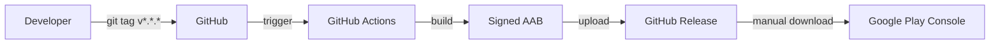
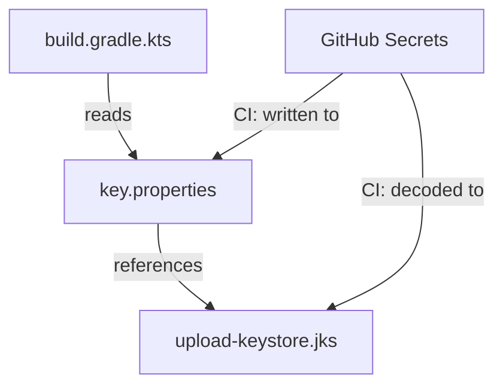
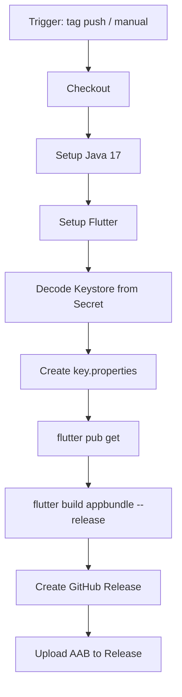
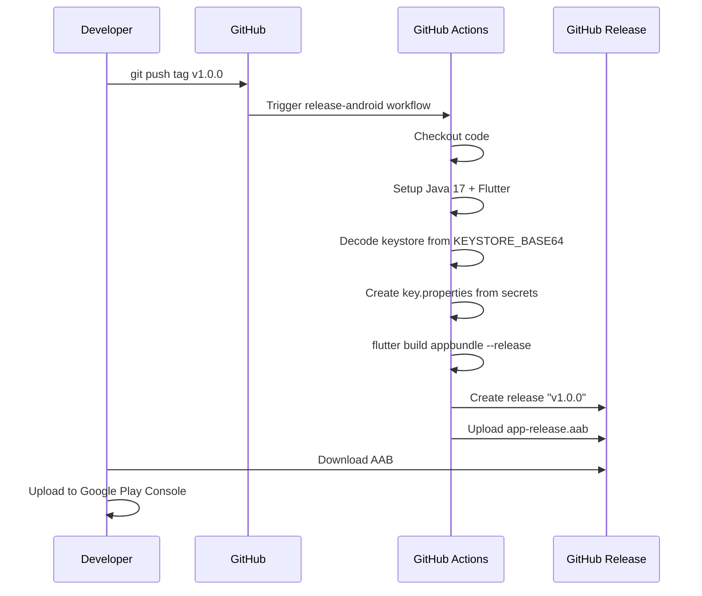

# Design: GitHub Actionsで署名付きAABをビルドしGitHub Releaseにアップロード

## Architecture Overview

リリースプロセスは以下のコンポーネントで構成される。



## Component Design

### 1. Android署名設定

`android/app/build.gradle.kts` にリリース用の署名設定を追加する。
`key.properties` ファイルから署名情報を読み込む構成とし、ローカルビルドとCI環境の両方に対応する。



#### key.properties のフォーマット

```properties
storePassword=<password>
keyPassword=<password>
keyAlias=upload
storeFile=<path-to-keystore>/upload-keystore.jks
```

#### build.gradle.kts の変更

- `key.properties` を読み込む処理を追加
- `signingConfigs` に `release` 設定を追加
- `buildTypes.release` で `release` 署名設定を使用

### 2. GitHub Actions ワークフロー (`release-android.yml`)



#### トリガー設定

- **タグプッシュ**: `v*.*.*` パターンにマッチするタグ
- **手動実行**: `workflow_dispatch` で `version` パラメータを入力可能

#### GitHub Secrets

| Secret名 | 内容 |
|-----------|------|
| `KEYSTORE_BASE64` | キーストアファイルをBase64エンコードした値 |
| `KEYSTORE_PASSWORD` | キーストアのパスワード |
| `KEY_ALIAS` | キーのエイリアス名 |
| `KEY_PASSWORD` | キーのパスワード |

### 3. キーストア作成手順

`keytool` コマンドでアップロード用キーストアを作成する。

```bash
keytool -genkey -v \
  -keystore upload-keystore.jks \
  -storetype JKS \
  -keyalg RSA \
  -keysize 2048 \
  -validity 10000 \
  -alias upload
```

## Data Flow

### タグプッシュ時のフロー



### 手動実行時のフロー

手動実行時は `workflow_dispatch` のインプットからバージョン情報を取得し、同様のフローでビルド・リリースを行う。

## Domain Models

このIssueでは新しいドメインモデルの追加はない。CI/CDインフラストラクチャの変更のみ。

### 変更対象ファイル

| ファイル | 変更内容 |
|----------|----------|
| `android/app/build.gradle.kts` | リリース署名設定の追加 |
| `.github/workflows/release-android.yml` | 新規: リリースワークフロー |
| `.gitignore` | `key.properties`, `*.jks` の追加 |
| `android/.gitignore` | `key.properties` の追加 |
