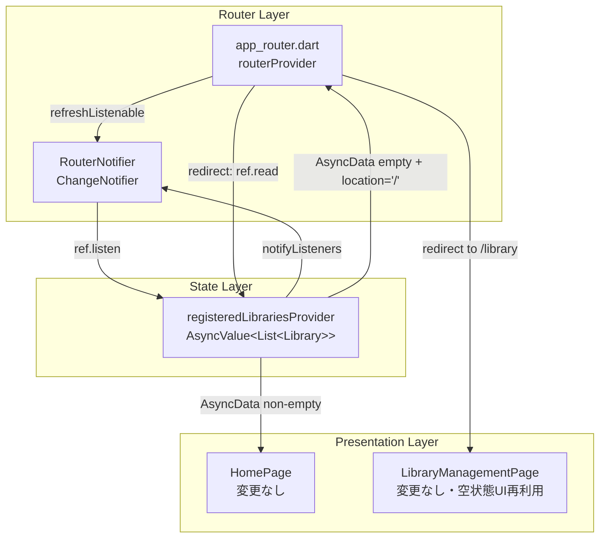
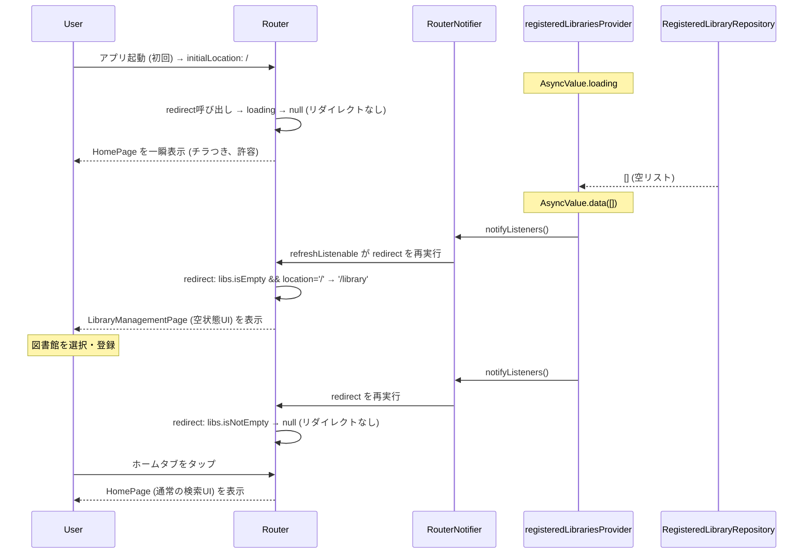
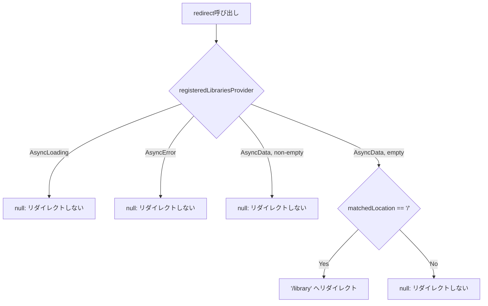
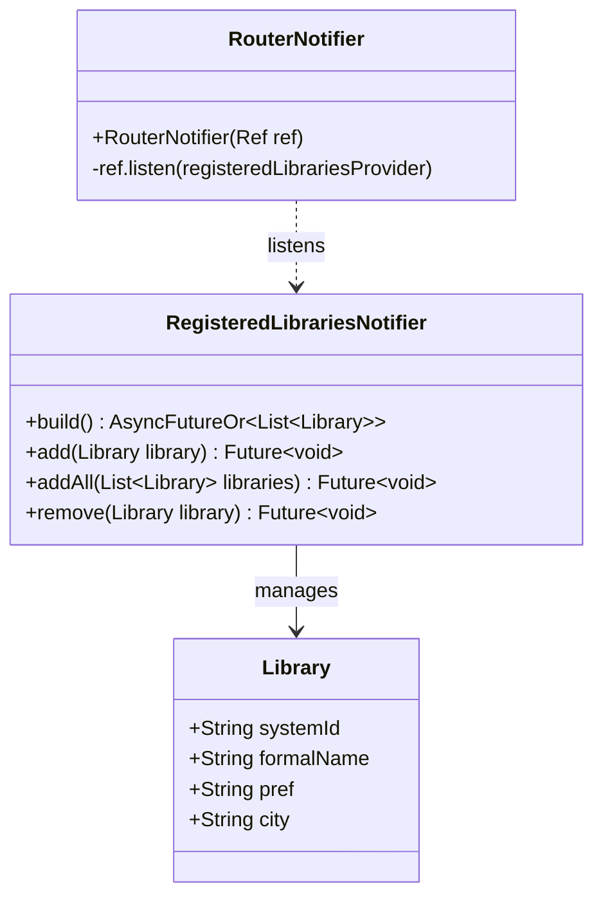

# Issue #64: Design — 図書館未登録時のオンボーディング体験改善

## アプローチ評価

### 選択肢 1: ルーターリダイレクト方式 (採用)

`GoRouter` の `redirect` コールバック内で `registeredLibrariesProvider` の状態を `ref.read` し、未登録時に `/library` へリダイレクトする。`refreshListenable` に `RouterNotifier`（`ChangeNotifier`）を設定し、プロバイダー変化時に redirect を再実行させる。

**メリット:**
- ルーティングレイヤーで一元管理できる
- `StatefulShellRoute` の BottomNavigationBar と正しく同期される（`/library` への遷移でタブ index も 1 になる）
- `home_page.dart` に一切変更不要

**デメリット:**
- `AsyncLoading` 中（起動直後の数十ms）は redirect が発火せずホーム画面が一瞬表示される（チラつき）→ 許容する
- `ref.listen` を使った `RouterNotifier` の実装が必要

**総評: 採用する**

### 選択肢 2: ホーム画面内分岐方式

`HomePage` を `ConsumerWidget` に変更し、`registeredLibrariesProvider` を `watch` する。データが空リストならオンボーディングUI、1件以上なら通常の検索UIを表示する。

**メリット:**
- `StatefulShellRoute` 構造に一切手を加えない
- `AsyncValue.when` で loading / error / data を自然にハンドリングできる
- `LibraryManagementPage._buildEmptyState` と同パターンのUIを `HomePage` に追加するだけで完結
- 変更範囲が `home_page.dart` と対応するテストのみに限定される
- BottomNavigationBar の挙動が変わらない

**デメリット:**
- ホーム画面が図書館登録状態に依存することになるが、これは機能要件として自然

**総評: 採用しない（ローディング中のチラつきは許容できるが、ルーターリダイレクト方式の方がシンプル）**

### 選択肢 3: スプラッシュ/オンボーディング画面方式

専用の `/onboarding` ルートを追加し、初回起動フラグをローカルストレージに保存して制御する。

**メリット:**
- リッチなオンボーディング体験を提供できる

**デメリット:**
- 新規ルートの追加が必要（`StatefulShellRoute` 外の独立ルート）
- 「一度でも図書館を登録したことがある」状態の管理が複雑
- 全図書館を削除して再び未登録になったケースで再表示するか否かの判断が必要
- 実装コストが最も高い

**総評: 採用しない。将来的な初回起動チュートリアルとして検討の余地はある**

---

## Architecture Overview

`app_router.dart` に `RouterNotifier`（`ChangeNotifier`）と `redirect` を追加し、図書館未登録時に `/` から `/library` へリダイレクトする。`home_page.dart` への変更は不要。



## Component Design

### `RouterNotifier` (新規クラス、`app_router.dart` 内)

`registeredLibrariesProvider` の変化を監視し、GoRouter の `refreshListenable` として機能する。

```dart
class RouterNotifier extends ChangeNotifier {
  RouterNotifier(Ref ref) {
    ref.listen(registeredLibrariesProvider, (_, __) => notifyListeners());
  }
}
```

### `routerProvider` の変更

`refreshListenable` と `redirect` を追加する。

```dart
final routerProvider = Provider<GoRouter>((ref) {
  final notifier = RouterNotifier(ref);
  return GoRouter(
    initialLocation: '/',
    refreshListenable: notifier,
    redirect: (context, state) {
      final libraries = ref.read(registeredLibrariesProvider);
      return libraries.maybeWhen(
        data: (libs) => (libs.isEmpty && state.matchedLocation == '/') ? '/library' : null,
        orElse: () => null, // loading / error: リダイレクトしない
      );
    },
    routes: [...], // 変更なし
  );
});
```

### `HomePage` — 変更なし

`home_page.dart` への変更は一切不要。

### `LibraryManagementPage` — 変更なし

既存の空状態UI（「図書館が登録されていません」+「図書館を登録する」ボタン）がそのまま活用される。

## Data Flow





## Domain Models

本イシューではドメインモデルの変更はない。


