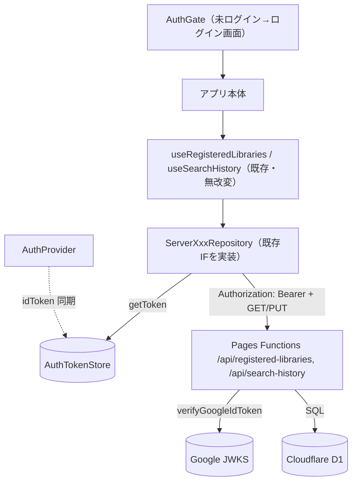

# 登録図書館・検索履歴のサーバー永続化（#74 / Phase 3） — Design

## Architecture Overview

必須ログイン。ログイン後、登録図書館・検索履歴は **D1** に永続化。既存リポジトリインターフェースはそのまま、実装を「保護 API（Pages Functions）+ D1」を叩くサーバー版に差し替える。リポジトリは現在の ID トークンを `AuthTokenStore` から読む（`AuthProvider` が同期）。



## Component Design

### 認証ゲート / セッション
- `src/presentation/auth/AuthGate.tsx`：`useAuth().user` が null ならログイン画面、あればアプリ。**App.tsx でルーターを包む**（テストの `renderRouteWithProviders` はゲートを通さないので既存ページ/ルートテストは無改変で通る）。
- ログイン画面：`src/presentation/pages/LoginPage.tsx`（アプリ説明 + `<GoogleLogin useOneTap auto_select>`）。GIS 自動選択で起動時サイレント復帰。
- `AuthProvider`：`idToken` を `AuthTokenStore.setAuthToken()` に同期（effect）。`signOut` 時に React Query キャッシュを `queryClient.clear()`（ユーザー間のデータ混在防止）。

### トークン橋渡し
- `src/data/datasources/authTokenStore.ts`：`getAuthToken()` / `setAuthToken(token)`（モジュール内 mutable）。サーバーリポジトリはこれを読む。テストでは `tokenProvider` をコンストラクタ注入できるようにする。

### サーバーAPIクライアント（data/datasources）
- `registeredLibraryApiClient.ts` / `searchHistoryApiClient.ts`：`GET`（一覧）/ `PUT`（全置換）を `Authorization: Bearer` 付きで叩く。`fetchFn` 注入・タイムアウト（既存 `calilApiClient` 流儀）。

### サーバー版リポジトリ（data/repositories・既存IFを実装）
- `ServerRegisteredLibraryRepository`：`getAll` = API GET。`add/addAll/remove/saveAll` = 現在リストを取得→変更→PUT（全置換）して更新後リストを返す（既存 localStorage 実装と同じ戻り値契約）。
- `ServerSearchHistoryRepository`：`getAll` = GET。`save(entry)`（同一 isbn は置換）/ `remove(isbn)` / `removeAll` = 取得→変更→PUT。
- どちらも `tokenProvider`（既定 `getAuthToken`）でトークン取得。401 は認証エラーとして投げる（呼び出し側でログアウト扱い）。

### Pages Functions（保護 API）
- 共有: `functions/_shared/googleAuth.js` に `verifyGoogleIdToken` を移設（#73 の `functions/api/me.js` から）。`me.js` もこれを import。
- 認証ヘルパ: `functions/_shared/requireUser.js`（Bearer 取り出し→検証→user / 401）。
- `functions/api/registered-libraries.js`：`onRequestGet`（user の一覧）/ `onRequestPut`（全置換）。D1 バインド `env.DB`。
- `functions/api/search-history.js`：同様に GET / PUT。
- いずれも `GOOGLE_CLIENT_ID`（aud 検証）と `DB`（D1）を `env` から使用。

### D1 スキーマ（`infra/d1/schema.sql` 等）
```sql
CREATE TABLE IF NOT EXISTS registered_libraries (
  user_id TEXT NOT NULL,
  library_key TEXT NOT NULL,
  library_json TEXT NOT NULL,
  created_at INTEGER NOT NULL,
  PRIMARY KEY (user_id, library_key)
);
CREATE TABLE IF NOT EXISTS search_history (
  user_id TEXT NOT NULL,
  isbn TEXT NOT NULL,
  searched_at INTEGER NOT NULL,
  statuses_json TEXT NOT NULL,
  PRIMARY KEY (user_id, isbn)
);
```
PUT 全置換は「該当 user の行を削除→新リストを一括 INSERT」（トランザクション/バッチ）。`library_key` は `libraryKey()`。

### DI / wiring
- `dependencies.tsx`：本番は `ServerRegisteredLibraryRepository` / `ServerSearchHistoryRepository` を配線。`testUtils` の `makeFakeDeps` は従来どおり Fake/localStorage 実装を既定にする（テストはネットワーク不要）。
- 既存フック（`useRegisteredLibraries` / `useSearchHistory` とそのミューテーション）・`useBookAvailability` は **無改変**（`deps.xxxRepository` を呼ぶだけ）。

## Data Flow
1. 起動 → AuthGate（GIS 自動選択で復帰 or ログイン画面）。
2. ログイン → `AuthProvider` がトークンを `AuthTokenStore` に同期。
3. 各フックが従来どおり `deps.repository` を呼ぶ → サーバー版が Bearer 付きで D1 を読み書き。
4. ログアウト → キャッシュ clear、ログイン画面へ。

## セキュリティ
- 保護 API は署名(JWKS)・iss・aud(=GOOGLE_CLIENT_ID)・exp を必須検証。`user_id` はトークンの `sub`。クライアント指定の user は信用しない。
- D1 アクセスはサーバーのみ。クライアントは Bearer のみ送る。

## テスト
- `verifyGoogleIdToken`（共有後も）/ `requireUser` の単体テスト（有効/aud/exp/署名/無トークン）。
- `ServerRegisteredLibraryRepository` / `ServerSearchHistoryRepository`：`fetchFn` + `tokenProvider` 注入で GET/PUT 挙動・401 を検証。
- `AuthGate`：未ログイン=ログイン画面、ログイン=children。
- 既存ページ/ルートテストは無改変で緑（ゲートは App 限定、テストは Fake repos）。

## 外部セットアップ（ユーザー手元のトークンで私が代行）
1. D1 作成（`wrangler d1 create libcheck` 相当を API/CLI）→ `database_id` を `wrangler.toml` の `[[d1_databases]]` にバインド。
2. スキーマ適用（`schema.sql`）。
3. Pages env `GOOGLE_CLIENT_ID` 設定（保護 API の aud 用）。

## 影響/非対象
- ログイン状態のトークン更新（失効時の自動リフレッシュ）は本 Phase 外（401→ログアウト扱い）。
- #71 ドメイン / Azure デコミッションは別タスク。
