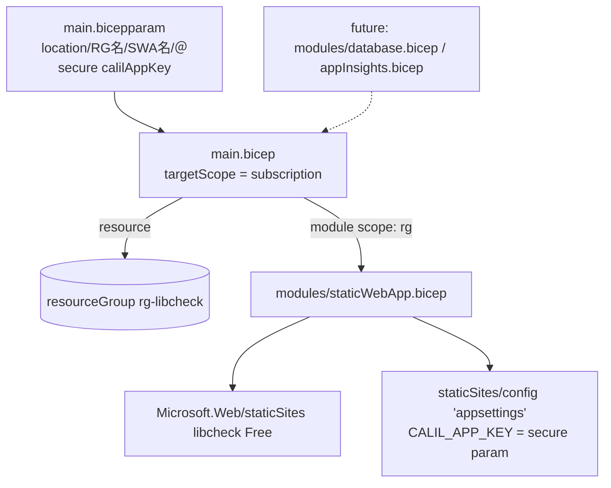

# インフラの IaC 化（Bicep） — Design

Issue: #75

## Architecture Overview

サブスクリプションスコープの `main.bicep` がリソースグループを宣言し、リソースはモジュールに分離する。初回は Static Web App モジュールのみ。将来の DB（#74）・Application Insights（#76）は同じ `modules/` に足していく。



## File Layout

```
infra/
  main.bicep                 # targetScope='subscription'：RG 作成 + モジュール呼び出し
  main.bicepparam            # パラメータ（calilAppKey は readEnvironmentVariable で env から）
  modules/
    staticWebApp.bicep       # SWA 本体 + appsettings 子リソース
  README.md                  # what-if / apply 手順、CI 自動適用の今後方針
```

## Component Design

### `main.bicep`（subscription scope）
- `targetScope = 'subscription'`
- params: `location`（既定 `eastasia`）、`resourceGroupName`（`rg-libcheck`）、`staticWebAppName`（`libcheck`）、`@secure() calilAppKey`
- `resource rg 'Microsoft.Resources/resourceGroups@2024-03-01'`（冪等）
- `module swa 'modules/staticWebApp.bicep'`（`scope: rg`）へ name/location/calilAppKey を渡す
- `output staticWebAppHostname`（モジュール出力を中継）

### `modules/staticWebApp.bicep`（resource group scope）
- `resource site 'Microsoft.Web/staticSites@2024-04-01'`：`sku { name:'Free', tier:'Free' }`、`properties: {}`（GitHub 連携プロパティは管理しない＝トークン方式の既存配信に干渉しない）
- `resource appSettings 'Microsoft.Web/staticSites/config@2024-04-01'`：`parent: site`、`name: 'appsettings'`、`properties: { CALIL_APP_KEY: calilAppKey }`
- `output defaultHostname = site.properties.defaultHostname`

### `main.bicepparam`
```bicep
using './main.bicep'
param location = 'eastasia'
param resourceGroupName = 'rg-libcheck'
param staticWebAppName = 'libcheck'
param calilAppKey = readEnvironmentVariable('CALIL_APP_KEY')  // env から注入（リポジトリに値を置かない）
```

## デプロイフロー（手動 + what-if）

```bash
export CALIL_APP_KEY=...   # 値は api/local.settings.json 等から（コミットしない）
# 差分プレビュー（破壊的変更が無いか確認）
az deployment sub what-if  --location eastasia --template-file infra/main.bicep --parameters infra/main.bicepparam
# 適用
az deployment sub create   --location eastasia --template-file infra/main.bicep --parameters infra/main.bicepparam
```

## 安全性・冪等性
- 既存 SWA と同名・同 location・同 SKU を宣言するため、`create` は in-place 更新（冪等）。
- `appsettings` は全置換のため、毎回 `CALIL_APP_KEY` を渡す（NFR-1/制約）。値未設定なら `readEnvironmentVariable` がエラーで気づける。
- **初回適用前に必ず `what-if`** を実行し、`repositoryUrl`/`branch` 等の差分が破壊的でないことを確認する（トークン方式の配信はこれらに依存しないため許容）。

## 将来拡張（このIssueでは実装しない）
- `modules/database.bicep`（#74 のDB）、`modules/appInsights.bicep`（#76 の効果測定）を追加し、`main.bicep` から呼ぶ。
- 出力（接続文字列等）は SWA の appsettings へ secure に受け渡す設計余地を残す。

## CI 自動適用の今後方針（整理のみ・別対応）
- Azure AD でフェデレーション資格情報（OIDC）またはサービスプリンシパルを作成し、GitHub に登録。
- `workflow_dispatch` / `infra/**` 変更の PR で `az deployment sub what-if`、`main` 反映で `create` を実行するワークフローを追加。
- シークレットは GitHub Secrets（`CALIL_APP_KEY`）から `@secure()` パラメータへ注入。
- 本対応では未実装。README に手順骨子のみ記載する。
