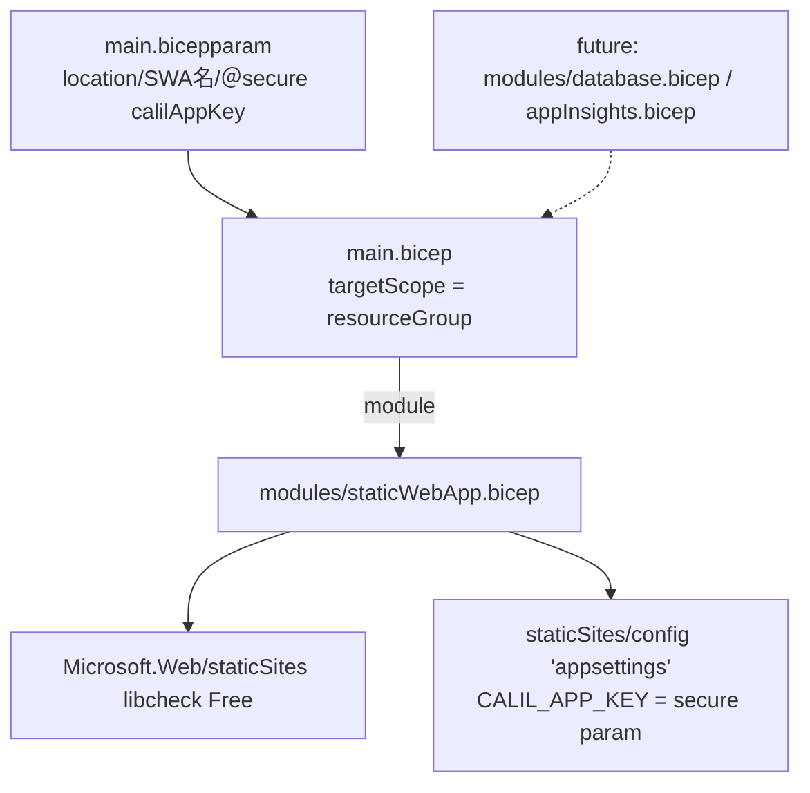

# インフラの IaC 化（Bicep） — Design

Issue: #75

## Architecture Overview

**リソースグループスコープ**の `main.bicep` がリソースをモジュール経由で宣言する（最小権限：CI 用 ID は `rg-libcheck` の Contributor のみ）。リソースグループ自体は一度きりのブートストラップで作成済み。将来の DB（#74）・Application Insights（#76）は同じ `modules/` に足していく。



## File Layout

```
infra/
  main.bicep                 # targetScope='resourceGroup'：モジュール呼び出し
  main.bicepparam            # パラメータ（calilAppKey は readEnvironmentVariable で env から）
  modules/
    staticWebApp.bicep       # SWA 本体 + appsettings 子リソース
  README.md                  # what-if / apply 手順、CI、OIDC セットアップ手順
.github/workflows/infra.yml  # CI: PR=what-if / main・手動=apply（production 承認ゲート）
```

## Component Design

### `main.bicep`（resource group scope）
- `targetScope = 'resourceGroup'`
- params: `location`（既定 `eastasia`）、`staticWebAppName`（`libcheck`）、`repositoryUrl`/`branch`（既存値を再表明）、`@secure() calilAppKey`
- `module staticWebApp 'modules/staticWebApp.bicep'`（デプロイ先 RG にデプロイ）
- `output staticWebAppHostname`

### `modules/staticWebApp.bicep`（resource group scope）
- `resource site 'Microsoft.Web/staticSites@2024-04-01'`：`sku { name:'Free', tier:'Free' }`、`properties: { provider, repositoryUrl, branch }`（既存値を再表明し settable フィールドの消失を防ぐ）
- `resource appSettings 'Microsoft.Web/staticSites/config@2024-04-01'`：`parent: site`、`name: 'appsettings'`、`properties: { CALIL_APP_KEY: calilAppKey }`
- `output defaultHostname = site.properties.defaultHostname`

### `main.bicepparam`
```bicep
using './main.bicep'
param location = 'eastasia'
param staticWebAppName = 'libcheck'
param calilAppKey = readEnvironmentVariable('CALIL_APP_KEY')  // env から注入（リポジトリに値を置かない）
```

## デプロイフロー

手動・CI 共通の中核コマンド（RG スコープ）:
```bash
az deployment group what-if --resource-group rg-libcheck --template-file infra/main.bicep --parameters infra/main.bicepparam
az deployment group create  --resource-group rg-libcheck --template-file infra/main.bicep --parameters infra/main.bicepparam
```

## CI 設計（`.github/workflows/infra.yml`）

- 認証: **OIDC**（パスワードレス）。`azure/login@v2` + フェデレーション資格情報。
  - PR の what-if ジョブ → subject `repo:satoryu/LibCheck:pull_request`
  - apply ジョブ（`environment: production`）→ subject `repo:satoryu/LibCheck:environment:production`
- トリガー: PR(`infra/**`)=what-if / `push: main`(`infra/**`)・`workflow_dispatch`=apply
- 承認ゲート: `production` 環境に required reviewers。main 反映後も承認してから apply。
- 権限: CI 用サービスプリンシパルは **`rg-libcheck` の Contributor のみ**（最小権限）。
- シークレット: `CALIL_APP_KEY` は GitHub Secret → `env:` 経由で `@secure()` パラメータへ。

## 安全性・冪等性
- 既存 SWA と同名・同 location・同 SKU・同 settable プロパティを宣言するため、`create` は in-place 更新（冪等）。
- `appsettings` は全置換のため、毎回 `CALIL_APP_KEY` を渡す。
- what-if の残差（`stableInboundIP`/`trafficSplitting`/`deploymentAuthPolicy`）は無害なノイズ。`appsettings` は what-if 非対応（`x Unsupported`）。詳細は `infra/README.md`。

## 将来拡張（このIssueでは実装しない）
- `modules/database.bicep`（#74）、`modules/appInsights.bicep`（#76）を追加し `main.bicep` から呼ぶ。
