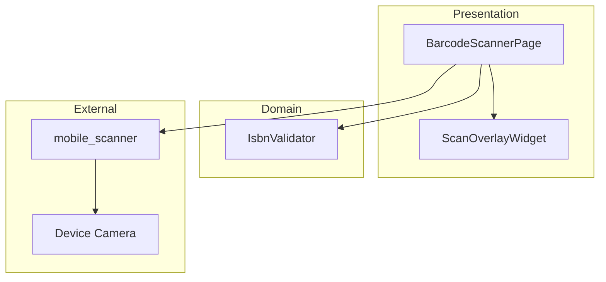
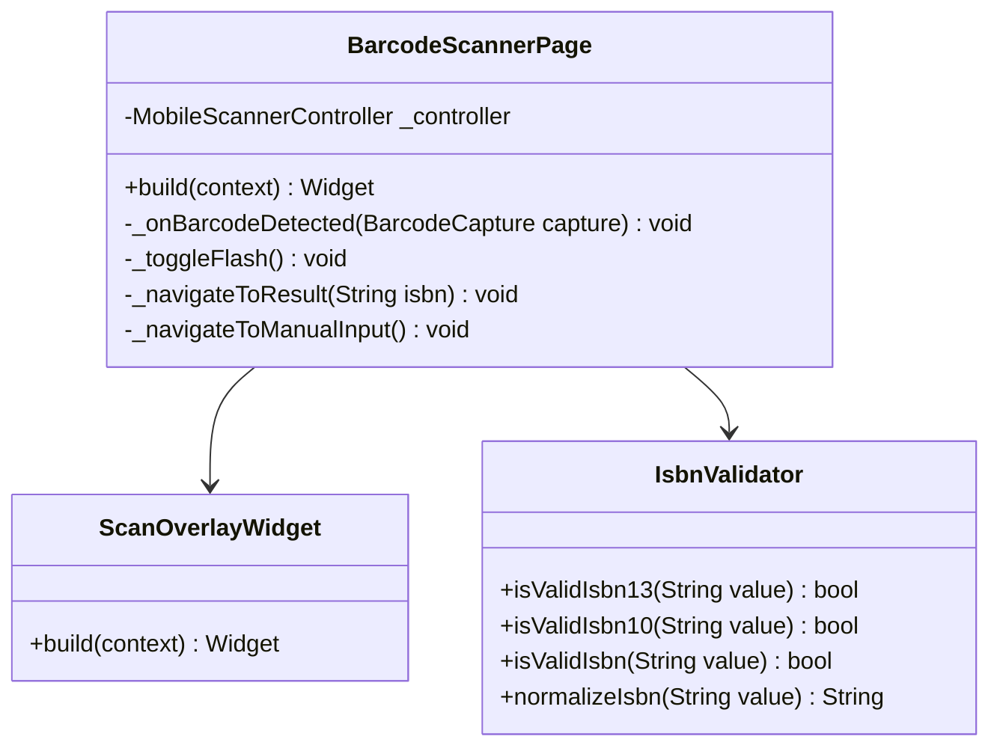
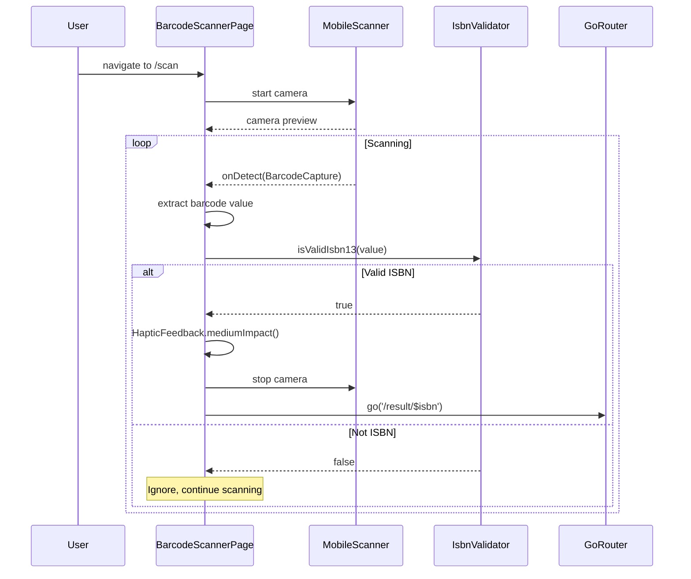

# Issue #8: ISBNバーコードスキャン - 設計

## Architecture Overview

mobile_scanner パッケージを活用し、カメラによるバーコード読み取り機能を実装する。



## Component Design

### BarcodeScannerPage

カメラプレビューとバーコード読み取りを管理するメインページ。



### IsbnValidator

ISBN のバリデーションを行うユーティリティクラス。Issue #9（手動入力）でも共有する。

```dart
class IsbnValidator {
  /// ISBN-13 のチェックディジットを検証
  static bool isValidIsbn13(String isbn) {
    final digits = isbn.replaceAll('-', '');
    if (digits.length != 13) return false;
    if (!digits.startsWith('978') && !digits.startsWith('979')) return false;
    // チェックディジット検証
    var sum = 0;
    for (var i = 0; i < 12; i++) {
      final digit = int.tryParse(digits[i]);
      if (digit == null) return false;
      sum += (i.isEven) ? digit : digit * 3;
    }
    final checkDigit = (10 - (sum % 10)) % 10;
    return checkDigit == int.tryParse(digits[12]);
  }

  /// ISBN-10 のチェックディジットを検証
  static bool isValidIsbn10(String isbn) {
    final digits = isbn.replaceAll('-', '');
    if (digits.length != 10) return false;
    var sum = 0;
    for (var i = 0; i < 9; i++) {
      final digit = int.tryParse(digits[i]);
      if (digit == null) return false;
      sum += digit * (10 - i);
    }
    final lastChar = digits[9];
    final lastValue = lastChar == 'X' ? 10 : int.tryParse(lastChar);
    if (lastValue == null) return false;
    sum += lastValue;
    return sum % 11 == 0;
  }

  /// ISBN-13 または ISBN-10 のいずれかで有効か検証
  static bool isValidIsbn(String isbn) {
    final normalized = isbn.replaceAll('-', '');
    return isValidIsbn13(normalized) || isValidIsbn10(normalized);
  }

  /// ハイフンを除去して正規化
  static String normalizeIsbn(String isbn) => isbn.replaceAll('-', '');
}
```

## Data Flow



## UI Design

design-guidelines.md セクション 2.3 に準拠:

### バーコードスキャナー画面レイアウト

- AppBar: 「バーコードスキャン」+ 戻るボタン + フラッシュライトアイコン
- カメラプレビュー（画面の上部 2/3）
- スキャンガイド枠（半透明オーバーレイ + 中央のフレーム）
- ISBN読み取り結果表示エリア
- ヘルプテキスト「バーコードをガイド枠に合わせてください」
- 「ISBN を手動入力する」ボタン（OutlinedButton）

### カメラ権限エラー画面

- design-guidelines.md セクション 4.2 のカメラ権限エラーに準拠
- 「設定を開く」ボタン + 「ISBNを手動入力する」ボタン

## Routing

```
/scan → BarcodeScannerPage()
```

app_router.dart に GoRoute を追加する。

## パッケージ依存

```yaml
dependencies:
  mobile_scanner: ^6.0.0
```

AndroidManifest.xml にカメラ権限を追加:
```xml
<uses-permission android:name="android.permission.CAMERA" />
```
