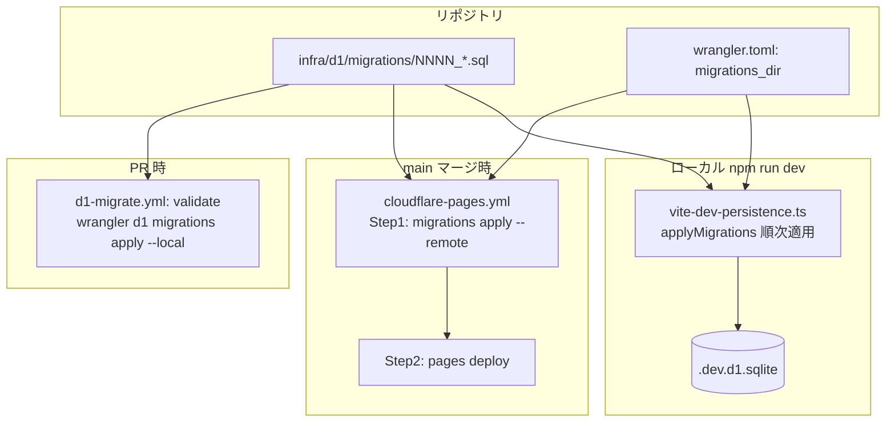

# #83 D1 スキーマのマイグレーション運用化 — Design

## Architecture Overview

`wrangler d1 migrations` を正本とする。マイグレーションファイルは `infra/d1/migrations/` に連番で置き、wrangler が D1 内の `d1_migrations` テーブルで適用済みを追跡する。本番適用は **CI（デプロイ直前）** で、ローカルは dev プラグインが同じファイル群を適用する。



設計上の要点:

- **適用はデプロイ前**（同一ジョブ内の前段ステップ）。別ワークフローに分けると push 時に並走して順序が崩れるため、`cloudflare-pages.yml` に同居させて「スキーマ→コード」を保証する（NFR-1）。
- **冪等**: `wrangler d1 migrations apply` は適用済みを `d1_migrations` で判定しスキップする。毎 push 走っても未適用が無ければ no-op（FR-3, AC-3）。
- **検証は本番に触れない**: PR では `--local`（一時 SQLite）に適用して SQL の妥当性のみ確認する（FR-4, AC-4）。
- **wrangler はローカル導入しない**: CI では `cloudflare/wrangler-action@v3`（デプロイで実績あり）を使い、過去に詰まった sharp ネイティブビルドを回避する（NFR-3）。

## Component Design

### 1. マイグレーションファイル `infra/d1/migrations/0001_init.sql`

現行 `schema.sql` をベースラインとして移す。`CREATE TABLE IF NOT EXISTS` を維持し、既に同テーブルを持つ本番 D1 に冪等適用できるようにする（Constraints）。

> **ベースラインの注意**: 既存本番 D1 は migrations 導入前に手動適用されており `d1_migrations` 表が無い。初回 `migrations apply --remote` で wrangler は `0001` を「未適用」とみなし実行するが、`IF NOT EXISTS` のため実テーブルは no-op で、wrangler は `0001` を適用済みとして記録する。以降は通常どおり差分適用される。

### 2. `wrangler.toml`

```toml
[[d1_databases]]
binding = "DB"
database_name = "libcheck"
database_id = "ba647dce-..."
migrations_dir = "infra/d1/migrations"
```

### 3. dev プラグイン `vite-dev-persistence.ts`

`schema.sql` 単一読み込みを、`infra/d1/migrations/` 配下の `*.sql` を**連番順に**読み適用する形へ変更する。順序・コメント除去・文分割のロジックを純粋関数 `orderedMigrationStatements()` に切り出し、ユニットテスト可能にする（TDD 対象）。

```ts
// 純粋関数: マイグレーションファイル群 → 実行する SQL 文の配列（連番順）
export function orderedMigrationStatements(
  files: { name: string; content: string }[],
): string[]
```

- `.sql` のみ対象、ファイル名の数値プレフィックス昇順、`--` コメント行を除去、`;` で文分割し空を捨てる。
- dev プラグインはこの結果を `db.exec(stmt)` で順に流す。`d1_migrations` 追跡はローカルでは不要（毎回 `IF NOT EXISTS` で冪等構築する方針）。

### 4. CI

#### `cloudflare-pages.yml`（main / workflow_dispatch）— 適用 + デプロイ

build の後・deploy の前に「Apply D1 migrations (remote)」ステップを追加:

```yaml
- name: Apply D1 migrations (remote)
  uses: cloudflare/wrangler-action@v3
  with:
    apiToken: ${{ secrets.CLOUDFLARE_API_TOKEN }}
    accountId: ${{ secrets.CLOUDFLARE_ACCOUNT_ID }}
    command: d1 migrations apply libcheck --remote
- name: Deploy to Cloudflare Pages
  uses: cloudflare/wrangler-action@v3
  with: { ... command: pages deploy }
```

適用が失敗するとジョブが落ち、deploy ステップに進まない（NFR-2）。

#### `d1-migrate.yml`（PR）— 検証のみ

`infra/d1/migrations/**` または当ワークフロー変更の PR で、`--local` 適用により SQL を検証:

```yaml
on:
  pull_request:
    paths: ['infra/d1/migrations/**', '.github/workflows/d1-migrate.yml', 'wrangler.toml']
jobs:
  validate:
    steps:
      - uses: actions/checkout@v4
      - uses: cloudflare/wrangler-action@v3
        with:
          apiToken: ${{ secrets.CLOUDFLARE_API_TOKEN }}
          accountId: ${{ secrets.CLOUDFLARE_ACCOUNT_ID }}
          command: d1 migrations apply libcheck --local
```

`--local` は一時 SQLite を作って適用するだけで本番 D1 に触れない（FR-4）。

### 5. ドキュメント

`infra/d1/README.md` に「新しいマイグレーションの追加手順」を記載（ファイル命名規約 `NNNN_説明.sql`、ローカル確認、PR→main で自動適用される流れ、ベースラインの注意）。

## Data Flow

1. 開発者が `infra/d1/migrations/000N_*.sql` を追加して PR。
2. PR: `d1-migrate.yml` が `--local` 適用で SQL を検証。`ci.yml` が型・テスト。
3. マージ: `cloudflare-pages.yml` が `--remote` 適用（未適用のみ・冪等）→ `pages deploy`。
4. ローカル: `npm run dev` 起動時に dev プラグインが migrations を順次適用し `.dev.d1.sqlite` を構築。

## Domain Models

スキーマ定義（`registered_libraries` / `search_history`）は #74 のまま不変。本 issue は**スキーマの管理・適用方法**の変更であり、ドメインモデルやアプリコード（`src/`）には変更を加えない。
