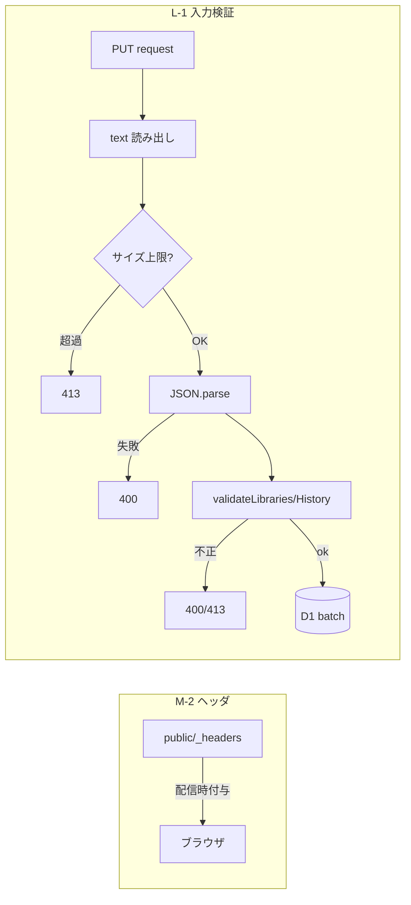

# #87 セキュリティ強化（M-2 / L-1）— Design

## Architecture Overview

2つの独立した変更。アプリのドメイン/プレゼンテーションには手を入れない。

- **M-2**: 静的配信に `public/_headers`（Cloudflare Pages）を追加。
- **L-1**: 永続化 Functions の PUT 入口に、純粋関数 `functions/_shared/validation.js` による検証を挟む。



## Component Design

### M-2: `public/_headers`

全パス `/*` に付与:

| ヘッダ | 値 | 目的 |
| --- | --- | --- |
| Content-Security-Policy | 後述 | XSS 影響の限定（トークン外部送信の抑止）・クリックジャッキング |
| X-Frame-Options | `DENY` | クリックジャッキング（CSP 非対応ブラウザ向けの保険） |
| X-Content-Type-Options | `nosniff` | MIME スニッフィング防止 |
| Referrer-Policy | `strict-origin-when-cross-origin` | リファラ漏えい抑制 |
| Permissions-Policy | `camera=(self), microphone=(), geolocation=(), browsing-topics=()` | バーコード用カメラのみ許可、他は無効化 |

CSP（1行・ホワイトリスト）:

```
default-src 'self';
base-uri 'self';
object-src 'none';
frame-ancestors 'none';
form-action 'self';
img-src 'self' data: https:;
font-src 'self' data:;
style-src 'self' 'unsafe-inline' https://accounts.google.com/gsi/style;
script-src 'self' https://accounts.google.com/gsi/client;
connect-src 'self' https://api.openbd.jp https://accounts.google.com/gsi/;
frame-src https://accounts.google.com/gsi/
```

根拠（実依存との対応）:
- `script-src`/`frame-src`/`style-src`/`connect-src` の `accounts.google.com/gsi/*` … Google Identity Services（ログイン）。Google 公式の GIS CSP 要件に準拠。
- `connect-src https://api.openbd.jp` … ブラウザが直接叩く OpenBD 書誌 API。
- `img-src https:` … OpenBD 書影（cover.openbd.jp）・Amazon 画像・Google プロフィール画像。広めだが画像は低リスク。
- `style-src 'unsafe-inline'` … MUI/emotion と GIS のインライン style。`script-src` には `'unsafe-inline'` を付けない（index.html にインラインスクリプト無し）。
- `frame-ancestors 'none'` … 本アプリを iframe 化させない（GIS は逆に「我々が GIS の iframe を埋める」ので `frame-src` 側で許可。`frame-ancestors` とは無関係で衝突しない）。
- COOP/COEP は GIS のポップアップ/postMessage を壊す恐れがあるため**入れない**。

> 注意: `public/_headers` の効果は Cloudflare Pages 配信時のみ。Vite dev では再現されない。CSP の最終確認は `npm run pages:dev` か本番で行う。

### L-1: `functions/_shared/validation.js`（純粋関数）

```js
export const LIMITS = {
  maxBodyBytes: 1_000_000, // 1MB
  maxItems: 2000,          // 配列長
  maxStringLen: 4000,      // 個々の文字列フィールド
};
export function tooLarge(text)                  // 本文サイズ上限超過か
export function validateLibraries(body)         // { ok, value } | { ok:false, status, error }
export function validateHistory(body)
```

- `validateLibraries`: `body.libraries` が配列でなければ 400、長さ超過は 413、各 lib の `systemId`/`libKey`/`libId` が非空文字列でなければ 400。
- `validateHistory`: `body.entries` が配列でなければ 400、長さ超過は 413、各 entry の `isbn`/`searchedAt` が非空文字列、`libraryStatuses` は（あれば）オブジェクトでなければ 400。

### 各ハンドラの組み込み

`registered-libraries.js` / `search-history.js` の PUT を次の順に:

```js
const text = await request.text();
if (tooLarge(text)) return json({ error: 'payload too large' }, 413);
let body;
try { body = JSON.parse(text); } catch { return json({ error: 'bad request' }, 400); }
const v = validateLibraries(body);      // または validateHistory
if (!v.ok) return json({ error: v.error }, v.status);
const libraries = v.value;              // 以降は従来どおり D1 batch
```

`request.json()` を `request.text()`＋サイズチェック＋`JSON.parse` に置き換えるのみ。D1 書き込みロジックは不変。

## Data Flow

1. PUT 受信 → 本文を text で読み、サイズ上限チェック（413）。
2. JSON パース（失敗 400）。
3. 形・長さ検証（400/413）。
4. 既存の全置換 batch を実行（200）。

GET と Calil プロキシ、認証ロジックは変更しない。

## Domain Models

変更なし。`Library` / `SearchHistoryEntry` のスキーマは #74 のまま。本 issue は入口の検証と配信ヘッダのみ。
