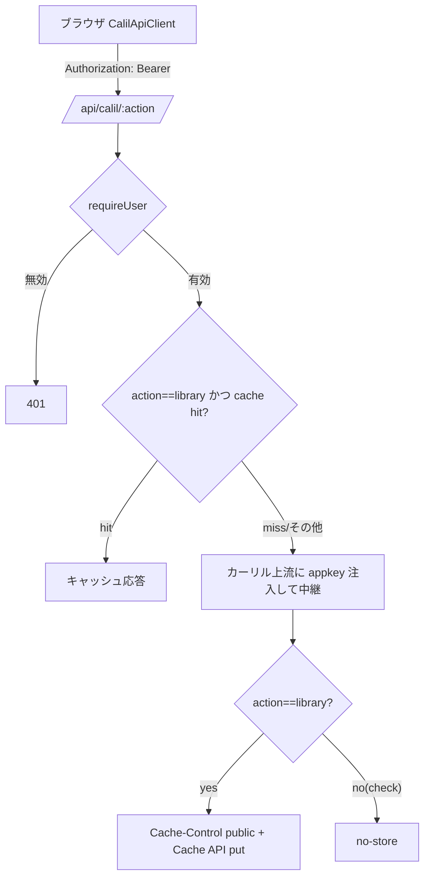

# #89 Calil プロキシ 認証必須化 + library キャッシュ — Design

## Architecture Overview



要点:
- **認証はキャッシュ参照より前**。匿名・偽トークンは 401 で即終了し、上流にもキャッシュにも触れない（厳密な C）。
- `library` のみキャッシュ（準静的）。`check`（リアルタイム在庫）は `no-store`。
- Cache API はランタイム機能。テスト（`caches` 不在）では未使用パスとして安全にスキップ。

## Component Design

### サーバ `functions/api/calil/[action].js`

```js
import { requireUser } from '../_shared/googleAuth.js';

const CALIL_ORIGIN = 'https://api.calil.jp';
const ALLOWED_ACTIONS = new Set(['library', 'check']);
const LIBRARY_CACHE_TTL = 86400; // 1日

export async function onRequestGet(context) {
  const { request, env, params } = context;
  const action = params.action;
  if (!ALLOWED_ACTIONS.has(action)) return new Response('Not Found', { status: 404 });

  // C: 認証必須（上流＝キー使用の前段で弾く）
  const { user, response: authResponse } = await requireUser(request, env);
  if (!user) return authResponse;

  const appKey = env.CALIL_APP_KEY;
  if (!appKey) return new Response('Server misconfigured: CALIL_APP_KEY is not set', { status: 500 });

  const requestUrl = new URL(request.url);
  const cacheable = action === 'library';
  const cache = cacheable ? globalThis.caches?.default : undefined;

  // library はキャッシュ参照
  let cacheKey;
  if (cache) {
    const keyUrl = new URL(requestUrl.toString());
    keyUrl.searchParams.delete('appkey'); // クライアントは空 appkey を送る
    cacheKey = new Request(keyUrl.toString(), { method: 'GET' });
    const hit = await cache.match(cacheKey);
    if (hit) return hit;
  }

  // 上流へ appkey を注入して中継
  const target = new URL(`${CALIL_ORIGIN}/${action}`);
  for (const [k, v] of requestUrl.searchParams) target.searchParams.set(k, v);
  target.searchParams.set('appkey', appKey);

  let upstream;
  try {
    upstream = await fetch(target.toString(), { headers: { accept: 'application/json' } });
  } catch {
    return new Response('Bad Gateway', { status: 502 });
  }

  const bodyText = await upstream.text();
  const result = new Response(bodyText, {
    status: upstream.status,
    headers: {
      'content-type': upstream.headers.get('content-type') ?? 'application/json',
      'cache-control':
        cacheable && upstream.status === 200
          ? `public, max-age=${LIBRARY_CACHE_TTL}`
          : 'no-store',
    },
  });

  if (cache && upstream.status === 200) {
    context.waitUntil?.(cache.put(cacheKey, result.clone()));
  }
  return result;
}
```

### クライアント `CalilApiClient`

`getAuthToken()` を既定の `tokenProvider` として注入し、`executeRequest` で Bearer を付与:

```js
this.tokenProvider = options.tokenProvider ?? getAuthToken;
...
private authHeaders() {
  const token = this.tokenProvider();
  return token ? { authorization: `Bearer ${token}` } : {};
}
// executeRequest:
response = await this.fetchFn(url, { signal: controller.signal, headers: this.authHeaders() });
```

- 既存テストは `tokenProvider` 未指定＝既定 `getAuthToken`、テスト環境ではトークン未設定 → ヘッダ無し → **無改変で緑**。
- 新規テストで `tokenProvider: () => 'tok'` を渡し、fetch の第2引数に `authorization: 'Bearer tok'` が入ることを検証。

### `calilApiConfig.ts` のコメント更新

Azure Functions 前提の SECURITY コメントを、Cloudflare Pages Functions + 認証必須の現状に更新（挙動変更なし）。

## Data Flow

1. クライアントが ID トークン付きで `/api/calil/{action}` を呼ぶ。
2. Function が `requireUser`（401 で遮断）。
3. `library` はキャッシュ参照（hit ならキー消費せず返す）。
4. miss/`check` は上流へ appkey を注入して中継。`library` は `public` キャッシュ、`check` は `no-store`。

## Domain Models

変更なし。レスポンス形・`LibraryResponse`/`CheckResponse` は不変。本 issue は配信前段（認証・キャッシュ・ヘッダ）のみ。
