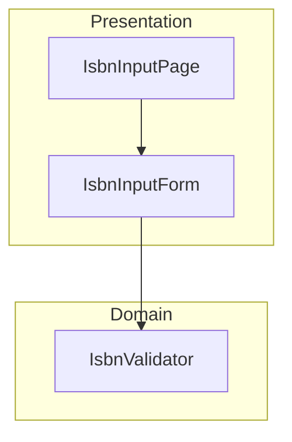
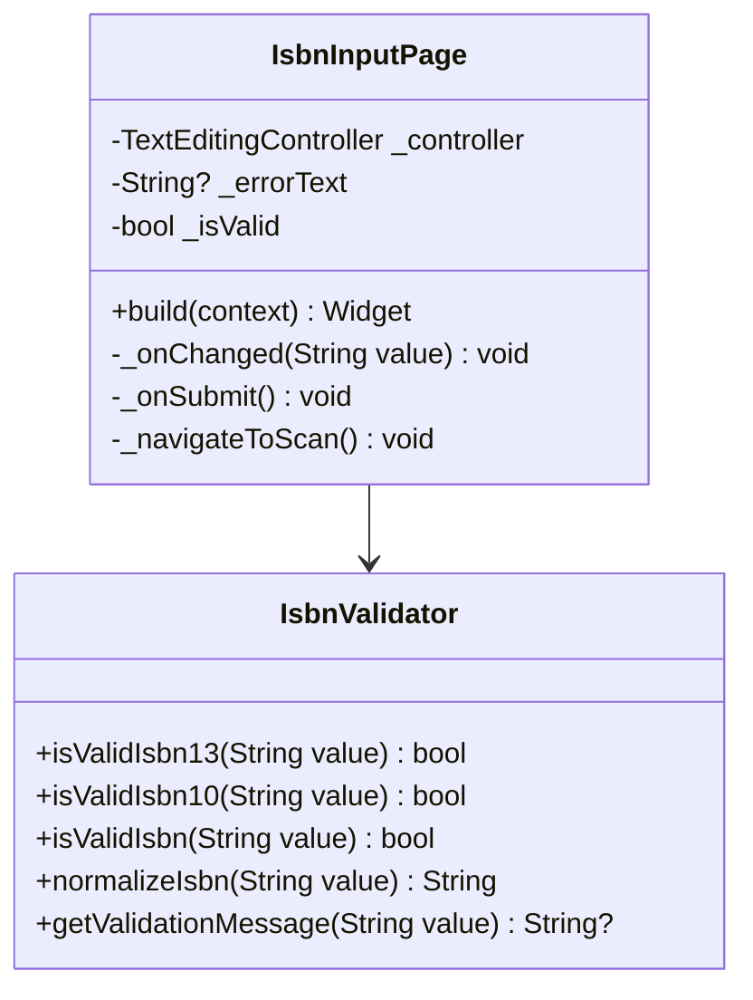
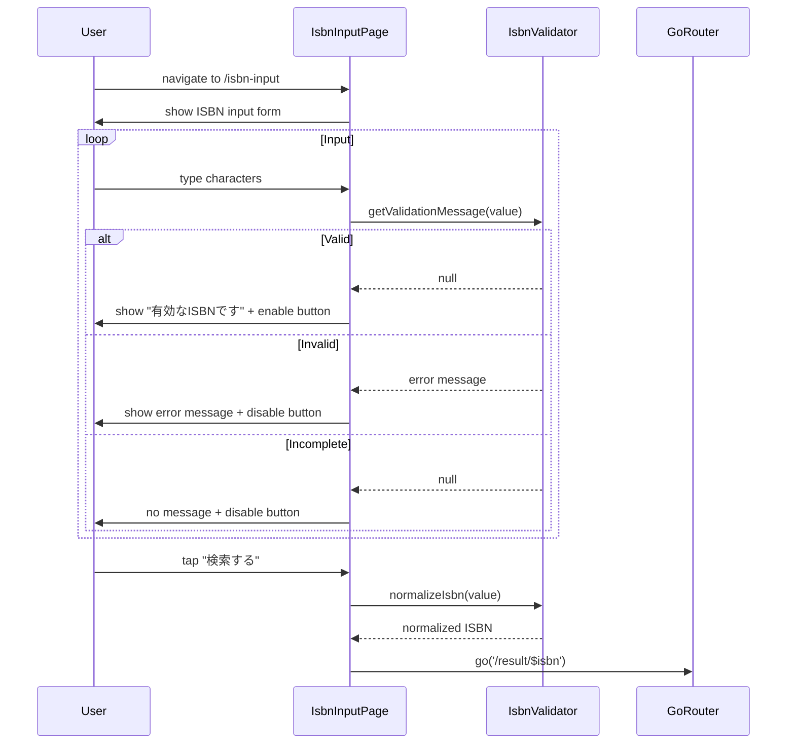

# Issue #9: ISBN手動入力 - 設計

## Architecture Overview

ISBN手動入力フォームを実装する。IsbnValidator は Issue #8 で作成したものを共有する。



## Component Design

### IsbnInputPage

ISBN入力フォームとバリデーションを管理するページ。



### バリデーションロジック

```dart
/// 入力値に対するバリデーションメッセージを返す
/// null の場合は有効
static String? getValidationMessage(String value) {
  final normalized = value.replaceAll('-', '');
  if (normalized.isEmpty) return null; // 未入力はエラーを出さない
  if (normalized.length < 10) return null; // 入力途中はエラーを出さない
  if (normalized.length == 10) {
    return isValidIsbn10(normalized) ? null : 'ISBN-10 のチェックディジットが正しくありません';
  }
  if (normalized.length == 13) {
    if (!normalized.startsWith('978') && !normalized.startsWith('979')) {
      return 'ISBN-13 は 978 または 979 で始まる必要があります';
    }
    return isValidIsbn13(normalized) ? null : 'ISBN-13 のチェックディジットが正しくありません';
  }
  return 'ISBNは10桁または13桁で入力してください';
}
```

## Data Flow



## UI Design

design-guidelines.md セクション 2.4 に準拠:

### ISBN手動入力画面レイアウト

- AppBar: 「ISBN入力」+ 戻るボタン
- 説明テキスト「ISBNを入力してください」
- OutlinedTextField（ラベル: 「ISBN (13桁 または 10桁)」）
  - keyboardType: number
  - バリデーション結果の表示（有効/エラー）
- ヒントテキスト「書籍の裏表紙に記載されている13桁の数字を入力してください。」
- 「検索する」FilledButton（無効なISBNでは disabled）
- 「バーコードスキャンへ」OutlinedButton

## Routing

```
/isbn-input → IsbnInputPage()
```

app_router.dart に GoRoute を追加する。
